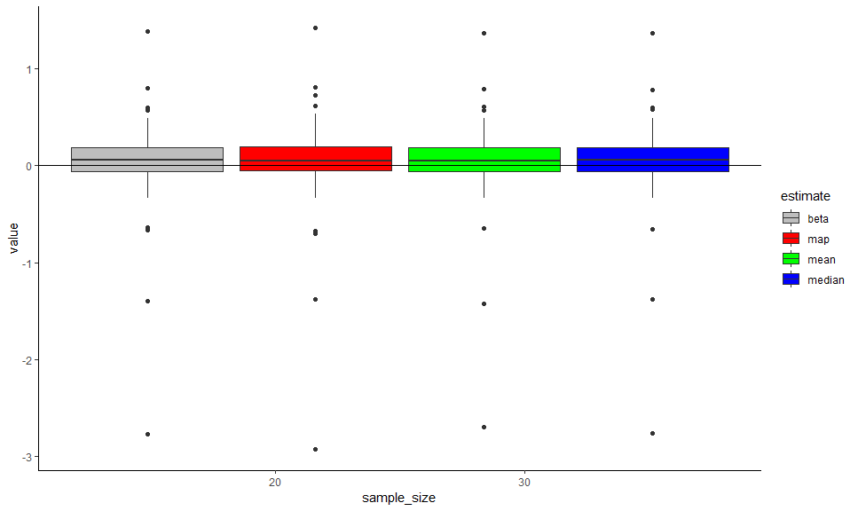
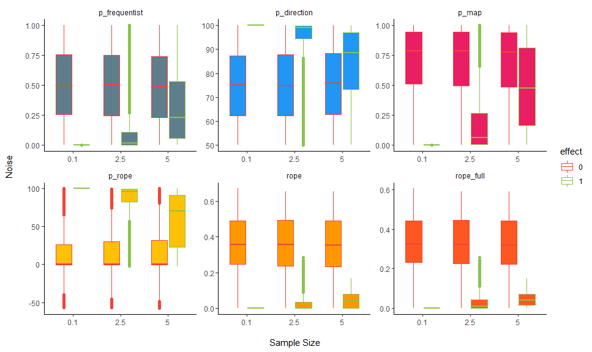
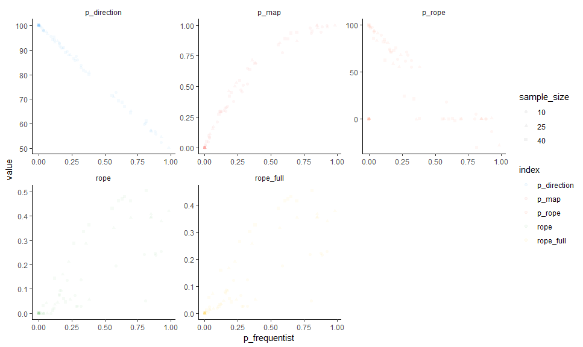
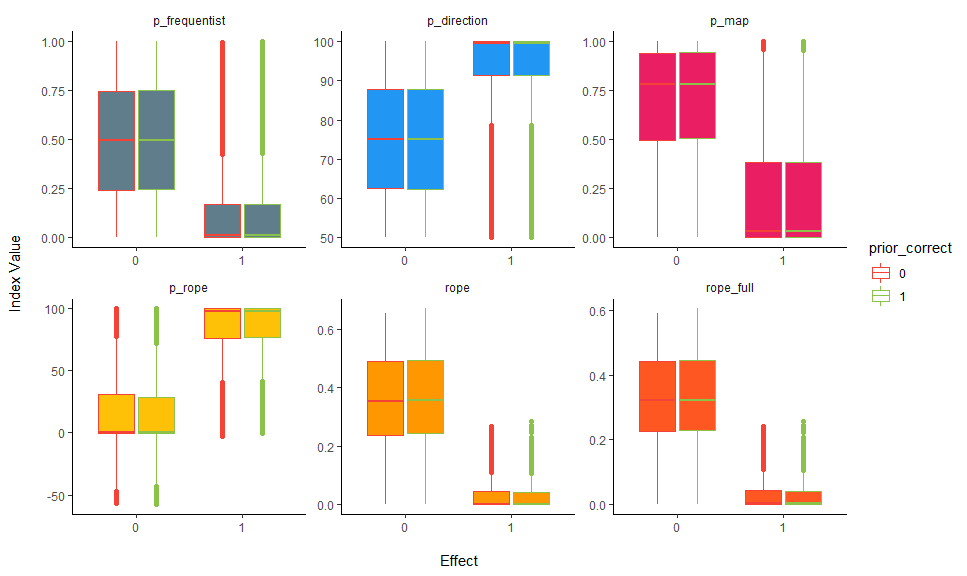
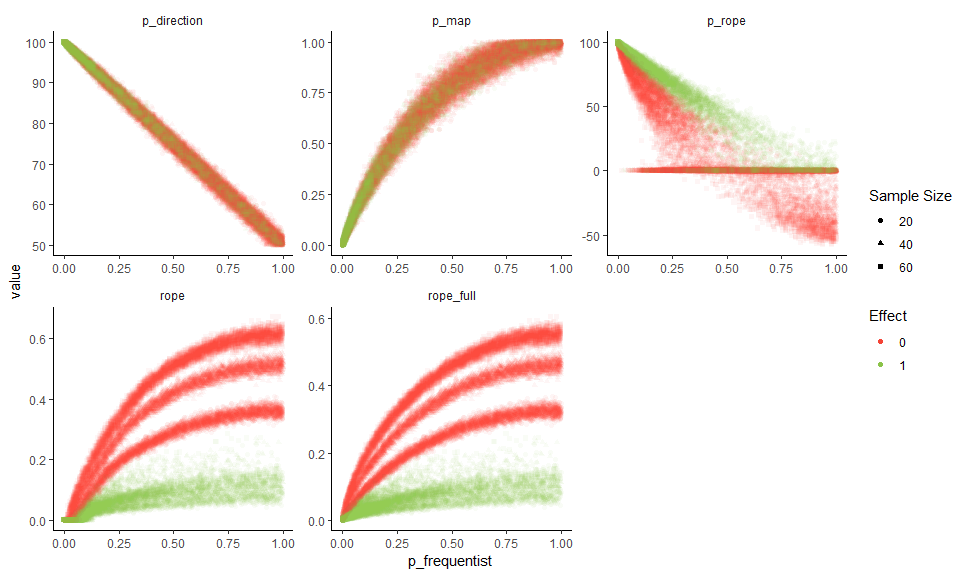
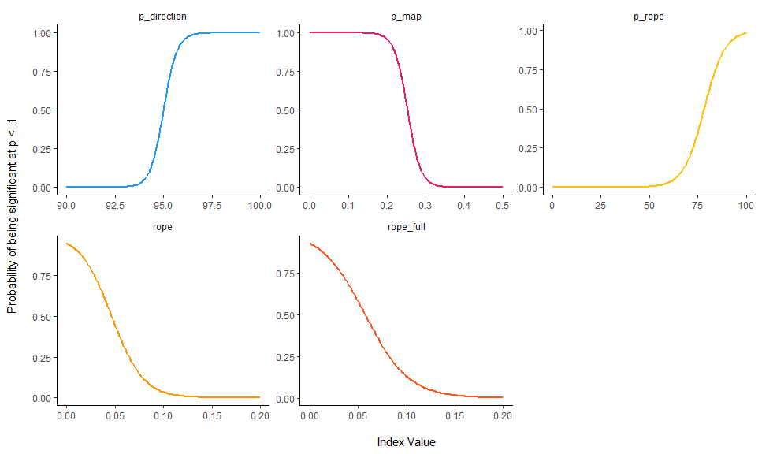
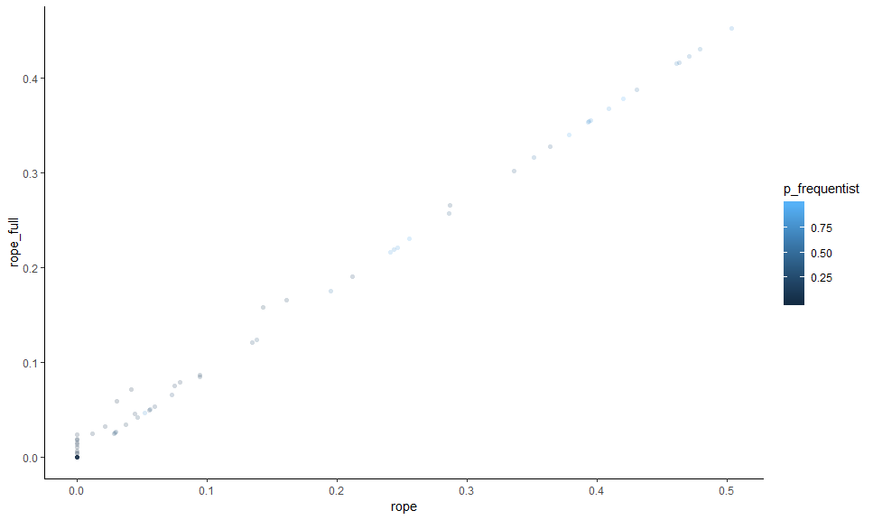
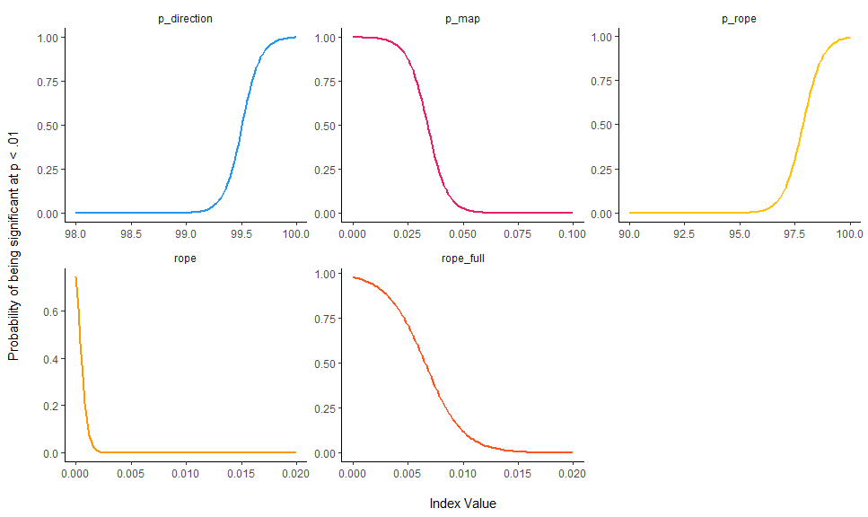
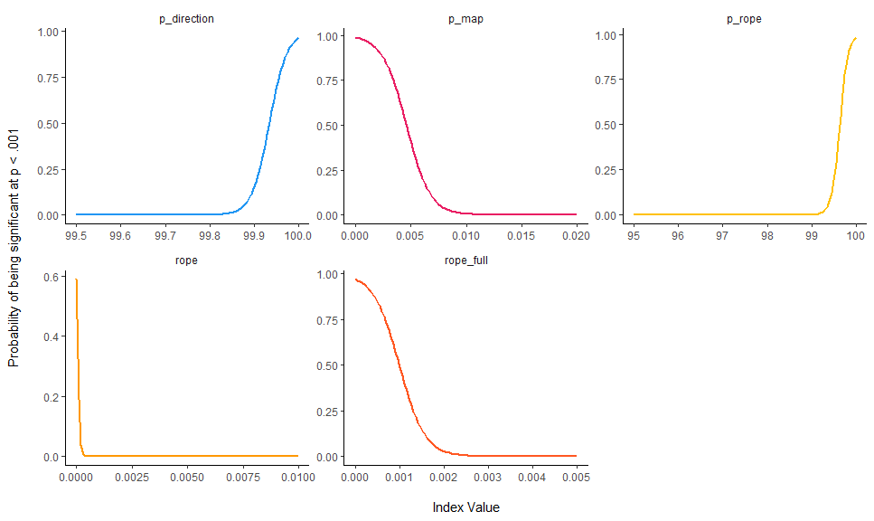

bayestestR
================

-   [Goal](#goal)
-   [Installation](#installation)
-   [Functions](#functions)
    -   [Posterior Description](#posterior-description)
    -   [Null-Hypothesis Significance Testing (NHST)](#null-hypothesis-significance-testing-nhst)
    -   [Utilities](#utilities)
-   [Comparison of Indices for Parameter's Posteriors Description in the Bayesian Framework](#comparison-of-indices-for-parameters-posteriors-description-in-the-bayesian-framework)
    -   [Generate Regression Data with Noise](#generate-regression-data-with-noise)
    -   [Comparison of Parameter's Point-Estimates](#comparison-of-parameters-point-estimates)
        -   [Relationship with the theorethical true value](#relationship-with-the-theorethical-true-value)
        -   [Relationship with the frequentist beta](#relationship-with-the-frequentist-beta)
    -   [Comparison of Indices of Effect Existence](#comparison-of-indices-of-effect-existence)
        -   [Effect Detection](#effect-detection)
        -   [Relationship with the frequentist's *p* value](#relationship-with-the-frequentists-p-value)
    -   [Reporting Guidelines](#reporting-guidelines)
    -   [:warning: Frequentist-like Arbitrary Thresholds](#warning-frequentist-like-arbitrary-thresholds)
-   [Credits](#credits)

[](https://travis-ci.org/DominiqueMakowski/bayestestR) [](https://codecov.io/gh/DominiqueMakowski/bayestestR) [](http://hits.dwyl.io/DominiqueMakowski/bayestestR)

Understand and Describe Bayesian Models and Posterior Distributions.

------------------------------------------------------------------------

Goal
====

`bayestestR` is a lightweight package providing utilities to describe posterior distributions and Bayesian models.

Installation
============

Run the following:

``` r
install.packages("devtools")
library("devtools")
install_github("DominiqueMakowski/bayestestR")
```

``` r
library("bayestestR")
```

------------------------------------------------------------------------

Functions
=========

Posterior Description
---------------------

-   **`hdi()`**: Compute the highest density interval (HDI) of a posterior distribution, i.e., the interval which contains all points within the interval have a higher probability density than points outside the interval.

``` r
posterior <- rnorm(1000)
hdi(posterior, CI = 90)
hdi(posterior, CI = c(80, 90, 95))
```

-   **`map_estimate()`**: Find the Highest Maximum A Posteriori (MAP) estimate of a posterior.

``` r
map_estimate(rnorm(1000, 1, 1))
```

-   **`rope()`**: Compute the proportion of the HDI of a posterior distribution that lies within a region of practical equivalence.

``` r
rope(posterior = rnorm(1000, 1, 1), bounds = c(-0.1, 0.1))
```

Null-Hypothesis Significance Testing (NHST)
-------------------------------------------

-   **`rope_test()`**: Perform a Test for Practical Equivalence based on the "HDI+ROPE decision rule" (Kruschke 2018) to check whether parameter values should be accepted or rejected against an explicitely formulated "null hypothesis".

``` r
rope_test(posterior = rnorm(1000, 1, 1), bounds = c(-0.1, 0.1))
```

-   **`p_rope()`**: The ROPE-based p-value represents the maximum Credible Interval (HDI) that does not contain (positive values) or is entirely contained (negative values) in the negligible values space defined by the ROPE. A ROPE-based p of 97% means that there is a probability of .97 that a parameter (desccribed by its posterior distribution) is outside the ROPE.

``` r
p_rope(posterior = rnorm(1000, 1, 1), bounds = c(-0.1, 0.1))
```

-   **`p_direction()`**: Compute the Probability of Direction (p, also known as the Maximum Probability of Effect - MPE), a Bayesian equivalent of the p-value (altough differently expressed). It varies between 50% and 100% and can be interpreted as the probability that a parameter (described by its posterior distribution) is positive or negative (following the median's sign). It is defined as the proportion of the posterior distribution of the median's sign. It is used as an index of effect existence, i.e., whether the probability that the effect is in the same direction than the point-estimate (independently of the effect's size or significance). This p-value is fairly similar to its frequentist counterpart (i.e., is strongly correlated).

``` r
p_direction(rnorm(1000, mean = 1, sd = 1))
```

-   **`p_map()`**: Compute a Bayesian equivalent of the p-value, related to the odds that a parameter (described by its posterior distribution) has againt the null hypothesis (h0) using Mills' (2014, 2017) Objective Bayesian Hypothesis Testing paradigm. It is mathematically based on the density at the Maximum A Priori (MAP).

``` r
p_map(posterior = rnorm(1000, 1, 1))
```

Utilities
---------

-   **`rnorm_perfect()`**: Generate a sample of size n with a near-perfect normal distribution.

``` r
x <- rnorm_perfect(n = 10)
plot(density(x))
```


------------------------------------------------------------------------

Comparison of Indices for Parameter's Posteriors Description in the Bayesian Framework
======================================================================================

Generate Regression Data with Noise
-----------------------------------

``` r
library(ggplot2)
library(dplyr)
library(tidyr)

df <- read.csv("https://raw.github.com/DominiqueMakowski/bayestestR/master/data/bayes_indices.csv")
```

For the sake of time and computational space, we downloaded the data from github. However, you can find the code to generate it again below (*takes about 1h*).

``` r
library(bayestestR)
library(rstanarm)
library(broom)

# options(mc.cores = parallel::detectCores())
set.seed(333)

generate_data <- function(sample_size, noise, correlation=1){
  data <- data.frame(x = scale(rnorm(sample_size, 0, 1)))
  if(correlation==1){
    data$y <- scale(data$x)
    data$y <- data$y + rnorm(sample_size, mean = 0, sd = noise)
  } else{
    data$y <- scale(rnorm(sample_size, 0, 1))
  }
  return(data)
}


# df <- read.csv("https://raw.github.com/DominiqueMakowski/bayestestR/master/data/bayes_indices.csv")
# df <- read.csv("../data/bayes_indices.csv")
df <- data.frame() # Uncomment this if you want to reset the data

for(noise in c(0.1, seq(2.5, 5, by=2.5))){
  for(sample_size in c(20, 40, 60)){
    print(paste0(noise, "-", sample_size))
    for(effect in c(0, 1)){
      for(prior in c(0, 1)){
        for(i in 1:1000){
          cat(".")
          data <- generate_data(sample_size, noise, effect)
    
          freq_model <- lm(y ~ x, data=data)
          summary(freq_model)
          beta <- broom::tidy(freq_model)[2, ]$estimate
          p_frequentist <- broom::tidy(freq_model)[2, ]$p.value
    
          out <- capture.output(bayes_model <- rstanarm::stan_glm(y ~ x, 
                                                                  data=data, 
                                                                  chains=2,
                                                                  prior=normal(location=prior)))
          posterior <- as.data.frame(bayes_model)$x
    
          median <- median(posterior)
          mean <- mean(posterior)
          map <- map_estimate(posterior)[1]
    
          p_direction <- p_direction(posterior)
          rope <- rope(posterior, bounds = c(-0.1, 0.1))
          rope_full <- rope(posterior, bounds = c(-0.1, 0.1), CI=100)
          p_rope <- p_rope(posterior, bounds = c(-0.1, 0.1))
          p_map <- p_map(posterior)
    
          df <- rbind(df,
                       data.frame(effect=effect,
                                  noise=noise,
                                  sample_size=sample_size,
                                  prior=prior,
                                  prior_correct=abs(1-abs(effect-prior)),
                                  iteration=i,
                                  beta = beta,
                                  median = median,
                                  mean = mean,
                                  map = map,
                                  p_frequentist = p_frequentist,
                                  p_direction = p_direction,
                                  rope = rope,
                                  rope_full = rope_full,
                                  p_rope=p_rope,
                                  p_map = p_map))
        }
      }
    }
  }
  write.csv(df, "../data/bayes_indices.csv", row.names = FALSE)
}
```

Comparison of Parameter's Point-Estimates
-----------------------------------------

### Relationship with the theorethical true value

#### Sensitivity to Noise

``` r
df %>%
  select(noise, beta, prior_correct, effect, median, mean, map) %>%
  gather(estimate, value, -noise, -effect, -prior_correct) %>%
  mutate(noise = as.factor(noise),
         prior_correct = as.factor(prior_correct),
         value = value-effect) %>%
  ggplot(aes(x = noise, y = value, fill = estimate, color=prior_correct)) +
  geom_boxplot() +
  geom_hline(yintercept = 0) +
  theme_classic() +
  scale_fill_manual(values = c("beta" = "#607D8B", "map" = "#795548", "mean" = "#FF9800", "median" = "#FFEB3B"),
                    name = "Index") +
  scale_color_manual(values = c(`0`="#f44336", `1`="#8BC34A"),
                     name = "Correct Prior") +
  xlab("Point-estimate of the true value 0\n") +
  ylab("\nNoise") +
  coord_cartesian(ylim=c(-1, 1))
```


#### Sensitivity to Sample Size

``` r
df %>%
  select(sample_size, beta, effect, prior_correct, median, mean, map) %>%
  gather(estimate, value, -sample_size, -effect, -prior_correct) %>%
  mutate(sample_size = as.factor(sample_size),
         prior_correct = as.factor(prior_correct),
         value = value-effect) %>%
  ggplot(aes(x = sample_size, y = value, fill = estimate, color=prior_correct)) +
  geom_boxplot() +
  geom_hline(yintercept = 0) +
  theme_classic() +
  scale_fill_manual(values = c("beta" = "#607D8B", "map" = "#795548", "mean" = "#FF9800", "median" = "#FFEB3B"),
                    name = "Index") +
  scale_color_manual(values = c(`0`="#f44336", `1`="#8BC34A"),
                     name = "Correct Prior") +
  ylab("Point-estimate of the true value 0\n") +
  xlab("\nSample Size") +
  coord_cartesian(ylim=c(-1, 1))
```



#### Summary

``` r
df %>%
  select(sample_size, beta, effect, prior_correct, median, mean, map, noise) %>%
  gather(estimate, value, -sample_size, -effect, -prior_correct, -noise) %>%
  mutate(noise= scale(noise),
         sample_size = scale(sample_size),
         prior_correct = as.factor(prior_correct)) %>% 
  glm(effect ~ estimate/value * noise * sample_size * prior_correct, data=., family="binomial") %>% 
  broom::tidy() %>% 
  select(term, estimate, p=p.value) %>% 
  filter(stringr::str_detect(term, 'value')) %>% 
  mutate(term = stringr::str_remove(term, ":value"),
         term = stringr::str_remove(term, "estimate"),
         p = ifelse(p < .001, "< .001***", ifelse(p < .01, "< .01**", ifelse(p < .05, "< .05*", "> .05")))) %>% 
  knitr::kable(digits=2)
```

| term                                      |  estimate| p               |
|:------------------------------------------|---------:|:----------------|
| beta                                      |     12.54| &lt; .001\*\*\* |
| map                                       |     12.30| &lt; .001\*\*\* |
| mean                                      |     12.49| &lt; .001\*\*\* |
| median                                    |     12.50| &lt; .001\*\*\* |
| beta:noise                                |     -6.74| &lt; .001\*\*\* |
| map:noise                                 |     -6.61| &lt; .001\*\*\* |
| mean:noise                                |     -6.72| &lt; .001\*\*\* |
| median:noise                              |     -6.73| &lt; .001\*\*\* |
| beta:sample\_size                         |      5.03| &lt; .001\*\*\* |
| map:sample\_size                          |      4.95| &lt; .001\*\*\* |
| mean:sample\_size                         |      4.99| &lt; .001\*\*\* |
| median:sample\_size                       |      4.99| &lt; .001\*\*\* |
| beta:prior\_correct1                      |     -0.64| &gt; .05        |
| map:prior\_correct1                       |     -0.67| &gt; .05        |
| mean:prior\_correct1                      |     -0.53| &gt; .05        |
| median:prior\_correct1                    |     -0.53| &gt; .05        |
| beta:noise:sample\_size                   |     -2.48| &lt; .001\*\*\* |
| map:noise:sample\_size                    |     -2.43| &lt; .001\*\*\* |
| mean:noise:sample\_size                   |     -2.45| &lt; .001\*\*\* |
| median:noise:sample\_size                 |     -2.46| &lt; .001\*\*\* |
| beta:noise:prior\_correct1                |      0.55| &gt; .05        |
| map:noise:prior\_correct1                 |      0.61| &gt; .05        |
| mean:noise:prior\_correct1                |      0.51| &gt; .05        |
| median:noise:prior\_correct1              |      0.51| &gt; .05        |
| beta:sample\_size:prior\_correct1         |     -0.47| &gt; .05        |
| map:sample\_size:prior\_correct1          |     -0.52| &gt; .05        |
| mean:sample\_size:prior\_correct1         |     -0.44| &gt; .05        |
| median:sample\_size:prior\_correct1       |     -0.44| &gt; .05        |
| beta:noise:sample\_size:prior\_correct1   |      0.44| &gt; .05        |
| map:noise:sample\_size:prior\_correct1    |      0.48| &gt; .05        |
| mean:noise:sample\_size:prior\_correct1   |      0.42| &gt; .05        |
| median:noise:sample\_size:prior\_correct1 |      0.43| &gt; .05        |

### Relationship with the frequentist beta

Comparison of Indices of Effect Existence
-----------------------------------------

### Effect Detection

#### Sensitivity to Noise

``` r
df %>%
  select(noise, effect, sample_size, p_frequentist, p_direction, p_map, p_rope, rope, rope_full) %>%
  gather(index, value, -noise, -sample_size, -effect) %>%
  mutate(noise = as.factor(noise),
         effect = as.factor(effect),
         index = factor(index, levels=c("p_frequentist", "p_direction", "p_map", "p_rope", "rope", "rope_full"))) %>%
  ggplot(aes(x = noise, y=value, color = effect, fill=index)) +
  geom_boxplot() +
  facet_wrap(~index, scales = "free") +
  theme_classic() +
  theme(strip.background = element_blank()) +
  scale_color_manual(values = c(`0` = "#f44336", `1` = "#8BC34A", name="Effect")) +
  scale_fill_manual(values = c("p_frequentist"="#607D8B", "p_map" = "#E91E63", "p_direction" = "#2196F3", 
                               "rope" = "#FF9800", "rope_full" = "#FF5722", "p_rope"="#FFC107"), guide=FALSE) +
  ylab("Noise\n") +
  xlab("\nSample Size") 
```



#### Sensitivity to Sample Size

``` r
df %>%
  select(noise, effect, sample_size, p_frequentist, p_direction, p_map, p_rope, rope, rope_full) %>%
  gather(index, value, -noise, -sample_size, -effect) %>%
  mutate(sample_size = as.factor(sample_size),
         effect = as.factor(effect),
         index = factor(index, levels=c("p_frequentist", "p_direction", "p_map", "p_rope", "rope", "rope_full"))) %>%
  ggplot(aes(x = sample_size, y=value, color = effect, fill=index)) +
  geom_boxplot() +
  facet_wrap(~index, scales = "free") +
  theme_classic() +
  theme(strip.background = element_blank()) +
  scale_color_manual(values = c(`0` = "#f44336", `1` = "#8BC34A", name="Effect")) +
  scale_fill_manual(values = c("p_frequentist"="#607D8B", "p_map" = "#E91E63", "p_direction" = "#2196F3", 
                               "rope" = "#FF9800", "rope_full" = "#FF5722", "p_rope"="#FFC107"), guide=FALSE) +
  ylab("Index Value\n") +
  xlab("\nSample Size") 
```



#### Sensitivity to Priors

``` r
df %>%
  select(noise, effect, sample_size, p_frequentist, p_direction, p_map, p_rope, rope, rope_full, prior_correct) %>%
  gather(index, value, -noise, -sample_size, -effect, -prior_correct) %>%
  mutate(sample_size = as.factor(sample_size),
         effect = as.factor(effect),
         prior_correct = as.factor(prior_correct),
         index = factor(index, levels=c("p_frequentist", "p_direction", "p_map", "p_rope", "rope", "rope_full"))) %>%
  ggplot(aes(x = effect, y=value, color = prior_correct, fill=index)) +
  geom_boxplot() +
  facet_wrap(~index, scales = "free") +
  theme_classic() +
  theme(strip.background = element_blank()) +
  scale_color_manual(values = c(`0` = "#f44336", `1` = "#8BC34A", name="Correct Prior")) +
  scale_fill_manual(values = c("p_frequentist"="#607D8B", "p_map" = "#E91E63", "p_direction" = "#2196F3", 
                               "rope" = "#FF9800", "rope_full" = "#FF5722", "p_rope"="#FFC107"), guide=FALSE) +
  ylab("Index Value\n") +
  xlab("\nEffect") 
```



#### Summary

``` r
df %>%
  mutate(p_frequentist = scale(p_frequentist),
         p_direction = scale(p_direction),
         p_map = scale(p_map),
         p_rope = scale(p_rope),
         rope = scale(rope),
         rope_full = scale(rope_full)) %>% 
  select(noise, effect, sample_size, p_frequentist, p_direction, p_map, p_rope, rope, rope_full, prior_correct) %>%
  gather(index, value, -noise, -sample_size, -effect, -prior_correct) %>%
  mutate(sample_size = scale(sample_size),
         noise=scale(noise),
         effect = as.factor(effect),
         prior_correct = as.factor(prior_correct),
         index = factor(index, levels=c("p_frequentist", "p_direction", "p_map", "p_rope", "rope", "rope_full"))) %>%
  glm(effect ~ index/value * noise * sample_size * prior_correct, data=., family="binomial") %>% 
  broom::tidy() %>% 
  select(term, estimate, p=p.value) %>% 
  filter(stringr::str_detect(term, 'value')) %>%
  mutate(term = stringr::str_remove(term, ":value"),
         term = stringr::str_remove(term, "index"),
         p = ifelse(p < .001, "< .001***", ifelse(p < .01, "< .01**", ifelse(p < .05, "< .05*", "> .05")))) %>%
  knitr::kable(digits=2)
```

| term                                              |  estimate| p               |
|:--------------------------------------------------|---------:|:----------------|
| p\_frequentist                                    |     -3.41| &lt; .001\*\*\* |
| p\_direction                                      |      3.39| &lt; .001\*\*\* |
| p\_map                                            |     -2.60| &lt; .001\*\*\* |
| p\_rope                                           |      3.25| &lt; .001\*\*\* |
| rope                                              |     -5.85| &lt; .001\*\*\* |
| rope\_full                                        |     -7.07| &lt; .001\*\*\* |
| p\_frequentist:noise                              |      2.22| &lt; .001\*\*\* |
| p\_direction:noise                                |     -2.20| &lt; .001\*\*\* |
| p\_map:noise                                      |      1.44| &lt; .001\*\*\* |
| p\_rope:noise                                     |     -1.47| &lt; .001\*\*\* |
| rope:noise                                        |      0.99| &lt; .001\*\*\* |
| rope\_full:noise                                  |      0.67| &lt; .001\*\*\* |
| p\_frequentist:sample\_size                       |     -1.46| &lt; .001\*\*\* |
| p\_direction:sample\_size                         |      1.43| &lt; .001\*\*\* |
| p\_map:sample\_size                               |     -0.84| &lt; .001\*\*\* |
| p\_rope:sample\_size                              |      0.98| &lt; .001\*\*\* |
| rope:sample\_size                                 |     -0.46| &lt; .001\*\*\* |
| rope\_full:sample\_size                           |     -0.30| &lt; .05\*      |
| p\_frequentist:prior\_correct1                    |      0.01| &gt; .05        |
| p\_direction:prior\_correct1                      |      0.03| &gt; .05        |
| p\_map:prior\_correct1                            |      0.00| &gt; .05        |
| p\_rope:prior\_correct1                           |     -0.05| &gt; .05        |
| rope:prior\_correct1                              |      0.13| &gt; .05        |
| rope\_full:prior\_correct1                        |      0.17| &gt; .05        |
| p\_frequentist:noise:sample\_size                 |      0.95| &lt; .001\*\*\* |
| p\_direction:noise:sample\_size                   |     -0.93| &lt; .001\*\*\* |
| p\_map:noise:sample\_size                         |      0.42| &lt; .001\*\*\* |
| p\_rope:noise:sample\_size                        |     -0.49| &lt; .001\*\*\* |
| rope:noise:sample\_size                           |      0.50| &lt; .001\*\*\* |
| rope\_full:noise:sample\_size                     |      0.45| &lt; .001\*\*\* |
| p\_frequentist:noise:prior\_correct1              |     -0.01| &gt; .05        |
| p\_direction:noise:prior\_correct1                |     -0.02| &gt; .05        |
| p\_map:noise:prior\_correct1                      |      0.00| &gt; .05        |
| p\_rope:noise:prior\_correct1                     |      0.07| &gt; .05        |
| rope:noise:prior\_correct1                        |     -0.04| &gt; .05        |
| rope\_full:noise:prior\_correct1                  |     -0.06| &gt; .05        |
| p\_frequentist:sample\_size:prior\_correct1       |     -0.05| &gt; .05        |
| p\_direction:sample\_size:prior\_correct1         |      0.07| &gt; .05        |
| p\_map:sample\_size:prior\_correct1               |     -0.03| &gt; .05        |
| p\_rope:sample\_size:prior\_correct1              |      0.01| &gt; .05        |
| rope:sample\_size:prior\_correct1                 |     -0.04| &gt; .05        |
| rope\_full:sample\_size:prior\_correct1           |     -0.20| &gt; .05        |
| p\_frequentist:noise:sample\_size:prior\_correct1 |      0.01| &gt; .05        |
| p\_direction:noise:sample\_size:prior\_correct1   |     -0.03| &gt; .05        |
| p\_map:noise:sample\_size:prior\_correct1         |      0.00| &gt; .05        |
| p\_rope:noise:sample\_size:prior\_correct1        |      0.02| &gt; .05        |
| rope:noise:sample\_size:prior\_correct1           |      0.00| &gt; .05        |
| rope\_full:noise:sample\_size:prior\_correct1     |     -0.11| &gt; .05        |

### Relationship with the frequentist's *p* value

``` r
df %>%
  select(noise, sample_size, p_frequentist, p_direction, p_map, p_rope, rope, rope_full, effect) %>%
  gather(index, value, -noise, -p_frequentist, -sample_size, -effect) %>%
  mutate(effect = as.factor(effect),
         sample_size = as.factor(sample_size),
         index = factor(index, levels=c("p_frequentist", "p_direction", "p_map", "p_rope", "rope", "rope_full"))) %>% 
  ggplot(aes(x = p_frequentist, y = value, color = effect, shape=sample_size)) +
  geom_point(alpha=0.05) +
  facet_wrap(~index, scales = "free") +
  theme_classic() +
  theme(strip.background = element_blank()) +
  scale_color_manual(values = c(`0` = "#f44336", `1` = "#8BC34A"), name="Effect") +
  guides(colour = guide_legend(override.aes = list(alpha = 1)),
         shape = guide_legend(override.aes = list(alpha = 1), title="Sample Size"))
```



#### Relationship with frequentist's arbitrary clusters

``` r
df$sig_1 <- factor(ifelse(df$p_frequentist >= .1, "n.s.", "-"), levels=c("n.s.", "-"))
df$sig_05 <- factor(ifelse(df$p_frequentist >= .05, "n.s.", "*"), levels=c("n.s.", "*"))
df$sig_01 <- factor(ifelse(df$p_frequentist >= .01, "n.s.", "**"), levels=c("n.s.", "**"))
df$sig_001 <- factor(ifelse(df$p_frequentist >= .001, "n.s.", "***"), levels=c("n.s.", "***"))

get_data <- function(predictor, outcome, lbound=0, ubound=0.3){
  fit <- glm(paste(outcome, "~", predictor), data=df, family = "binomial")
  data <- data.frame(x=1:100)
  data[predictor] <- seq(lbound, ubound, length.out = 100)
  data$index <- predictor
  data[outcome] = predict(fit, newdata=data, type="response")
  data <- select_(data, "value"=predictor, outcome, "index")
  return(data)
}
```

##### Significant at .1

``` r
rbind(
  get_data(predictor="p_map", outcome="sig_1", lbound=0, ubound=0.5),
  get_data(predictor="p_direction", outcome="sig_1", lbound=90, ubound=100),
  get_data(predictor="rope", outcome="sig_1", lbound=0, ubound=0.2),
  get_data(predictor="rope_full", outcome="sig_1", lbound=0, ubound=0.2),
  get_data(predictor="p_rope", outcome="sig_1", lbound=0, ubound=100)
  ) %>% 
  mutate(index = as.factor(index)) %>%
  ggplot(aes(x=value, y=sig_1, color=index)) +
  geom_line(size=1) +
  facet_wrap(~index, scales = "free") +
  theme_classic() +
  theme(strip.background = element_blank()) +
  scale_color_manual(values = c("p_frequentist"="#607D8B", "p_map" = "#E91E63", "p_direction" = "#2196F3", 
                               "rope" = "#FF9800", "rope_full" = "#FF5722", "p_rope"="#FFC107"), guide=FALSE) +
  ylab("Probability of being significant at p < .1\n") +
  xlab("\nIndex Value")
```



##### Significant at .05

``` r
rbind(
  get_data(predictor="p_map", outcome="sig_05", lbound=0, ubound=0.3),
  get_data(predictor="p_direction", outcome="sig_05", lbound=95, ubound=100),
  get_data(predictor="rope", outcome="sig_05", lbound=0, ubound=0.1),
  get_data(predictor="rope_full", outcome="sig_05", lbound=0, ubound=0.1),
  get_data(predictor="p_rope", outcome="sig_05", lbound=70, ubound=100)
  ) %>% 
  mutate(index = as.factor(index)) %>%
  ggplot(aes(x=value, y=sig_05, color=index)) +
  geom_line(size=1) +
  facet_wrap(~index, scales = "free") +
  theme_classic() +
  theme(strip.background = element_blank()) +
  scale_color_manual(values = c("p_frequentist"="#607D8B", "p_map" = "#E91E63", "p_direction" = "#2196F3", 
                               "rope" = "#FF9800", "rope_full" = "#FF5722", "p_rope"="#FFC107"), guide=FALSE) +
  ylab("Probability of being significant at p < .05\n") +
  xlab("\nIndex Value")
```



##### Significant at .01

``` r
rbind(
  get_data(predictor="p_map", outcome="sig_01", lbound=0, ubound=0.1),
  get_data(predictor="p_direction", outcome="sig_01", lbound=98, ubound=100),
  get_data(predictor="rope", outcome="sig_01", lbound=0, ubound=0.02),
  get_data(predictor="rope_full", outcome="sig_01", lbound=0, ubound=0.02),
  get_data(predictor="p_rope", outcome="sig_01", lbound=90, ubound=100)
  ) %>% 
  mutate(index = as.factor(index)) %>%
  ggplot(aes(x=value, y=sig_01, color=index)) +
  geom_line(size=1) +
  facet_wrap(~index, scales = "free") +
  theme_classic() +
  theme(strip.background = element_blank()) +
  scale_color_manual(values = c("p_frequentist"="#607D8B", "p_map" = "#E91E63", "p_direction" = "#2196F3", 
                               "rope" = "#FF9800", "rope_full" = "#FF5722", "p_rope"="#FFC107"), guide=FALSE) +
  ylab("Probability of being significant at p < .01\n") +
  xlab("\nIndex Value")
```



##### Significant at .001

``` r
rbind(
  get_data(predictor="p_map", outcome="sig_001", lbound=0, ubound=0.02),
  get_data(predictor="p_direction", outcome="sig_001", lbound=99.5, ubound=100),
  get_data(predictor="rope", outcome="sig_001", lbound=0, ubound=0.01),
  get_data(predictor="rope_full", outcome="sig_001", lbound=0, ubound=0.005),
  get_data(predictor="p_rope", outcome="sig_001", lbound=95, ubound=100)
  ) %>% 
  mutate(index = as.factor(index)) %>%
  ggplot(aes(x=value, y=sig_001, color=index)) +
  geom_line(size=1) +
  facet_wrap(~index, scales = "free") +
  theme_classic() +
  theme(strip.background = element_blank()) +
  scale_color_manual(values = c("p_frequentist"="#607D8B", "p_map" = "#E91E63", "p_direction" = "#2196F3", 
                               "rope" = "#FF9800", "rope_full" = "#FF5722", "p_rope"="#FFC107"), guide=FALSE) +
  ylab("Probability of being significant at p < .001\n") +
  xlab("\nIndex Value")
```



<!-- ### Relationship with Noise -->
<!-- ```{r, message=FALSE, warning=FALSE} -->
<!-- df %>%  -->
<!--   select(noise, p, p_map, p_direction, rope, rope_overlap) %>%  -->
<!--   gather(index, value, -noise) %>%  -->
<!--   mutate(noise = as.factor(noise)) %>% -->
<!--   ggplot(aes(x=noise, y=value, fill=index)) + -->
<!--   geom_boxplot() + -->
<!--   # geom_point() + -->
<!--   # geom_smooth(method="loess") + -->
<!--   facet_wrap(~index, scales="free") + -->
<!--   theme_classic() + -->
<!--   theme(strip.background = element_blank()) + -->
<!--   scale_fill_manual(values=c("p"="#9C27B0", "p_map"="#f44336", "p_direction"="#2196F3", "rope"="#4CAF50", "rope_overlap"="#FFC107")) -->
<!-- ``` -->
<!-- ```{r, message=FALSE, warning=FALSE} -->
<!-- summary(lm(p ~ noise, data=df)) -->
<!-- summary(lm(p_map ~ noise, data=df)) -->
<!-- summary(lm(p_direction ~ noise, data=df)) -->
<!-- summary(lm(rope ~ noise, data=df)) -->
<!-- summary(lm(rope_overlap ~ noise, data=df)) -->
<!-- ``` -->
Reporting Guidelines
--------------------

From that, we can conclude:

-   For simple models and normally distributed posteriors, the **MAP estimate** seems to be more biased than the mean and the median of the posterior distribution.
-   Aside from being more robust, the **median** makes more sense than the **mean** in a probabilistic framework (*e.g.*, there is 50% chance that the true effect is either higher or lower than the median).
-   The **traditional ROPE** is not sensitive to delineate highly "significant" effects. The full ROPE does not present the same flaw.
-   The **Probability of Direction (p)** is the closest index to the frequentist *p* value.

**To minimally describe the posterior distribution of a parameter, we suggest reporting the *median* and the *90% CI (the 90% HDI)* for parameter characterisation and, in the context of null-hypothesis testing, the Probability of Direction (*p*d) for effect existence and, especially in the context of confirmatory analyses, the ROPE (full) with an explicitly specified range for effect significance.**

:warning: Frequentist-like Arbitrary Thresholds
-----------------------------------------------

**The following thresholds are presented as landmarks only for comparison with the frequentist framework. Please consider with caution.**

-   **p (direction)**

    -   *p* (direction) &lt; 95% ~ *p* &lt; .1: uncertain
    -   *p* (direction) &gt; 95% ~ *p* &lt; .1: possibly existing
    -   *p* (direction) &gt; 97.5% ~ *p* &lt; .05: likely existing
    -   *p* (direction) &gt; 99% ~ *p* &lt; .01: probably existing
    -   *p* (direction) &gt; 99.9% ~ *p* &lt; .001: certainly existing
    -   *p* (direction) = 100%: definitely existing

-   **ROPE (full)**

    -   Depends on other parameters such as sample size and ROPE bounds

*Note: If you have any advice, opinion or such, we encourage you to let us know by opening an [discussion thread](https://github.com/DominiqueMakowski/bayestestR/issues) or making a pull request.*

Credits
=======

You can cite the package as following:

-   Makowski, (2019). *Understand and Describe Bayesian Models and Posterior Distributions using BayestestR*. CRAN. doi: .

Please remember that parts of the code in this package was inspired / shamelessly copied from other great packages that you must check out and cite, such as [sjstats](https://github.com/strengejacke/sjstats) or [BayesTesting.jl](https://github.com/tszanalytics/BayesTesting.jl). All credits go to their authors.
