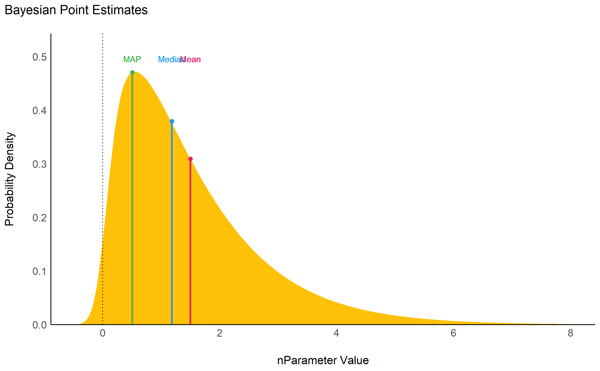
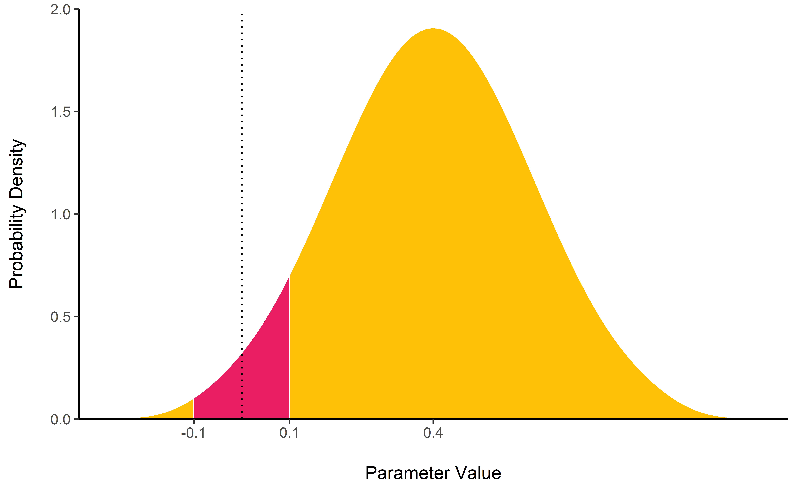
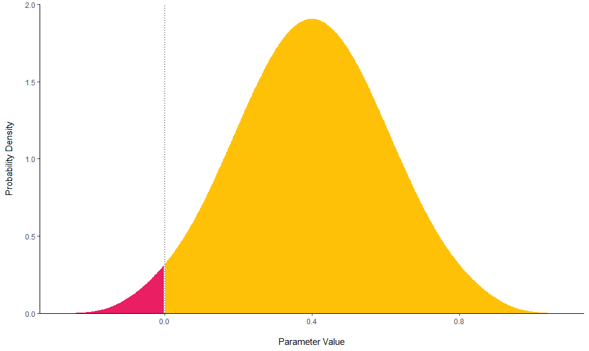
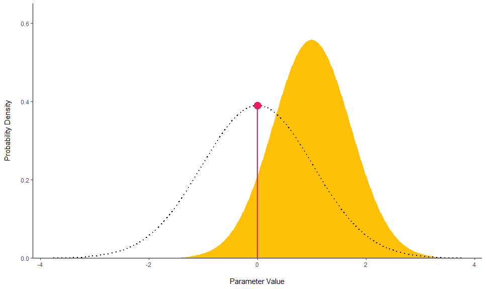
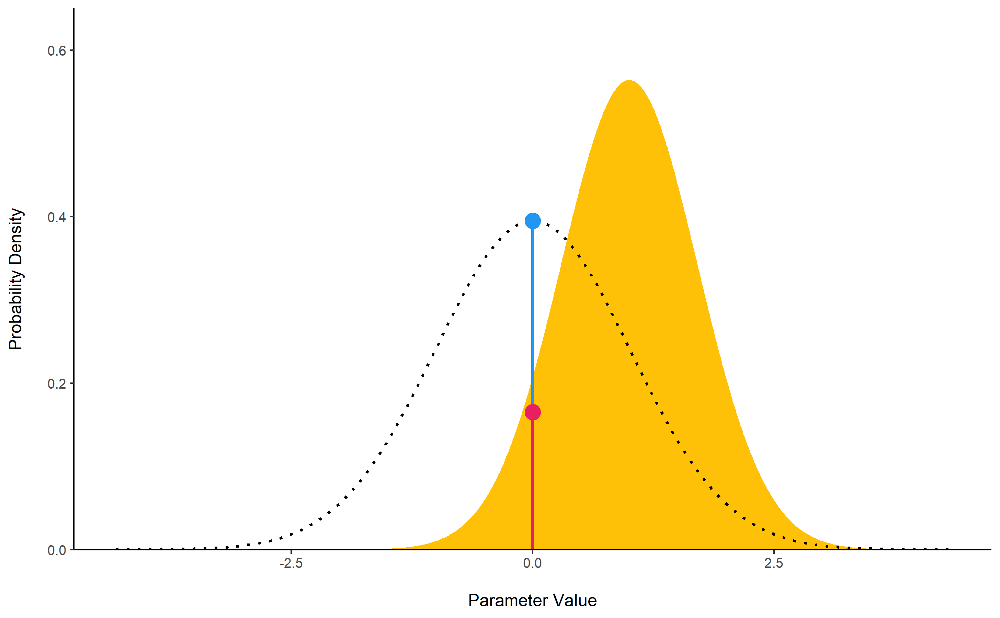

# bayestestR 

[](https://doi.org/10.21105/joss.01541)
[](https://CRAN.R-project.org/package=bayestestR)
[](https://lifecycle.r-lib.org/articles/stages.html)

***Become a Bayesian master you will***

------------------------------------------------------------------------

:warning: We changed the default the CI width! Please make an [informed
decision](https://easystats.github.io/bayestestR/articles/credible_interval.html)
and set it explicitly (`ci = 0.89`, `ci = 0.95` or anything else that
you decide) :warning:

------------------------------------------------------------------------

Existing R packages allow users to easily fit a large variety of models
and extract and visualize the posterior draws. However, most of these
packages only return a limited set of indices (e.g., point-estimates and
CIs). **bayestestR** provides a comprehensive and consistent set of
functions to analyze and describe posterior distributions generated by a
variety of models objects, including popular modeling packages such as
**rstanarm**, **brms** or **BayesFactor**.

You can reference the package and its documentation as follows:

- Makowski, D., Ben-Shachar, M. S., & Lüdecke, D. (2019). *bayestestR:
  Describing Effects and their Uncertainty, Existence and Significance
  within the Bayesian Framework*. Journal of Open Source Software,
  4(40), 1541.
  [10.21105/joss.01541](https://doi.org/10.21105/joss.01541)
- Makowski, D., Ben-Shachar, M. S., Chen, S. H. A., & Lüdecke, D.
  (2019). *Indices of Effect Existence and Significance in the Bayesian
  Framework*. Frontiers in Psychology 2019;10:2767.
  [10.3389/fpsyg.2019.02767](https://doi.org/10.3389/fpsyg.2019.02767)

## Installation

[](https://cran.r-project.org/package=bayestestR)
[](https://easystats.r-universe.dev)
[](https://github.com/easystats/bayestestR/actions)

The *bayestestR* package is available on CRAN, while its latest
development version is available on R-universe (from *rOpenSci*).

| Type        | Source     | Command                                                                      |
|-------------|------------|------------------------------------------------------------------------------|
| Release     | CRAN       | `install.packages("bayestestR")`                                             |
| Development | R-universe | `install.packages("bayestestR", repos = "https://easystats.r-universe.dev")` |

Once you have downloaded the package, you can then load it using:

``` r
library("bayestestR")
```

> **Tip**
>
> **Instead of `library(bayestestR)`, use `library(easystats)`.** **This
> will make all features of the easystats-ecosystem available.**
>
> **To stay updated, use `easystats::install_latest()`.**

## Documentation

Access the package
[documentation](https://easystats.github.io/bayestestR/) and check-out
these vignettes:

### Tutorials

- [Get Started with Bayesian
  Analysis](https://easystats.github.io/bayestestR/articles/bayestestR.html)
- [Example 1: Initiation to Bayesian
  models](https://easystats.github.io/bayestestR/articles/example1.html)
- [Example 2: Confirmation of Bayesian
  skills](https://easystats.github.io/bayestestR/articles/example2.html)
- [Example 3: Become a Bayesian
  master](https://easystats.github.io/bayestestR/articles/example3.html)

### Articles

- [Credible Intervals
  (CI)](https://easystats.github.io/bayestestR/articles/credible_interval.html)
- [Probability of Direction
  (pd)](https://easystats.github.io/bayestestR/articles/probability_of_direction.html)
- [Region of Practical Equivalence
  (ROPE)](https://easystats.github.io/bayestestR/articles/region_of_practical_equivalence.html)
- [Bayes Factors
  (BF)](https://easystats.github.io/bayestestR/articles/bayes_factors.html)
- [Comparison of
  Point-Estimates](https://easystats.github.io/bayestestR/articles/web_only/indicesEstimationComparison.html)
- [Comparison of Indices of Effect
  Existence](https://doi.org/10.3389/fpsyg.2019.02767)
- [Reporting
  Guidelines](https://easystats.github.io/bayestestR/articles/guidelines.html)

# Features

In the Bayesian framework, parameters are estimated in a probabilistic
fashion as *distributions*. These distributions can be summarised and
described by reporting four types of indices:

- [**Centrality**](https://easystats.github.io/bayestestR/articles/web_only/indicesEstimationComparison.html)
  - `mean()`, `median()` or
    [`map_estimate()`](https://easystats.github.io/bayestestR/reference/map_estimate.html)
    for an estimation of the mode.
  - [`point_estimate()`](https://easystats.github.io/bayestestR/reference/point_estimate.html)
    can be used to get them at once and can be run directly on models.
- [**Uncertainty**](https://easystats.github.io/bayestestR/articles/credible_interval.html)
  - [`hdi()`](https://easystats.github.io/bayestestR/reference/hdi.html)
    for *Highest Density Intervals (HDI)*,
    [`spi()`](https://easystats.github.io/bayestestR/reference/spi.html)
    for *Shortest Probability Intervals (SPI)* or
    [`eti()`](https://easystats.github.io/bayestestR/reference/eti.html)
    for *Equal-Tailed Intervals (ETI)*.
  - [`ci()`](https://easystats.github.io/bayestestR/reference/ci.html)
    can be used as a general method for Confidence and Credible
    Intervals (CI).
- [**Effect
  Existence**](https://easystats.github.io/bayestestR/articles/indicesExistenceComparison.html):
  whether an effect is different from 0.
  - [`p_direction()`](https://easystats.github.io/bayestestR/reference/p_direction.html)
    for a Bayesian equivalent of the frequentist *p*-value (see
    [Makowski et al., 2019](https://doi.org/10.3389/fpsyg.2019.02767))
  - [`p_pointnull()`](https://easystats.github.io/bayestestR/reference/p_map.html)
    represents the odds of null hypothesis (*h0 = 0*) compared to the
    most likely hypothesis (the MAP).
  - [`bf_pointnull()`](https://easystats.github.io/bayestestR/reference/bayesfactor_parameters.html)
    for a classic *Bayes Factor (BF)* assessing the likelihood of effect
    presence against its absence (*h0 = 0*).
- [**Effect
  Significance**](https://easystats.github.io/bayestestR/articles/indicesExistenceComparison.html):
  whether the effect size can be considered as non-negligible.
  - [`p_rope()`](https://easystats.github.io/bayestestR/reference/p_rope.html)
    is the probability of the effect falling inside a [*Region of
    Practical Equivalence
    (ROPE)*](https://easystats.github.io/bayestestR/articles/region_of_practical_equivalence.html).
  - [`bf_rope()`](https://easystats.github.io/bayestestR/reference/bayesfactor_parameters.html)
    computes a Bayes factor against the null as defined by a region (the
    ROPE).
  - [`p_significance()`](https://easystats.github.io/bayestestR/reference/p_significance.html)
    that combines a region of equivalence with the probability of
    direction.

[`describe_posterior()`](https://easystats.github.io/bayestestR/reference/describe_posterior.html)
is the master function with which you can compute all of the indices
cited below at once.

``` r
describe_posterior(
  rnorm(10000),
  centrality = "median",
  test = c("p_direction", "p_significance"),
  verbose = FALSE
)
## Summary of Posterior Distribution
## 
## Parameter | Median |        95% CI |     pd |   ps
## --------------------------------------------------
## Posterior |  -0.01 | [-1.98, 1.93] | 50.52% | 0.46
```

`describe_posterior()` works for many objects, including more complex
*brmsfit*-models. For better readability, the output is separated by
model components:

``` r
zinb <- read.csv("http://stats.idre.ucla.edu/stat/data/fish.csv")
set.seed(123)
model <- brm(
  bf(
    count ~ child + camper + (1 | persons),
    zi ~ child + camper + (1 | persons)
  ),
  data = zinb,
  family = zero_inflated_poisson(),
  chains = 1,
  iter = 500
)

describe_posterior(
  model,
  effects = "all",
  component = "all",
  test = c("p_direction", "p_significance"),
  centrality = "all"
)
```

    ## Summary of Posterior Distribution
    ## 
    ## Parameter   | Median |  Mean |   MAP |         95% CI |     pd |   ps |  Rhat |    ESS
    ## --------------------------------------------------------------------------------------
    ## (Intercept) |   0.96 |  0.96 |  0.96 | [-0.81,  2.51] | 90.00% | 0.88 | 1.011 | 110.00
    ## child       |  -1.16 | -1.16 | -1.16 | [-1.36, -0.94] |   100% | 1.00 | 0.996 | 278.00
    ## camper      |   0.73 |  0.72 |  0.73 | [ 0.54,  0.91] |   100% | 1.00 | 0.996 | 271.00
    ## 
    ## # Fixed effects (zero-inflated)
    ## 
    ## Parameter   | Median |  Mean |   MAP |         95% CI |     pd |   ps |  Rhat |    ESS
    ## --------------------------------------------------------------------------------------
    ## (Intercept) |  -0.48 | -0.51 | -0.22 | [-2.03,  0.89] | 78.00% | 0.73 | 0.997 | 138.00
    ## child       |   1.85 |  1.86 |  1.81 | [ 1.19,  2.54] |   100% | 1.00 | 0.996 | 303.00
    ## camper      |  -0.88 | -0.86 | -0.99 | [-1.61, -0.07] | 98.40% | 0.96 | 0.996 | 292.00
    ## 
    ## # Random effects (conditional) Intercept: persons
    ## 
    ## Parameter |    Median |  Mean |   MAP |         95% CI |     pd |   ps |  Rhat |    ESS
    ## ---------------------------------------------------------------------------------------
    ## persons.1 |     -0.99 | -1.01 | -0.84 | [-2.68,  0.80] | 92.00% | 0.90 | 1.007 | 106.00
    ## persons.2 | -4.65e-03 | -0.04 |  0.03 | [-1.63,  1.66] | 50.00% | 0.45 | 1.013 | 109.00
    ## persons.3 |      0.69 |  0.66 |  0.69 | [-0.95,  2.34] | 79.60% | 0.78 | 1.010 | 114.00
    ## persons.4 |      1.57 |  1.56 |  1.56 | [-0.05,  3.29] | 96.80% | 0.96 | 1.009 | 114.00
    ## 
    ## # Random effects (zero-inflated) Intercept: persons
    ## 
    ## Parameter | Median |  Mean |   MAP |         95% CI |     pd |   ps |  Rhat |    ESS
    ## ------------------------------------------------------------------------------------
    ## persons.1 |   1.10 |  1.11 |  1.08 | [-0.23,  2.72] | 94.80% | 0.93 | 0.997 | 166.00
    ## persons.2 |   0.18 |  0.18 |  0.22 | [-0.94,  1.58] | 63.20% | 0.54 | 0.996 | 154.00
    ## persons.3 |  -0.30 | -0.31 | -0.54 | [-1.79,  1.02] | 64.00% | 0.59 | 0.997 | 154.00
    ## persons.4 |  -1.45 | -1.46 | -1.44 | [-2.90, -0.10] | 98.00% | 0.97 | 1.000 | 189.00
    ## 
    ## # Random effects (conditional) SD/Cor: persons
    ## 
    ## Parameter   | Median | Mean |  MAP |         95% CI |   pd |   ps |  Rhat |    ESS
    ## ----------------------------------------------------------------------------------
    ## (Intercept) |   1.42 | 1.58 | 1.07 | [ 0.71,  3.58] | 100% | 1.00 | 1.010 | 126.00
    ## 
    ## # Random effects (zero-inflated) SD/Cor: persons
    ## 
    ## Parameter   | Median | Mean |  MAP |         95% CI |   pd |   ps |  Rhat |    ESS
    ## ----------------------------------------------------------------------------------
    ## (Intercept) |   1.30 | 1.49 | 0.99 | [ 0.63,  3.41] | 100% | 1.00 | 0.996 | 129.00

*bayestestR* also includes [**many other
features**](https://easystats.github.io/bayestestR/reference/index.html)
useful for your Bayesian analyses. Here are some more examples:

## Point-estimates

``` r
library(bayestestR)

posterior <- distribution_gamma(10000, 1.5) # Generate a skewed distribution
centrality <- point_estimate(posterior) # Get indices of centrality
centrality
## Point Estimate
## 
## Median | Mean |  MAP
## --------------------
## 1.18   | 1.50 | 0.51
```

As for other [**easystats**](https://github.com/easystats) packages,
`plot()` methods are available from the
[**see**](https://easystats.github.io/see/) package for many functions:

<!-- -->

While the **median** and the **mean** are available through base R
functions,
[`map_estimate()`](https://easystats.github.io/bayestestR/reference/map_estimate.html)
in *bayestestR* can be used to directly find the **Highest Maximum A
Posteriori (MAP)** estimate of a posterior, *i.e.*, the value associated
with the highest probability density (the “peak” of the posterior
distribution). In other words, it is an estimation of the *mode* for
continuous parameters.

## Uncertainty (CI)

[`hdi()`](https://easystats.github.io/bayestestR/reference/hdi.html)
computes the **Highest Density Interval (HDI)** of a posterior
distribution, i.e., the interval which contains all points within the
interval have a higher probability density than points outside the
interval. The HDI can be used in the context of Bayesian posterior
characterization as **Credible Interval (CI)**.

Unlike equal-tailed intervals (see
[`eti()`](https://easystats.github.io/bayestestR/reference/eti.html))
that typically exclude 2.5% from each tail of the distribution, the HDI
is *not* equal-tailed and therefore always includes the mode(s) of
posterior distributions.

``` r
posterior <- distribution_chisquared(10000, 4)

hdi(posterior, ci = 0.89)
## 89% HDI: [0.18, 7.63]

eti(posterior, ci = 0.89)
## 89% ETI: [0.75, 9.25]
```

<!-- -->

## Existence and Significance Testing

### Probability of Direction (*pd*)

[`p_direction()`](https://easystats.github.io/bayestestR/reference/p_direction.html)
computes the *Probability of Direction* (*p*d, also known as the Maximum
Probability of Effect - *MPE*). It varies between 50% and 100% (*i.e.*,
`0.5` and `1`) and can be interpreted as the probability (expressed in
percentage) that a parameter (described by its posterior distribution)
is strictly positive or negative (whichever is the most probable). It is
mathematically defined as the proportion of the posterior distribution
that is of the median’s sign. Although differently expressed, this index
is fairly similar (*i.e.*, is strongly correlated) to the frequentist
*p*-value.

**Relationship with the p-value**: In most cases, it seems that the *pd*
corresponds to the frequentist one-sided *p*-value through the formula
`p-value = (1-pd/100)` and to the two-sided *p*-value (the most commonly
reported) through the formula `p-value = 2*(1-pd/100)`. Thus, a `pd` of
`95%`, `97.5%` `99.5%` and `99.95%` corresponds approximately to a
two-sided *p*-value of respectively `.1`, `.05`, `.01` and `.001`. See
the [*reporting
guidelines*](https://easystats.github.io/bayestestR/articles/guidelines.html).

``` r
posterior <- distribution_normal(10000, 0.4, 0.2)
p_direction(posterior)
## Probability of Direction
## 
## Parameter |     pd
## ------------------
## Posterior | 97.72%
```

<!-- -->

### ROPE

[`rope()`](https://easystats.github.io/bayestestR/reference/rope.html)
computes the proportion (in percentage) of the HDI (default to the 89%
HDI) of a posterior distribution that lies within a region of practical
equivalence.

Statistically, the probability of a posterior distribution of being
different from 0 does not make much sense (the probability of it being
different from a single point being infinite). Therefore, the idea
underlining ROPE is to let the user define an area around the null value
enclosing values that are *equivalent to the null* value for practical
purposes Kruschke (2018).

Kruschke suggests that such null value could be set, by default, to the
-0.1 to 0.1 range of a standardized parameter (negligible effect size
according to Cohen, 1988). This could be generalized: For instance, for
linear models, the ROPE could be set as `0 +/- .1 * sd(y)`. This ROPE
range can be automatically computed for models using the
[rope_range](https://easystats.github.io/bayestestR/reference/rope_range.html)
function.

Kruschke suggests using the proportion of the 95% (or 90%, considered
more stable) HDI that falls within the ROPE as an index for
“null-hypothesis” testing (as understood under the Bayesian framework,
see
[equivalence_test](https://easystats.github.io/bayestestR/reference/equivalence_test.html)).

``` r
posterior <- distribution_normal(10000, 0.4, 0.2)
rope(posterior, range = c(-0.1, 0.1))
## # Proportion of samples inside the ROPE [-0.10, 0.10]:
## 
## inside ROPE
## -----------
## 4.40 %
```

<!-- -->

### Bayes Factor

[`bayesfactor_parameters()`](https://easystats.github.io/bayestestR/reference/bayesfactor_parameters.html)
computes Bayes factors against the null (either a point or an interval),
bases on prior and posterior samples of a single parameter. This Bayes
factor indicates the degree by which the mass of the posterior
distribution has shifted further away from or closer to the null
value(s) (relative to the prior distribution), thus indicating if the
null value has become less or more likely given the observed data.

When the null is an interval, the Bayes factor is computed by comparing
the prior and posterior odds of the parameter falling within or outside
the null; When the null is a point, a Savage-Dickey density ratio is
computed, which is also an approximation of a Bayes factor comparing the
marginal likelihoods of the model against a model in which the tested
parameter has been restricted to the point null (Wagenmakers, Lodewyckx,
Kuriyal, & Grasman, 2010).

``` r
prior <- distribution_normal(10000, mean = 0, sd = 1)
posterior <- distribution_normal(10000, mean = 1, sd = 0.7)

bayesfactor_parameters(posterior, prior, direction = "two-sided", null = 0, verbose = FALSE)
## Bayes Factor (Savage-Dickey density ratio)
## 
## BF  
## ----
## 1.94
## 
## * Evidence Against The Null: 0
```

<!-- -->

<sup>*The lollipops represent the density of a point-null on the prior
distribution (the blue lollipop on the dotted distribution) and on the
posterior distribution (the red lollipop on the yellow distribution).
The ratio between the two - the Savage-Dickey ratio - indicates the
degree by which the mass of the parameter distribution has shifted away
from or closer to the null.*</sup>

For more info, see [the Bayes factors
vignette](https://easystats.github.io/bayestestR/articles/bayes_factors.html).

## Utilities

### Find ROPE’s appropriate range

[`rope_range()`](https://easystats.github.io/bayestestR/reference/rope_range.html):
This function attempts at automatically finding suitable “default”
values for the Region Of Practical Equivalence (ROPE). Kruschke (2018)
suggests that such null value could be set, by default, to a range from
`-0.1` to `0.1` of a standardized parameter (negligible effect size
according to Cohen, 1988), which can be generalised for linear models to
`-0.1 * sd(y), 0.1 * sd(y)`. For logistic models, the parameters
expressed in log odds ratio can be converted to standardized difference
through the formula `sqrt(3)/pi`, resulting in a range of `-0.05` to
`0.05`.

``` r
rope_range(model)
```

### Density Estimation

[`estimate_density()`](https://easystats.github.io/bayestestR/reference/estimate_density.html):
This function is a wrapper over different methods of density estimation.
By default, it uses the base R `density` with by default uses a
different smoothing bandwidth (`"SJ"`) from the legacy default
implemented the base R `density` function (`"nrd0"`). However, Deng &
Wickham suggest that `method = "KernSmooth"` is the fastest and the most
accurate.

### Perfect Distributions

[`distribution()`](https://easystats.github.io/bayestestR/reference/distribution.html):
Generate a sample of size n with near-perfect distributions.

``` r
distribution(n = 10)
##  [1] -1.55 -1.00 -0.66 -0.38 -0.12  0.12  0.38  0.66  1.00  1.55
```

### Probability of a Value

[`density_at()`](https://easystats.github.io/bayestestR/reference/density_at.html):
Compute the density of a given point of a distribution.

``` r
density_at(rnorm(1000, 1, 1), 1)
## [1] 0.41
```

## Code of Conduct

Please note that the bayestestR project is released with a [Contributor
Code of
Conduct](https://contributor-covenant.org/version/2/1/CODE_OF_CONDUCT.html).
By contributing to this project, you agree to abide by its terms.

# References

<div id="refs" class="references csl-bib-body hanging-indent"
line-spacing="2">

<div id="ref-kruschke2018rejecting" class="csl-entry">

Kruschke, J. K. (2018). Rejecting or accepting parameter values in
Bayesian estimation. *Advances in Methods and Practices in Psychological
Science*, *1*(2), 270–280.

</div>

<div id="ref-kruschke2018bayesian" class="csl-entry">

Kruschke, J. K., & Liddell, T. M. (2018). The bayesian new statistics:
Hypothesis testing, estimation, meta-analysis, and power analysis from a
bayesian perspective. *Psychonomic Bulletin & Review*, *25*(1), 178–206.

</div>

<div id="ref-wagenmakers2010bayesian" class="csl-entry">

Wagenmakers, E.-J., Lodewyckx, T., Kuriyal, H., & Grasman, R. (2010).
Bayesian hypothesis testing for psychologists: A tutorial on the
savage–dickey method. *Cognitive Psychology*, *60*(3), 158–189.

</div>

</div>
