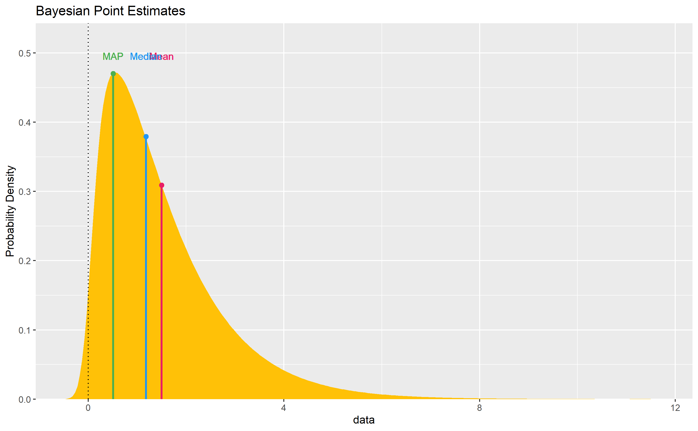
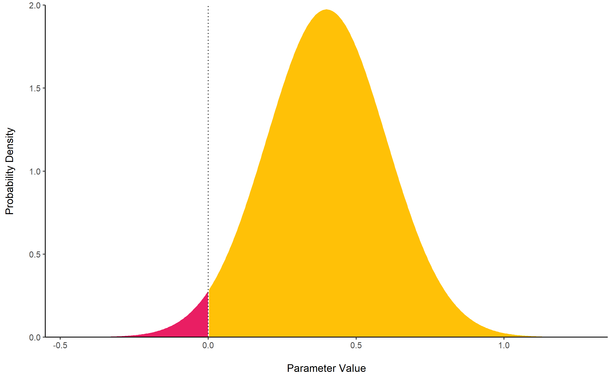

# bayestestR 

[](https://travis-ci.org/easystats/bayestestR)
[](https://codecov.io/gh/easystats/bayestestR)
[](https://easystats.github.io/bayestestR/)
[](https://zenodo.org/badge/latestdoi/165641861)

`bayestestR` is a lightweight package providing utilities to describe
posterior distributions and Bayesian models.

## Installation

Run the following:

``` r
install.packages("devtools")
devtools::install_github("easystats/bayestestR")
```

``` r
library("bayestestR")
```

## Documentation

The package documentation can be found
[**here**](https://easystats.github.io/bayestestR/). Check-out these
posts:

  - [Get Started with Bayesian
    Analysis](https://easystats.github.io/bayestestR/articles/bayestestR.html)
  - [Example 1: Bayesian (General) Linear
    Models](https://easystats.github.io/bayestestR/articles/example1_GLM.html)
  - [Comparison of
    Point-Estimates](https://easystats.github.io/bayestestR/articles/indicesEstimationComparison.html)
  - [Comparison of Indices of Effect
    Existence](https://easystats.github.io/bayestestR/articles/indicesExistenceComparison.html)
  - [Reporting
    Guidelines](https://easystats.github.io/bayestestR/articles/guidelines.html)

# Functions

## Posterior Description

### Highest Density Interval (HDI) - The *Credible* Interval (CI)

[**`hdi()`**](https://easystats.github.io/bayestestR/reference/hdi.html)
computes the **Highest Density Interval (HDI)** of a posterior
distribution, *i.e.*, the interval which contains all points within the
interval have a higher probability density than points outside the
interval. The HDI can be used in the context of Bayesian posterior
characterisation as **Credible Interval (CI)**.

Unlike equal-tailed intervals (see
[ci](https://easystats.github.io/bayestestR/reference/ci.html)) that
typically exclude 2.5% from each tail of the distribution, the HDI is
*not* equal-tailed and therefore always includes the mode(s) of
posterior distributions.

By default, hdi() returns the 90% intervals (`ci = 0.9`), deemed to be
more stable than, for instance, 95% intervals (Kruschke, 2015). An
effective sample size of at least 10.000 is recommended if 95% intervals
should be computed (Kruschke 2015, p. 183ff).

``` r
hdi(rnorm(1000), ci = .90)
```

<!-- -->

### MAP Estimate

[**`map_estimate()`**](https://easystats.github.io/bayestestR/reference/map_estimate.html)
find the **Highest Maximum A Posteriori (MAP)** estimate of a posterior,
*i.e.,* the most probable value. It corresponds to the “peak” (or the
*mode*) of the posterior distribution. This function returns a dataframe
containing the MAP value. If the `density` is set to `TRUE`, it will
include a second column containing the *probability* (*i.e.,* the value
of the estimated density function) associated with the MAP (the value of
the y axis of the density curve at the MAP).

``` r
map_estimate(rnorm(1000, 1, 1))
```

<!-- -->

### ROPE

[**`rope()`**](https://easystats.github.io/bayestestR/reference/rope.html)
computes the proportion (in percentage) of the HDI (default to the 90%
HDI) of a posterior distribution that lies within a region of practical
equivalence.

Statistically, the probability of a posterior distribution of being
different from 0 does not make much sense (the probability of it being
different from a single point being infinite). Therefore, the idea
underlining ROPE is to let the user define an area around the null value
enclosing values that are *equivalent to the null* value for practical
purposes (Kruschke 2010, 2011, 2014).

Kruschke (2018) suggests that such null value could be set, by default,
to the -0.1 to 0.1 range of a standardized parameter (negligible effect
size according to Cohen, 1988). This could be generalized: For instance,
for linear models, the ROPE could be set as `0 +/- .1 * sd(y)`. This
ROPE range can be automatically computed for models using the
[rope\_range](https://easystats.github.io/bayestestR/reference/rope_range.html)
function.

Kruschke (2010, 2011, 2014) suggests using the proportion of the 95% (or
90%, considered more stable) HDI that falls within the ROPE as an index
for “null-hypothesis” testing (as understood under the Bayesian
framework, see
[equivalence\_test](https://easystats.github.io/bayestestR/reference/equivalence_test.html)).

``` r
rope(rnorm(1000, 1, 1), range = c(-0.1, 0.1))
```

<!-- -->

## Null-Hypothesis Significance Testing (NHST)

### Equivalence test

[**`equivalence_test()`**](https://easystats.github.io/bayestestR/reference/equivalence_test.html)
a **Test for Practical Equivalence** based on the *“HDI+ROPE decision
rule”* (Kruschke, 2018) to check whether parameter values should be
accepted or rejected against an explicitly formulated “null hypothesis”
(*i.e.*, a
[ROPE](https://easystats.github.io/bayestestR/reference/rope.html)).

``` r
equivalence_test(rnorm(1000, 1, 1), range = c(-0.1, 0.1))
```

### Probability of Direction (*p*d)

[**`p_direction()`**](https://easystats.github.io/bayestestR/reference/p_direction.html)
computes the **Probability of Direction** (***p*d**, also known as the
Maximum Probability of Effect - *MPE*). It varies between 50% and 100%
and can be interpreted as the probability (expressed in percentage) that
a parameter (described by its posterior distribution) is strictly
positive or negative (whichever is the most probable). It is
mathematically defined as the proportion of the posterior distribution
that is of the median’s sign. Although differently expressed, this index
is fairly similar (*i.e.*, is strongly correlated) to the frequentist
***p*-value**.

**Relationship with the p-value**: In most cases, it seems that the *pd*
corresponds to the frequentist one-sided *p*-value through the formula
`p-value = (1-pd/100)` and to the two-sided *p*-value (the most commonly
reported) through the formula `p-value = 2*(1-pd/100)`. Thus, a `pd` of
`95\%`, `97.5\%` `99.5\%` and `99.95\%` corresponds approximately to a
two-sided *p*-value of respectively `.1`, `.05`, `.01` and `.001`. See
the [*reporting
guidelines*](https://easystats.github.io/bayestestR/articles/guidelines.html).

``` r
p_direction(rnorm(1000, mean = 1, sd = 1))
```

<!-- -->

### ROPE-based probability

[**`p_rope()`**](https://easystats.github.io/bayestestR/reference/p_rope.html)
Compute the ROPE-based p-value, an exploratory index representing the
maximum percentage of
[HDI](https://easystats.github.io/bayestestR/reference/hdi.html) that
does not contain (positive values) or is entirely contained (negative
values) in the negligible values space defined by the
[ROPE](https://easystats.github.io/bayestestR/reference/rope.html). It
differs from the ROPE percentage, *i.e.*, from the proportion of a given
CI in the ROPE, as it represents the maximum CI to reach a ROPE
proportion of 0% (positive values) or 100% (negative values). A
ROPE-based *p* of 97% means that there is a probability of .97 that a
parameter (described by its posterior distribution) is outside the ROPE.
On the contrary, a ROPE-based p of -97% means that there is a
probability of .97 that the parameter is inside the ROPE.

``` r
p_rope(rnorm(1000, 1, 1), range = c(-0.1, 0.1))
```

### MAP-based *p*-value

[**`p_map()`**](https://easystats.github.io/bayestestR/reference/p_map.html)
computes a Bayesian equivalent of the p-value, related to the odds that
a parameter (described by its posterior distribution) has against the
null hypothesis (*h0*) using Mills’ (2014, 2017) *Objective Bayesian
Hypothesis Testing* framework. It is mathematically based on the density
at the Maximum A Priori (MAP) and corresponds to the density value at 0
divided by the density of the MAP estimate.

``` r
p_map(posterior = rnorm(1000, 1, 1))
```

<!-- -->

## Utilities

### Find ROPE’s appropriate range

[**`rope_range()`**](https://easystats.github.io/bayestestR/reference/rope_range.html):
This function attempts at automatically finding suitable “default”
values for the Region Of Practical Equivalence (ROPE). Kruschke (2018)
suggests that such null value could be set, by default, to a range from
`-0.1` to `0.1` of a standardized parameter (negligible effect size
according to Cohen, 1988), which can be generalised for linear models to
`-0.1 * sd(y), 0.1 * sd(y)`. For logistic models, the parameters
expressed in log odds ratio can be converted to standardized difference
through the formula `sqrt(3)/pi`, resulting in a range of `-0.05` to
`-0.05`.

``` r
rope_range(model)
```

### Perfect Normal Distribution

[**`rnorm_perfect()`**](https://easystats.github.io/bayestestR/reference/rnorm_perfect.html):
Generate a sample of size n with a near-perfect normal distribution.

``` r
rnorm_perfect(n = 10)
```

### Probability of a Value

[**`density_at()`**](https://easystats.github.io/bayestestR/reference/density_at.html):
Compute the density of a given point of a distribution.

``` r
density_at(rnorm(1000, 1, 1), 1)
```

## Credits

You can cite the package as following:

  - Makowski, D. & Lüdecke, D. (2019). *Understand and Describe Bayesian
    Models and Posterior Distributions using BayestestR*. Available from
    <https://github.com/easystats/bayestestR>.
    <DOI:10.5281/zenodo.2556486>.
