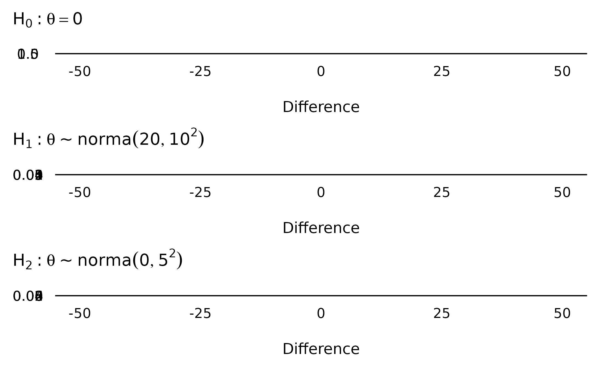
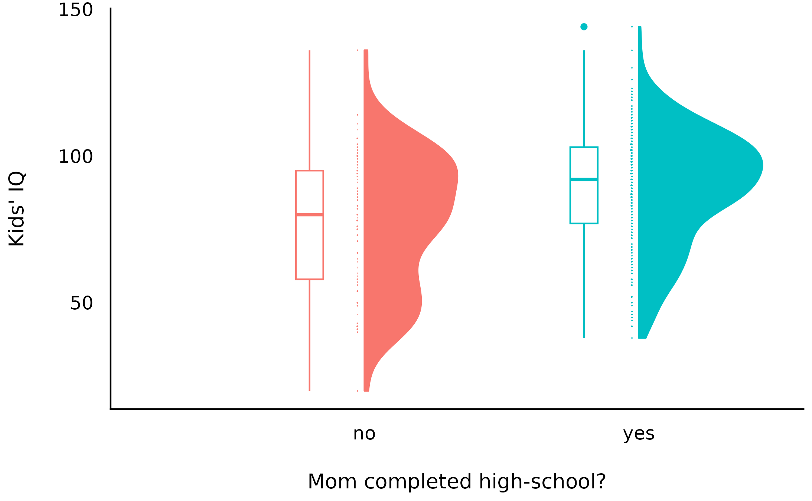
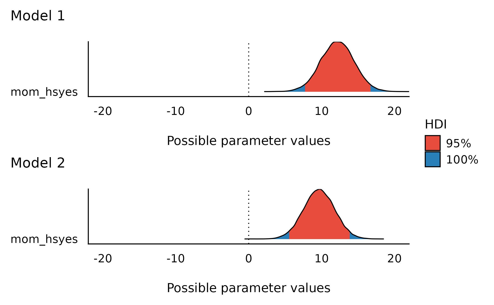
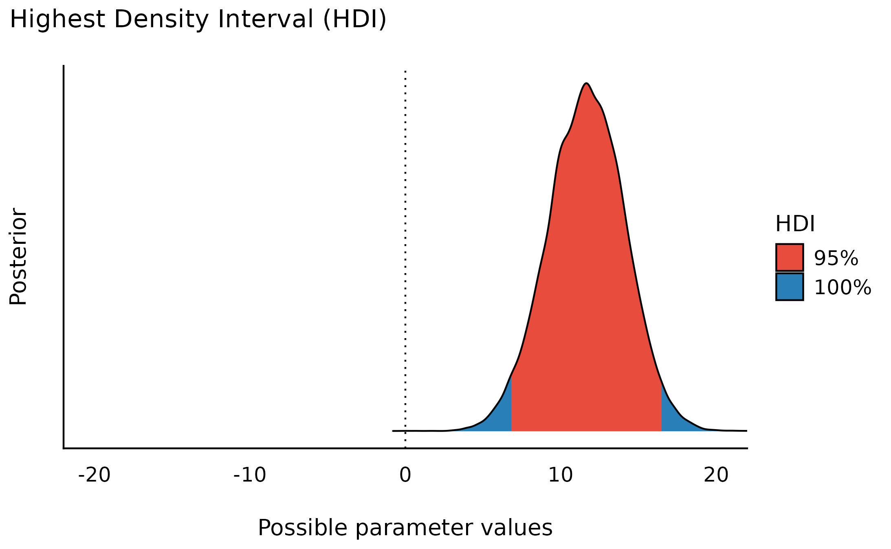
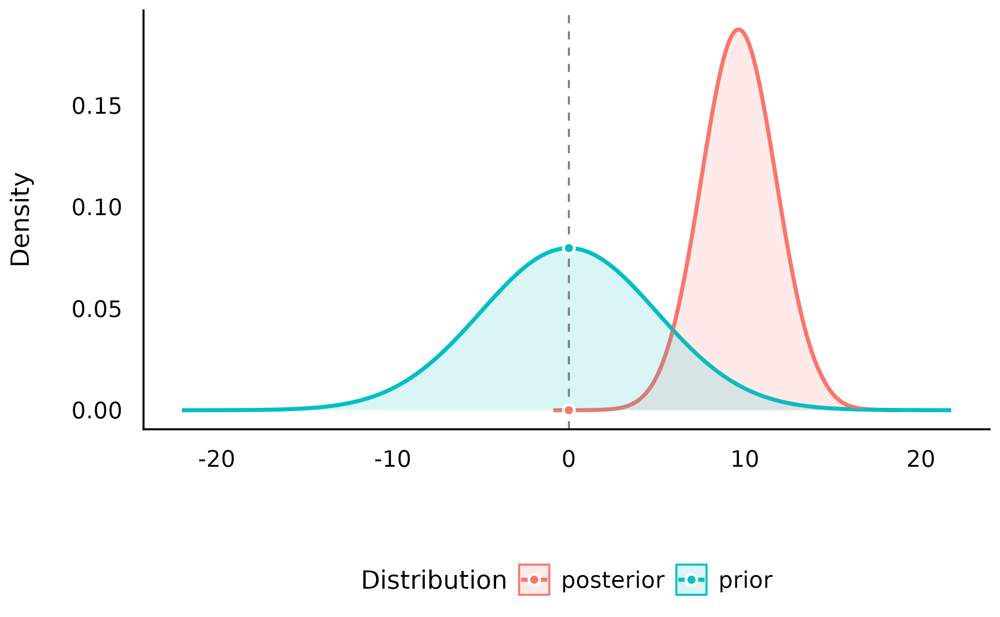
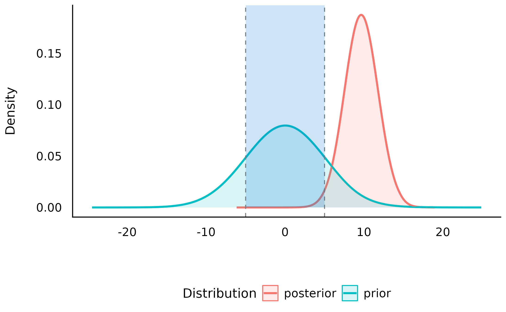
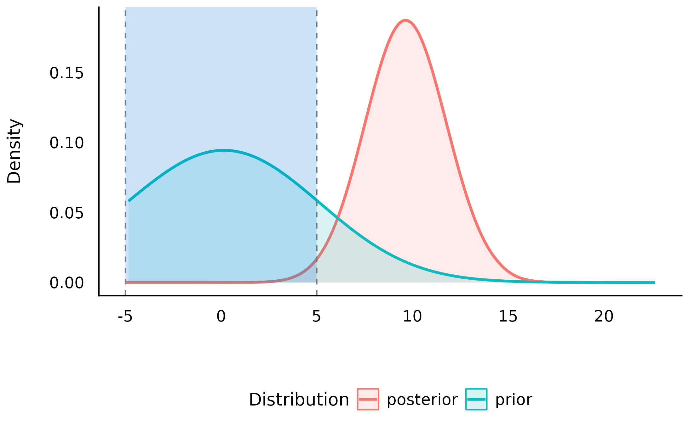
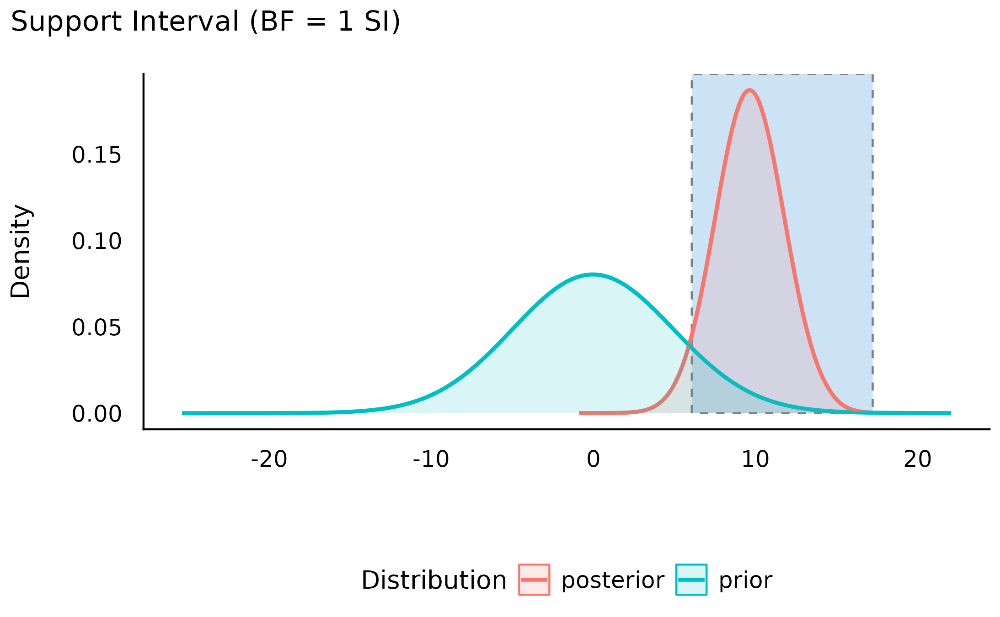

# Bayes Factors

This vignette can be referred to by citing the following:

- Makowski, D., Ben-Shachar, M. S., & Lüdecke, D. (2019). *bayestestR:
  Describing Effects and their Uncertainty, Existence and Significance
  within the Bayesian Framework*. Journal of Open Source Software,
  4(40), 1541. <https://doi.org/10.21105/joss.01541>

- Makowski, D., Ben-Shachar, M. S., Chen, S. H. A., & Lüdecke, D.
  (2019). *Indices of Effect Existence and Significance in the Bayesian
  Framework*. Retrieved from
  [10.3389/fpsyg.2019.02767](https://doi.org/10.3389/fpsyg.2019.02767)

------------------------------------------------------------------------

The adoption of the Bayesian framework, especially in the social and
psychological sciences, seems to be developing in two distinct
directions, with their separation often marked by their opinion of the
**Bayes factor**. In short, one school of thought (e.g., the *Amsterdam
school*, led by [E. J.
Wagenmakers](https://www.bayesianspectacles.org/)) advocate its use, and
emphasize its qualities as a statistical index, while another point to
its limits and prefer, instead, the precise description of posterior
distributions (using
[CIs](https://easystats.github.io/bayestestR/reference/hdi.html),
[ROPEs](https://easystats.github.io/bayestestR/reference/rope.html),
etc.).

The `bayestestR` package does **not** take a side in this debate, and
offers tools to carry out analysis irrespective of the school you
subscribe to. Instead, it strongly supports the notion of an *informed
choice*:

**discover the methods, learn about them, understand them, try them, and
decide for yourself**.

Having said that, here’s an introduction to Bayes factors :)

## The Bayes Factor

There are many ways to conceptualize Bayes factors (BFs), but
fundamentally: **BFs are indices of *relative* evidence between two
*hypotheses* over another**.

According to Bayes’ theorem, given a the prior probability of some
hypothesis \mathcal{H} (P(\mathcal{H})) and some data \mathcal{D}, we
can find the posterior probability of the hypothesis (P(\mathcal{H\|D}))
by accounting for the probability of observing that datum were the
hypothesis true (P(\mathcal{D\|H}), also known as the *likelihood*):[^1]

P(\mathcal{H\|D}) = \frac{P(\mathcal{D\|H})\times
P(\mathcal{H})}{P(\mathcal{D})}

Within this context, an hypothesis is formalized through the
specification of an a-priori model: Priors on the parameters (\Theta)
that define the data generating process.

If we have two hypothesis, we can find their posterior probability-odds
as such:

\underbrace{\frac{P(\mathcal{H}\_1\|\mathcal{D})}{P(\mathcal{H}\_2\|\mathcal{D})}}\_{\text{Posterior
Odds}} =
\underbrace{\frac{P(\mathcal{D}\|\mathcal{H}\_1)}{P(\mathcal{D}\|\mathcal{H}\_2)}}\_{\text{Likelihood
Ratio}} \times
\underbrace{\frac{P(\mathcal{H}\_1)}{P(\mathcal{H}\_2)}}\_{\text{Prior
Odds}}

Where the *likelihood ratio* (the middle term) is the ***Bayes
factor*** - it is the ***factor*** by which some **prior odds** have
been updated *after* observing the data to **posterior odds**. This
value can also be thought is *predictive terms* - how well has a
formalized prior model predicted the observed data compared to another
formalized prior model?

Thus, Bayes factors can be calculated in two ways:

- As a ratio quantifying **the relative probability of the observed data
  under each of the two hypotheses**: (In some contexts, these
  probabilities are also called *marginal likelihoods*.)

BF\_{12}=\frac{P(\mathcal{D}\|\mathcal{H}\_1)}{P(\mathcal{D}\|\mathcal{H}\_2)}

- As **the degree of shift in prior beliefs** about the relative
  credibility of two hypotheses (since they can be computed by dividing
  posterior odds by prior odds).

BF\_{12}=\frac{\text{Posterior Odds}\_{12}}{\text{Prior Odds}\_{12}}

[bayestestR](https://easystats.github.io/bayestestR/) provides functions
for computing Bayes factors in two different contexts:

- **Comparing statistical models that differ on their priors which
  represent two competing hypotheses**
- **Testing single estimates (parameters, coefficients, transformed
  parameters) within a given model**

## 1. Comparing Models using Bayes Factors

Let’s take a look at the *kid IQ* dataset from the
[rstanarm](https://mc-stan.org/rstanarm/) package.

``` r

data("kidiq", package = "rstanarm")

kidiq <- subset(kidiq, select = c(kid_score, mom_hs))
kidiq <- transform(
  kidiq,
  mom_hs = factor(mom_hs, levels = 0:1, labels = c("no", "yes"))
)

head(kidiq)
```

    >   kid_score mom_hs
    > 1        65    yes
    > 2        98    yes
    > 3        85    yes
    > 4        83    yes
    > 5       115    yes
    > 6        98     no

We’ll be trying to answer a simple question: what is the mean difference
in IQ scores between children whose mothers completed high-school and
those whose mothers did not complete high school (as indicated by the
`mom_hs` variable).

There are many hypothesis we might have about this difference. Let’s
start by examining:

- \mathcal{H}\_0: There’s no difference in IQ between the two groups.
- \mathcal{H}\_1: The difference is probably around 20 point in favor of
  kids whose mothers completed high school.
- \mathcal{H}\_2: A more conservative hypothesis that the difference, if
  it exists, is probably no more than about 5 point in either direction.

Let’s plot these:



We can build models with these different priors with
[brms](https://github.com/paul-buerkner/brms) or
[rstanarm](https://mc-stan.org/rstanarm/):[^2]

In any case, note the we will always require *many* posterior samples
for the stability of our BF estimation (typically 10 times more than
what we would need for posterior estimation alone; Gronau, Singmann, &
Wagenmakers (2020)).

``` r

library(rstanarm)

mod_H0 <- stan_glm(
  kid_score ~ 1,
  family = gaussian(),
  data = kidiq,

  chains = 10,
  iter = 5000,
  warmup = 1000,
  refresh = 0,
  # required for BF computation
  diagnostic_file = file.path(tempdir(), "df0.csv")
)

mod_H1 <- stan_glm(
  kid_score ~ mom_hs,
  family = gaussian(),
  data = kidiq,

  prior = normal(location = 20, scale = 10),

  chains = 10,
  iter = 5000,
  warmup = 1000,
  refresh = 0,
  diagnostic_file = file.path(tempdir(), "df1.csv")
)

mod_H2 <- stan_glm(
  kid_score ~ mom_hs,
  family = gaussian(),
  data = kidiq,

  prior = normal(location = 0, scale = 5),

  chains = 10,
  iter = 5000,
  warmup = 1000,
  refresh = 0,
  diagnostic_file = file.path(tempdir(), "df2.csv")
)
```

We can now ask: which a-priori model (each representing a different
hypothesis) is more likely to have produced the observed data?

This is usually done by comparing the marginal likelihoods of two
models. In such a case, the Bayes factor is a measure of the
**relative** evidence for one hypothesis over the other.

``` r

bfs <- bayesfactor_models(mod_H1, mod_H2, denominator = mod_H0, verbose = FALSE)

print(bfs, show_names = TRUE)
```

    > Bayes Factors for Model Comparison
    > 
    >          Model        BF
    > [mod_H1] mom_hs 4.43e+04
    > [mod_H2] mom_hs 1.17e+04
    > 
    > * Against Denominator: [mod_H0] (Intercept only)
    > *   Bayes Factor Type: marginal likelihoods (bridgesampling)

We can see that both models that allow for a difference between the
groups are much more supported by the data - with BF\>11661.33 -
compared to the null (intercept only).

Note that **interpretation guides** for Bayes factors can be found in
the `effectsize` package:

``` r

effectsize::interpret_bf(bfs$log_BF[1:2], log = TRUE)
```

    > [1] "extreme evidence in favour of" "extreme evidence in favour of"
    > (Rules: jeffreys1961)

Due to the transitive property of Bayes factors, we can easily change
the reference model to the model representing \mathcal{H}\_2:

``` r

bfs2 <- update(bfs, reference = 2, subset = 1)

print(bfs2, show_names = TRUE)
```

    > Bayes Factors for Model Comparison
    > 
    >          Model    BF
    > [mod_H1] mom_hs 3.80
    > 
    > * Against Denominator: [mod_H2] mom_hs
    > *   Bayes Factor Type: marginal likelihoods (bridgesampling)

The data supports the a-priori model that suggests a positive difference
almost 4 times over the model that suggests a small difference.

We can also get a matrix of Bayes factors of all the pairwise model
comparisons:

``` r

print(as.matrix(bfs), show_names = TRUE)
```

    > # Bayes Factors for Model Comparison
    > 
    >  Denominator\Numerator    |   [mod_H1] |   [mod_H2] |   [mod_H0]
    > ---------------------------------------------------------------
    > [mod_H1] mom_hs           |          1 |      0.263 |   2.26e-05
    > [mod_H2] mom_hs           |       3.80 |          1 |   8.58e-05
    > [mod_H0] (Intercept only) |   4.43e+04 |   1.17e+04 |          1

Overall, we can see that both models that allow for some non-0
difference are much more supported by the data compared to the
0-difference model. Let’s take a look at the data:



And indeed both models 1 and 2’s posteriors reflect this difference:



Note that these posterior distributions are *very* similar, but BFs do
not compare posterior models - only *a-priori* models!

For this reason, computing BFs only makes sense if we are able to
formulate our hypotheses into distinct priors.

### The BIC approximation

It is also possible to compute *approximate* Bayes factors for the
comparison of *frequentist* models (😱). This is done by comparing BIC
indices, allowing a Bayesian comparison of nested as well as non-nested
frequentist models (Wagenmakers, 2007).

Since frequentist modeling does not allow for specification of priors,
we are limited to either restricting parameters to 0 or not.

``` r

mod_H0f <- lm(kid_score ~ 1, data = kidiq)

mod_H1f <- lm(kid_score ~ mom_hs, data = kidiq)

bayesfactor_models(mod_H1f, denominator = mod_H0f)
```

    > Bayes Factors for Model Comparison
    > 
    >     Model        BF
    > [1] mom_hs 1.33e+04
    > 
    > * Against Denominator: [2] (Intercept only)
    > *   Bayes Factor Type: BIC approximation

(Note how similar this approximate BF is to the proper BFs estimated
above.)

### Model averaging

In the previous section, we discussed the direct comparison of two
models to determine if a hypothesis is supported by the data. However,
in many cases there are too many models to consider, or perhaps it is
not straightforward which models we should be comparing to determine if
an effect is supported by the data. For such cases, we can use Bayesian
model averaging (BMA) to determine the support provided by the data for
a parameter or model-term across many models.

#### Inclusion Bayes factors

Inclusion Bayes factors answer the question:

> **Are the observed data more probable under models with a particular
> predictor, than they are under models without that particular
> predictor?**

In other words, on average, are models with predictor X more likely to
have produced the observed data than models without predictor X?[^3]

These Bayes factors are computed not as the ratios of marginal
likelihoods, but as **the degree of shift in prior beliefs**: Since each
model has a prior probability, it is possible to sum the prior
probability of all models that include a predictor of interest (the
*prior inclusion probability*), and of all models that do not include
that predictor (the *prior exclusion probability*). After the data are
observed, and each model is assigned a posterior probability, we can
similarly consider the sums of the posterior models’ probabilities to
obtain the *posterior inclusion probability* and the *posterior
exclusion probability*. The change from prior inclusion odds to the
posterior inclusion odds is the **Inclusion Bayes factor**
\[BF\_{Inclusion}; Clyde, Ghosh, & Littman (2011)\].

``` r

(bfinc <- bayesfactor_inclusion(bfs))
```

    > Inclusion Bayes Factors (Model Averaged)
    > 
    >        P(prior) P(posterior) Inclusion BF
    > mom_hs     0.67         1.00     2.80e+04
    > 
    > * Compared among: all models
    > *    Priors odds: uniform-equal

([`bayesfactor_inclusion()`](https://easystats.github.io/bayestestR/reference/bayesfactor_inclusion.md)
is meant to provide Bayes Factors per predictor, similar to JASP’s
*Effects* option.)

We can see that across the 3 models under consideration, models *with*
the `mom_hs` term fit the data 27977.06 times more than the model
*without* that term.

#### Averaging posteriors

Similar to how we can average evidence for a predictor across models, we
can also average the **posterior estimate** across models.

``` r

ppp <- weighted_posteriors(mod_H0, mod_H1, mod_H2)

plot(hdi(ppp$mom_hsyes)) +
  coord_cartesian(xlim = c(-20, 20))
```



This looks a lot like the posterior obtained from the second model,
which shouldn’t be surprising since about 80% of the averaged posterior
comes from the second model.

``` r

attr(ppp, "weights")
```

    >    Model weights pweights
    > 1 mod_H0       1  2.5e-05
    > 2 mod_H1   31665  7.9e-01
    > 3 mod_H2    8334  2.1e-01

### Order restricted models

We’ve already seen we can formalize hypothesis into distributional
priors (e.g., *the difference is probably no more than about 5 point in
either direction.* became theta \sim Normal(0, 5^2)). These priors are
**unrestricted** - that is, **all values** between -\infty and \infty of
all parameters in the model have some non-zero credibility (no matter
how small; this is true for both the prior and posterior distribution).

But we can also formalize hypotheses as **order restrictions** (Morey,
2015; Morey & Rouder, 2011).

For example, we can impose an *additional* order restriction that the
difference *must be positive*, which we can write like this (if we had
to):

\mathcal{H}\_{2r}: \theta \sim Normal(0, 5^2)\begin{bmatrix} \infty \\ 0
\end{bmatrix}

By testing the probabilities of these restrictions on prior and
posterior samples, we can see how the probabilities of the restricted
distributions *change* after observing the data - [this change is a
Bayes factor](#bf-definitions). These can be achieved with
[`bayesfactor_restricted()`](https://easystats.github.io/bayestestR/reference/bayesfactor_restricted.md),
that compute a Bayes factor for these restricted model vs the
unrestricted model.

``` r

bayesfactor_restricted(mod_H2, hypothesis = "mom_hsyes > 0")
```

    > Bayes Factor (Order-Restriction)
    > 
    > Hypothesis    P(Prior) P(Posterior)   BF
    > mom_hsyes > 0     0.50            1 2.01
    > 
    > * Bayes factors for the restricted model vs. the un-restricted model.

In other words, the data fits the restricted model (where the difference
must be small *and positive*) twice as much as it fits the un-restircted
model (where the difference must be small).

We can compare multiple restricted hypotheses. For example: that the
difference isn’t just positive, it’s larger than 4.

``` r

bf_rstr <- bayesfactor_restricted(
  mod_H2,
  hypothesis = c(
    positive = "mom_hsyes > 0",
    strong = "mom_hsyes > 4"
  )
)
```

Here too we can obtain a matrix of BFs between all models:

``` r

print(as.matrix(bf_rstr), show_names = TRUE)
```

    > # Bayes Factors for Restricted Models
    > 
    >  Denominator\Numerator   |   [1] |   [positive] |   [strong]
    > -----------------------------------------------------------
    > [1] (Un-restricted)      |     1 |         2.00 |       4.70
    > [positive] mom_hsyes > 0 | 0.499 |            1 |       2.35
    > [strong] mom_hsyes > 4   | 0.213 |        0.426 |          1

We can see the “strong” model is preferred over both the un-restricted
model and the “positive” model.

Again, we can use the transitive properties of Bayes factors to find the
BF comparing \mathcal{H}\_{2r} and \mathcal{H}\_0:

\begin{align} BF\_{2r,0} & = BF\_{2,0} \times BF\_{2r,2} \\ & =
\frac{P(\mathcal{D}\|\mathcal{H}\_{2})}{P(\mathcal{D}\|\mathcal{H}\_0)}
\times
\frac{P(\mathcal{D}\|\mathcal{H}\_{2r})}{P(\mathcal{D}\|\mathcal{H}\_2)}
\\ & =
\frac{P(\mathcal{D}\|\mathcal{H}\_{2r})}{P(\mathcal{D}\|\mathcal{H}\_0)}
\end{align}

``` r

BF_2.0 <- as.numeric(bfs)[2]
BF_2r.2 <- as.numeric(bf_rstr)[2]

(BF_2r.0 <- BF_2.0 * BF_2r.2)
```

    > [1] 54865

So the data support the hypothesis that the difference is small but
strictly positive 54864.55 times more than the hypothesis that the
difference is exactly 0.

**Because these restrictions are on the prior distribution, they are
only appropriate for testing pre-planned (*a priori*) hypotheses, and
should not be used for any post hoc comparisons (Morey, 2015).**

------------------------------------------------------------------------

We are not limited to a single order restrictions - we can compound them
to create complex restrictions.

Let’s look at the [`disgust`
dataset](http://bayesfactor.blogspot.com/2015/01/multiple-comparisons-with-bayesfactor-2.md),
were 150 individuals rated “moral harshness” of undocumented migrants in
one of three conditions: no odor, clean odor (lemon), or disgusting
(sulfur) odor during questionnaire.

``` r

data("disgust", package = "bayestestR")

str(disgust)
```

    > 'data.frame': 150 obs. of  2 variables:
    >  $ score    : int  13 26 30 23 34 37 33 34 35 33 ...
    >  $ condition: Factor w/ 3 levels "control","lemon",..: 1 1 1 1 1 1 1 1 1 1 ...

Let’s build our simple one-way-ANOVA-like model:

``` r

mod_odor <- stan_glm(
  score ~ condition,
  family = gaussian(),
  data = disgust,

  prior = normal(location = 0, scale = 2),

  contrasts = list(condition = "contr.equalprior_pairs"),

  chains = 10,
  iter = 5000,
  warmup = 1000,
  refresh = 0,
  diagnostic_file = file.path(tempdir(), "df3.csv")
)
```

**NOTE**: See the *Specifying Correct Priors for Factors with More Than
2 Levels* appendix below for more details on the contrast coding used
here.

Let’s obtain the prior and posterior distributions of the condition
means using
[`posterior_epred()`](https://mc-stan.org/rstantools/reference/posterior_epred.html).

``` r

mod_odor.prior <- unupdate(mod_odor) # get the priors-only model

library(emmeans)

disgust_means <- emmeans(mod_odor, ~condition)
disgust_means.prior <- emmeans(mod_odor.prior, ~condition)
```

Our hypothesis is that the moral harshness ratings are lowest in the
lemon condition, higher in the control condition, and highest in the
sulfur condition - in other words, there is an *order* of: \text{lemon}
\< \text{control} \< \text{sulfur}.

We can formalize this hypothesis as an order restriction on the means of
the three conditions:

``` r

bayesfactor_restricted(
  posterior = disgust_means,
  prior = disgust_means.prior,
  hypothesis = "lemon < control & control < sulfur"
)
```

    > Bayes Factor (Order-Restriction)
    > 
    > Hypothesis                         P(Prior) P(Posterior)   BF
    > lemon < control & control < sulfur     0.17         0.68 4.04
    > 
    > * Bayes factors for the restricted model vs. the un-restricted model.

We can see that a-priori, this specific ordering of the 3 means has a
proability of \frac{1}{6} (1 of 6 possible orderings of 3 values), but
after observing the data, this ordering is about ~4 times more likely
than any other ordering.

The transitive properties of Bayes factors can also be used to compute a
Bayes factor for **dividing** hypotheses - that is for two
*complementary* opposing one-sided hypotheses (Morey & Wagenmakers,
2014).

For example, we can compare \mathcal{H}\_{+}: \theta \> 0 - *the
difference is positive* to \mathcal{H}\_{-}: \theta \< 0: *the
difference is negative*:

\begin{align} BF\_{+,-} & = BF\_{+,0} \times BF\_{0,-} \\ & =
\frac{P(\mathcal{D}\|\mathcal{H}\_{+})}{P(\mathcal{D}\|\mathcal{H}\_0)}
\times
\frac{P(\mathcal{D}\|\mathcal{H}\_{0})}{P(\mathcal{D}\|\mathcal{H}\_-)}
\\ & =
\frac{P(\mathcal{D}\|\mathcal{H}\_{+})}{P(\mathcal{D}\|\mathcal{H}\_{-})}
\end{align}

``` r

bf_div <- bayesfactor_restricted(
  posterior = disgust_means,
  prior = disgust_means.prior,
  hypothesis = c(
    positive = "lemon - sulfur > 0",
    negative = "lemon - sulfur < 0"
  )
)

print(as.matrix(bf_div), show_names = TRUE)
```

    > # Bayes Factors for Restricted Models
    > 
    >  Denominator\Numerator        |   [1] |   [positive] |   [negative]
    > ------------------------------------------------------------------
    > [1] (Un-restricted)           |     1 |        0.050 |         1.97
    > [positive] lemon - sulfur > 0 | 19.93 |            1 |        39.22
    > [negative] lemon - sulfur < 0 | 0.508 |        0.025 |            1

The hypothesis that the lemon condition yields lower ratings than the
sulfur condition is about 60 times more supported by the data than the
hypothesis that the lemon condition has higher ratings than the sulfur
condition.

Etc… etc… we can compound as many restrictions as we want, and compare
them to each other, or to the unrestricted model, or to the null model,
etc.

------------------------------------------------------------------------

Overall, Bayes factors are a powerful tool for comparing the relative
evidence of two *formalized* hypotheses (i.e., hypotheses that have been
formalized into distinct priors).

Note that Bayes factors are *not* a tool for comparing ***posterior***
models (for such comparisons, see the [`{loo}`
package](https://mc-stan.org/loo/)) - and in fact two similar posterior
models can have very different BFs if their priors are different.

## 2. Testing Models’ Parameters with Bayes Factors

For testing a point null hypothesis (e.g., \mathcal{H}\_0: \theta = 0)
against some alternative non-null hypothesis (e.g., \mathcal{H}\_1:
\theta \sim Normal(0, 5^2)), a nice “short cut” can be used to obtain a
Bayes factor - via the Savage-Dickey density ratio (Wagenmakers,
Lodewyckx, Kuriyal, & Grasman, 2010).

If we zoomed-in on the null value \theta_0 - what does it mean for the
null’s credability to have become *lower* in the posterior distribution?
Well, since the null is less credible, that necessarily means that the
alternative is *more* credible by the same amount!

Note that for a point null on a continuous parameter, the *probability*
of the null is always 0, and the probability of all other values is 1.
However, the *density* of the null can be non-zero, and it is this
density that quantifies the credibility of the null hypothesis. This
means that the prior *odds* of the null vs the alternative are:

\text{Prior Odds} = \frac{P(\theta \neq \theta_0)}{P(\theta=\theta_0)} =
\frac{1}{P(\theta=\theta_0)}

Likewise, the posterior odds of the null vs the alternative are:

\text{Posterior Odds} = \frac{P(\theta \neq \theta_0 \mid
\mathcal{D})}{P(\theta=\theta_0 \mid \mathcal{D})} =
\frac{1}{P(\theta=\theta_0 \mid \mathcal{D})} \\

Recall that a Bayes factor can be thought of as the degree of shift in
the relative credibility of two hypotheses from the prior model to the
posterior model:

\begin{align} BF\_{10} & = \frac{\text{Posterior
Odds}\_{10}}{\text{Prior Odds}\_{10}} = \frac{\frac{1}{P(\theta=\theta_0
\mid \mathcal{D})}}{\frac{1}{P(\theta=\theta_0)}} = \\ & =
\frac{P(\theta=\theta_0)}{P(\theta=\theta_0 \mid \mathcal{D})}
\end{align}

In other words, it is sufficient to compare the density of the null
under the prior distribution (P(\theta=\theta_0)) with the density of
the null under posterior distribution (P(\theta=\theta_0 \mid
\mathcal{D})) to obtain a Bayes factor comparing the null and
alternative hypotheses - the degree to which the null has become more or
less credible after observing the data.

This can be done using the
[`bayesfactor_parameters()`](https://easystats.github.io/bayestestR/reference/bayesfactor_parameters.md) -
let’s use it to test the null hypothesis that the difference in IQ
between the two groups is exactly 0:

``` r

(sddr <- bayesfactor_parameters(mod_H2, null = 0))
```

    > Bayes Factor (Savage-Dickey density ratio)
    > 
    > Parameter   |       BF
    > ----------------------
    > (Intercept) | 4.12e+60
    > mom_hsyes   | 5.93e+03
    > 
    > * Evidence Against The Null: 0

Looking at the Savage-Dickey density ratio for the `mom_hsyes`
parameter, we can see that the null has become substantially less
credible after observing the data - and therefore the alternative has
become *more* credible.

``` r

plot(sddr)
```



We can see that the center of the posterior distribution has shifted
away from 0 (to around 10), and the density at 0 has become much smaller
in the posterior distribution compared to the prior distribution
suggesting that the data is less compatible with the null value of 0
that with other values overall.

Compare the Savage-Dickey density ratio for the `mom_hsyes` parameter
with the Bayes factor comparing `mod_H2` (the alternative) and `mod_H0`
(the null):

``` r

print(update(bfs, subset = 2), show_names = TRUE)
```

    > Bayes Factors for Model Comparison
    > 
    >          Model        BF
    > [mod_H2] mom_hs 1.17e+04
    > 
    > * Against Denominator: [mod_H0] (Intercept only)
    > *   Bayes Factor Type: marginal likelihoods (bridgesampling)

Not perfect, but a good approximation.

#### Testing against a null-*region*

One way of operationalizing the null-hypothesis is by setting a null
*region*, such that an effect that falls within this interval would be
*practically* equivalent to the null (Kruschke, 2010). In our case, that
means defining a range of effects we would consider equal to no
difference in IQ between the two groups. Let’s say we consider any
difference between -5 and 5 points to be practically equivalent to no
difference at all, we would define our null-region as \mathcal{H}\_0:
\theta \in \[-5, 5\].

The Bayes factor for this null-region can be obtained by comparing the
change in the *relative* credibility of the null-region \mathcal{H}\_0:
\theta \in \[-5, 5\] and the non-null region \mathcal{H}\_1: \theta
\notin \[-5, 5\] from the prior to the posterior distribution - to
achieve this, we combine the logic of the Savage-Dickey density ratio
with the logic of the order-restricted Bayes factor!

This too can be done with
[`bayesfactor_parameters()`](https://easystats.github.io/bayestestR/reference/bayesfactor_parameters.md),
by specifying a null-region instead of a point null:

``` r

(sddr_region <- bayesfactor_parameters(mod_H2, null = c(-5, 5)))
```

    > Bayes Factor (Null-Interval)
    > 
    > Parameter   |       BF
    > ----------------------
    > (Intercept) | 5.86e+57
    > mom_hsyes   |   153.56
    > 
    > * Evidence Against The Null: [-5.000, 5.000]

``` r

plot(sddr_region)
```



We can see that the null-region has become much less credible by a
factor of \>100 after observing the data - suggesting that data is more
compatible with non-null values than with null values, and therefore the
alternative (that the difference is outside of the \[-5, 5\] range) has
become relatively much more credible.

#### Directional hypotheses

We can also compute Bayes factors for directional hypotheses (“one
sided”), if we have a prior hypotheses about the direction of the
effect. This is similiar to the *dividing* Bayes factor discussed above,
but we are still comparing the (directional) alternative to the null
(not between two directional hypotheses). This too can be done by
setting an *order restriction* on the prior and posterior distributions
(Morey & Wagenmakers, 2014). For example, if we have a prior hypothesis
that *the difference in IQ between the two groups is positive*, the
alternative will be restricted to the region to the right of the null
(point or interval):

``` r

(sddr_directional <- bayesfactor_parameters(mod_H2, null = c(-5, 5), direction = "right"))
```

    > Bayes Factor (Null-Interval)
    > 
    > Parameter   |       BF
    > ----------------------
    > (Intercept) | 5.88e+57
    > mom_hsyes   |   301.66
    > 
    > * Evidence Against The Null: [-5.000, 5.000]
    > *                 Direction: Right-Sided test

``` r

plot(sddr_directional)
```



As we can see, given that we have an *a priori* assumption about the
direction of the difference, the evidence against the null is even
stronger. Again, given this order restriction on the alternative
hypothesis, the posterior mass has substantially shifted away and
outside the null value, giving some extreme evidence against the null
and in favor of the alternative.

#### Support intervals and curves

So far we’ve seen that Bayes factors quantify relative support between
competing hypotheses. However, we can also ask:

> **Upon observing the data, the credibility of which of the parameter’s
> values has increased (or decreased)?**

For example, we’ve seen that the point null has become less credible
after observing the data, but we might also ask which values have
**gained** credibility given the observed data? The resulting range of
values is called **the support interval** as it indicates which values
are supported by the data (Wagenmakers, Gronau, Dablander, & Etz, 2018).
We can do this by once again comparing the prior and posterior
distributions and checking where the posterior densities are higher than
the prior densities.

In `bayestestR`, this can be achieved with the
[`si()`](https://easystats.github.io/bayestestR/reference/si.md)
function:

``` r

my_first_si <- si(mod_H2, BF = 1, verbose = FALSE)

print(my_first_si)
```

    > Support Interval
    > 
    > Parameter   |      BF = 1 SI | Effects |   Component
    > ----------------------------------------------------
    > (Intercept) | [74.33, 83.94] |   fixed | conditional
    > mom_hsyes   | [ 6.07, 17.23] |   fixed | conditional

The argument `BF = 1` indicates that we want the interval to contain
values that have gained support by a factor of at least 1 (that is,
*any* support at all).

Note that this is different from a credible interval, which contains
values that have high credibility in the posterior distribution,
regardless of how much their credibility has changed from the prior
distribution:

``` r

hdi(mod_H2)
```

    > Highest Density Interval
    > 
    > Parameter   |        95% HDI
    > ----------------------------
    > (Intercept) | [75.52, 83.06]
    > mom_hsyes   | [ 5.56, 13.87]

Visually, we can see that the credibility of all the values within this
interval has increased (and likewise the credibility of all the values
outside this interval has decreased):

``` r

plot(my_first_si)
```



We can also see the this support interval excludes the point null (0) -
whose credibility we’ve already seen has decreased by the observed data.
This emphasizes the relationship between the support interval and the
Bayes factor:

> “The interpretation of such intervals would be analogous to how a
> frequentist confidence interval contains all the parameter values that
> would not have been rejected if tested at level \alpha. For instance,
> a BF = 1/3 support interval encloses all values of theta for which the
> updating factor is not stronger than 3 against.” (Wagenmakers et al.,
> 2018)

Thus, the choice of BF (the level of support the interval should
indicate) depends on what we want our interval to represent:

- A BF = 1 contains values whose credibility has merely not decreased by
  observing the data.
- A BF \> 1 contains values who received more impressive support from
  the data.
- A BF \< 1 contains values whose credibility has *not* been
  impressively decreased by observing the data. Testing against values
  outside this interval will produce a Bayes factor larger than 1/BF in
  support of the alternative.

## Appendix: Specifying correct priors for factors

When modeling predictors with more than 2 levels (e.g., factors) there
any many options for how to *encode* the factor into the model (e.g.,
dummy coding, sum coding, etc.). Unlike frequentist modeling, where the
choice of contrast coding is mostly a matter of interpretability and
convenience, in Bayesian modeling different encodings – and priors on
those encodings – can lead to different implied priors.

Rouder, Morey, Verhagen, Swagman, & Wagenmakers (2017) discuss how one
might wish to set some global multidimensional prior (the *g*-prior) on
the factor’s levels that is not sensitive to the order of level or the
choice of reference group. These are implamneted in
[`contr.equalprior()`](https://easystats.github.io/bayestestR/reference/contr.equalprior.md)
and its siblings.

Below we demonstrate how the choice of contrast coding can lead to
different implied priors regarding the possible *ordering* and
*differences* between the factor’s levels.

Let us fit 3 models with different contrast codings for a factor with 3
levels:

``` r

library(rstanarm)
library(bayestestR)

data("disgust", package = "bayestestR")

# Use R's default treatment contrasts (first level as reference)
mod_odor.treatment <- stan_glm(
  score ~ condition,
  family = gaussian(),
  data = disgust,

  prior = normal(location = 0, scale = 2),

  contrasts = list(condition = "contr.treatment"),

  chains = 10,
  iter = 5000,
  warmup = 1000,
  refresh = 0,
  diagnostic_file = file.path(tempdir(), "df5.csv")
)

# Use effects contrasts (sum-to-zero)
mod_odor.sum <- stan_glm(
  score ~ condition,
  family = gaussian(),
  data = disgust,

  prior = normal(location = 0, scale = 2),

  contrasts = list(condition = "contr.sum"),

  chains = 10,
  iter = 5000,
  warmup = 1000,
  refresh = 0,
  diagnostic_file = file.path(tempdir(), "df6.csv")
)

mod_odor.equalprior <- stan_glm(
  score ~ condition,
  family = gaussian(),
  data = disgust,

  prior = normal(location = 0, scale = 2),

  contrasts = list(condition = "contr.equalprior"),

  chains = 10,
  iter = 5000,
  warmup = 1000,
  refresh = 0,
  diagnostic_file = file.path(tempdir(), "df7.csv")
)
```

Let’s use [marginaleffects](https://marginaleffects.com/) to obtain
estimates from these Bayesian (prior) models (after we already showed
how do do so with [emmeans](https://rvlenth.github.io/emmeans/) above).

``` r

mod_odor.treatment_prior <- unupdate(mod_odor.treatment)
mod_odor.sum_prior <- unupdate(mod_odor.sum)
mod_odor.equalprior_prior <- unupdate(mod_odor.equalprior)

(pr_treatment_prior <- avg_predictions(
  mod_odor.treatment_prior,
  variables = "condition"
))
```

    > 
    >  condition Estimate 2.5 % 97.5 %
    >    control     30.3 -2.94   63.4
    >    lemon       30.3 -3.03   63.4
    >    sulfur      30.3 -3.00   63.5
    > 
    > Type: response

``` r

(pr_sum_prior <- avg_predictions(
  mod_odor.sum_prior,
  variables = "condition"
))
```

    > 
    >  condition Estimate 2.5 % 97.5 %
    >    control     30.1 -3.28   63.9
    >    lemon       30.1 -3.37   63.8
    >    sulfur      30.1 -3.31   64.0
    > 
    > Type: response

``` r

(pr_equalprior_prior <- avg_predictions(
  mod_odor.equalprior_prior,
  variables = "condition"
))
```

    > 
    >  condition Estimate 2.5 % 97.5 %
    >    control     30.3 -3.10   64.0
    >    lemon       30.2 -2.97   63.9
    >    sulfur      30.2 -2.87   64.1
    > 
    > Type: response

We can see that for all 3 models, the means of all three groups have
about the same prior distribution: Md=60, 95 CI \[-3, +63\].

We might expect the same for the differences between the groups, but
this is not the case:

``` r

avg_comparisons(
  mod_odor.treatment_prior,
  variables = list("condition" = "pairwise")
)
```

    > 
    >          Contrast Estimate 2.5 % 97.5 %
    >  lemon - control  -0.00104 -3.92   3.91
    >  sulfur - control -0.01706 -3.92   3.90
    >  sulfur - lemon   -0.01666 -5.55   5.48
    > 
    > Term: condition
    > Type: response

We can see that while the prior differences are all centered on 0, the
prior difference of the `sulfer - lemon` comparison is much wider
compared to the comparisons involving the `control` condition.

With effects coding (sum-to-zero), we also get different implied priors
for the differences between the groups, this time the `lemon - control`
difference is much narrower than the other two differences involving the
`sulfer` condition:

``` r

avg_comparisons(mod_odor.sum_prior, variables = list("condition" = "pairwise"))
```

    > 
    >          Contrast Estimate 2.5 % 97.5 %
    >  lemon - control   0.00866 -5.58   5.50
    >  sulfur - control -0.02207 -8.78   8.69
    >  sulfur - lemon   -0.00672 -8.80   8.81
    > 
    > Term: condition
    > Type: response

But the
[`contr.equalprior()`](https://easystats.github.io/bayestestR/reference/contr.equalprior.md)
coding gives us the same prior distribution for all differences between
the groups:

``` r

avg_comparisons(
  mod_odor.equalprior_prior,
  variables = list("condition" = "pairwise")
)
```

    > 
    >          Contrast Estimate 2.5 % 97.5 %
    >  lemon - control  0.028964 -5.52   5.59
    >  sulfur - control 0.030357 -5.55   5.58
    >  sulfur - lemon   0.000774 -5.64   5.57
    > 
    > Term: condition
    > Type: response

Likewise, the implied priors for the ordering of the groups are
different across the three models:

``` r

pr_treatment <- avg_predictions(mod_odor.treatment, variables = "condition")

bayesfactor_restricted(
  posterior = pr_treatment,
  prior = pr_treatment_prior,
  hypothesis = "b2 < b1 & b1 < b3"
)
```

    > Bayes Factor (Order-Restriction)
    > 
    > Hypothesis        P(Prior) P(Posterior)   BF
    > b2 < b1 & b1 < b3     0.25         0.77 3.09
    > 
    > * Bayes factors for the restricted model vs. the un-restricted model.

``` r

pr_sum <- avg_predictions(mod_odor.sum, variables = "condition")

bayesfactor_restricted(
  posterior = pr_sum,
  prior = pr_sum_prior,
  hypothesis = "b2 < b1 & b1 < b3"
)
```

    > Bayes Factor (Order-Restriction)
    > 
    > Hypothesis        P(Prior) P(Posterior)   BF
    > b2 < b1 & b1 < b3     0.20         0.74 3.76
    > 
    > * Bayes factors for the restricted model vs. the un-restricted model.

``` r

pr_equalprior <- avg_predictions(mod_odor.equalprior, variables = "condition")

bayesfactor_restricted(
  posterior = pr_equalprior,
  prior = pr_equalprior_prior,
  hypothesis = "b2 < b1 & b1 < b3"
)
```

    > Bayes Factor (Order-Restriction)
    > 
    > Hypothesis        P(Prior) P(Posterior)   BF
    > b2 < b1 & b1 < b3     0.17         0.72 4.25
    > 
    > * Bayes factors for the restricted model vs. the un-restricted model.

We can see that while all models have the very similiar posterior
distributions, the implied prior orders are different, with only the
[`contr.equalprior()`](https://easystats.github.io/bayestestR/reference/contr.equalprior.md)
coding giving us a prior that does not favor any particular ordering of
the groups (and gives 1/6 prior probability to each of the 6 possible
orderings of 3 groups).

While
[`contr.equalprior()`](https://easystats.github.io/bayestestR/reference/contr.equalprior.md)
gives the original formulation given by Rouder et al. (2017), the
[`contr.equalprior_pairs()`](https://easystats.github.io/bayestestR/reference/contr.equalprior.md)
and
[`contr.equalprior_deviations()`](https://easystats.github.io/bayestestR/reference/contr.equalprior.md)
give slightly more intuitive coding schemes:

- [`contr.equalprior_pairs()`](https://easystats.github.io/bayestestR/reference/contr.equalprior.md)
  allows for setting a prior of what a all pairwise differences might
  be.
- [`contr.equalprior_deviations()`](https://easystats.github.io/bayestestR/reference/contr.equalprior.md)
  allows for setting a prior of what the difference between each group
  and the grand mean might be.

***Note:*** all priors set on these contrast codings *must* be centered
on 0 to work!

## References

Clyde, M. A., Ghosh, J., & Littman, M. L. (2011). Bayesian adaptive
sampling for variable selection and model averaging. *Journal of
Computational and Graphical Statistics*, *20*(1), 80–101.

Gronau, Q. F., Singmann, H., & Wagenmakers, E.-J. (2020).
Bridgesampling: An r package for estimating normalizing constants.
*Journal of Statistical Software*, *92*, 1–29.

Kruschke, J. K. (2010). What to believe: Bayesian methods for data
analysis. *Trends in Cognitive Sciences*, *14*(7), 293–300.

Morey, R. D. (2015). *Multiple comparisons with BayesFactor, part 2 –
order restrictions*. Retrieved from
[http://bayesfactor.blogspot.com/2015/01/multiple-comparisons-with-bayesfactor-2.html](http://bayesfactor.blogspot.com/2015/01/multiple-comparisons-with-bayesfactor-2.md)

Morey, R. D., & Rouder, J. N. (2011). Bayes factor approaches for
testing interval null hypotheses. *Psychological Methods*, *16*(4), 406.

Morey, R. D., & Wagenmakers, E.-J. (2014). Simple relation between
bayesian order-restricted and point-null hypothesis tests. *Statistics &
Probability Letters*, *92*, 121–124.

Rouder, J. N., Morey, R. D., Verhagen, J., Swagman, A. R., &
Wagenmakers, E.-J. (2017). Bayesian analysis of factorial designs.
*Psychological Methods*, *22*(2), 304.

Wagenmakers, E.-J. (2007). A practical solution to the pervasive
problems ofp values. *Psychonomic Bulletin & Review*, *14*(5), 779–804.

Wagenmakers, E.-J., Gronau, Q. F., Dablander, F., & Etz, A. (2018). *The
support interval*. <https://doi.org/10.31234/osf.io/zwnxb>

Wagenmakers, E.-J., Lodewyckx, T., Kuriyal, H., & Grasman, R. (2010).
Bayesian hypothesis testing for psychologists: A tutorial on the
savage–dickey method. *Cognitive Psychology*, *60*(3), 158–189.

[^1]: normalized by the marginal probability of observing the data,
    P(\mathcal{D}), which we will soon see is often not needed.

[^2]: We will be using [rstanarm](https://mc-stan.org/rstanarm/)
    throughout this vignette, but `bayestestR` also supports
    [brms](https://github.com/paul-buerkner/brms),
    [blavaan](https://ecmerkle.github.io/blavaan/),
    [rstan](https://mc-stan.org/rstan/), `{cmdstanr}`,
    [BayesFactor](https://richarddmorey.github.io/BayesFactor/) and
    more.

[^3]: A model without predictor X can be thought of as a model in which
    the parameter(s) of the predictor have been restricted to a
    null-point of 0.
