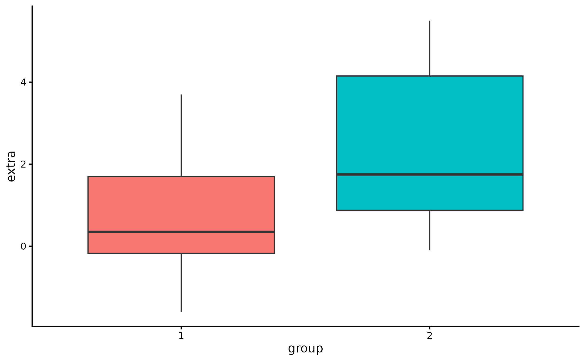
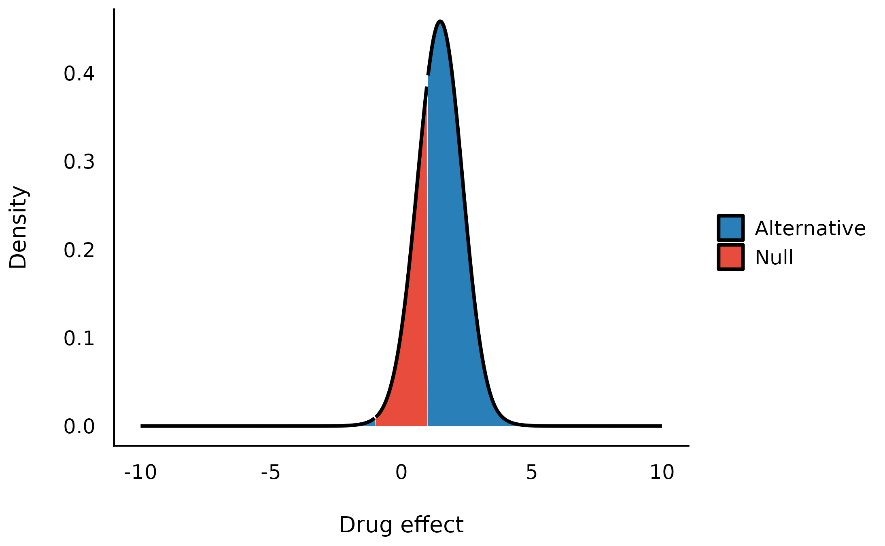
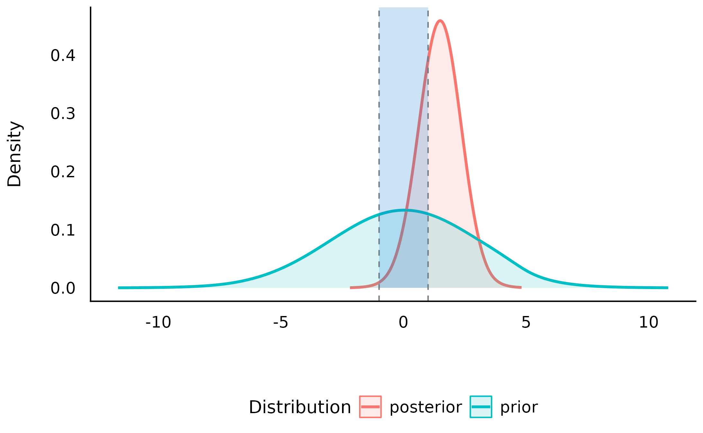
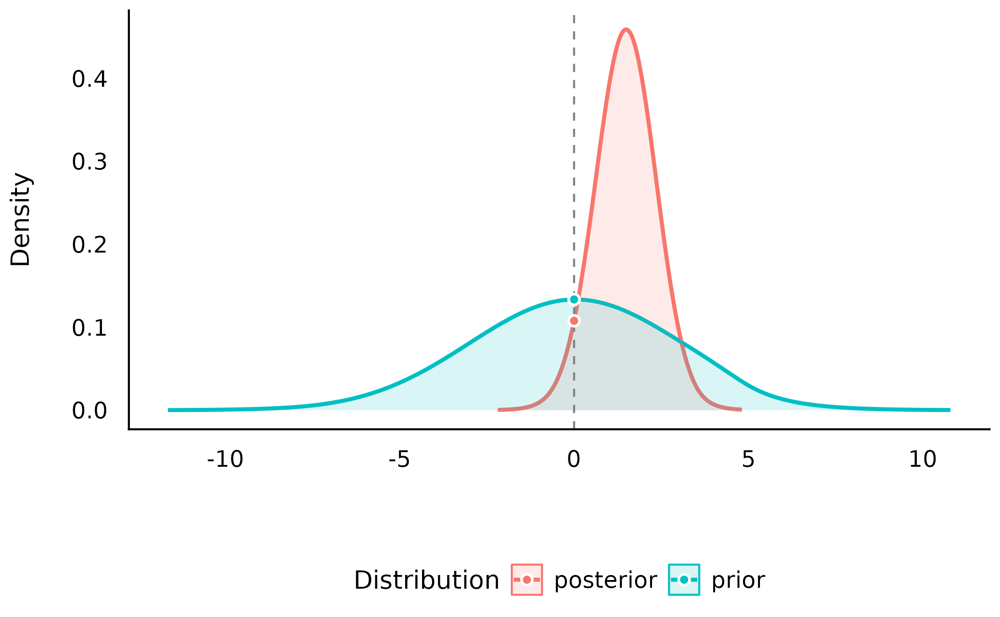
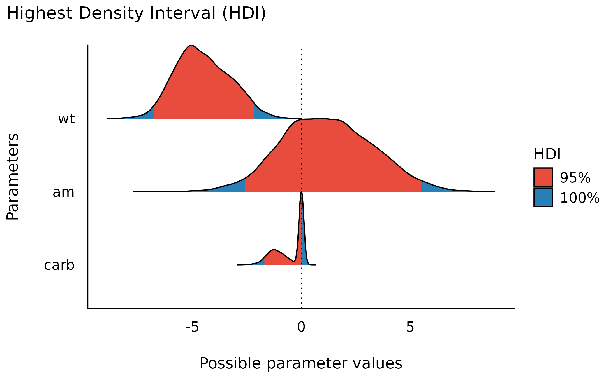

# Bayes Factors

This vignette can be referred to by citing the following:

- Makowski, D., Ben-Shachar, M. S., & Lüdecke, D. (2019). *bayestestR:
  Describing Effects and their Uncertainty, Existence and Significance
  within the Bayesian Framework*. Journal of Open Source Software,
  4(40), 1541. <https://doi.org/10.21105/joss.01541>

- Makowski, D., Ben-Shachar, M. S., Chen, S. H. A., & Lüdecke, D.
  (2019). *Indices of Effect Existence and Significance in the Bayesian
  Framework*. Retrieved from
  [10.3389/fpsyg.2019.02767](https://doi.org/10.3389/fpsyg.2019.02767)

------------------------------------------------------------------------

The adoption of the Bayesian framework for applied statistics,
especially in the social and psychological sciences, seems to be
developing in two distinct directions. One of the key topics marking
their separation is their opinion about the **Bayes factor**. In short,
one school of thought (e.g., the *Amsterdam school*, led by [E. J.
Wagenmakers](https://www.bayesianspectacles.org/)) advocate its use, and
emphasize its qualities as a statistical index, while another point to
its limits and prefer, instead, the precise description of posterior
distributions (using
[CIs](https://easystats.github.io/bayestestR/reference/hdi.html),
[ROPEs](https://easystats.github.io/bayestestR/reference/rope.html),
etc.).

The `bayestestR` package does **not** take a side in this debate, and
offers tools to carry out analysis irrespective of the school you
subscribe to. Instead, it strongly supports the notion of an *informed
choice*:

**discover the methods, learn about them, understand them, try them, and
decide for yourself**.

Having said that, here’s an introduction to Bayes factors :)

## The Bayes Factor

**Bayes Factors (BFs) are indices of *relative* evidence of one “model”
over another**.

In their role as a hypothesis testing index, they are to Bayesian
framework what a p-value is to the **classical/frequentist framework**.
In significance-based testing, p-values are used to assess how unlikely
are the observed data if the **null hypothesis** were true, while in the
**Bayesian model selection framework**, Bayes factors assess evidence
for different models, each model corresponding to a specific hypothesis.

According to Bayes’ theorem, we can update prior probabilities of some
model M (P(M)) to posterior probabilities (P(M\|D)) after observing some
datum D by accounting for the probability of observing that datum given
the model (P(D\|M), also known as the *likelihood*):

P(M\|D) = \frac{P(D\|M)\times P(M)}{P(D)}

Using this equation, we can compare the probability-odds of two models:

\underbrace{\frac{P(M_1\|D)}{P(M_2\|D)}}\_{\text{Posterior Odds}} =
\underbrace{\frac{P(D\|M_1)}{P(D\|M_2)}}\_{\text{Likelihood Ratio}}
\times \underbrace{\frac{P(M_1)}{P(M_2)}}\_{\text{Prior Odds}}

Where the *likelihood ratio* (the middle term) is the *Bayes factor* -
it is the ***factor*** by which some **prior odds** have been updated
after observing the data to **posterior odds**.

Thus, Bayes factors can be calculated in two ways:

- As a ratio quantifying **the relative probability of the observed data
  under each of the two models**. (In some contexts, these probabilities
  are also called *marginal likelihoods*.)

BF\_{12}=\frac{P(D\|M_1)}{P(D\|M_2)}

- As **the degree of shift in prior beliefs** about the relative
  credibility of two models (since they can be computed by dividing
  posterior odds by prior odds).

BF\_{12}=\frac{Posterior~Odds\_{12}}{Prior~Odds\_{12}}

Here we provide functions for computing Bayes factors in two different
contexts:

- **testing single parameters (coefficients) within a model**
- **comparing statistical models themselves**

## 1. Testing Models’ Parameters with Bayes Factors

A **Bayes factor for a single parameter** can be used to answer the
question:

> “Given the observed data, has the null hypothesis of an absence of an
> effect become more or less credible?”


Bayesian analysis of the Students’ (1908) Sleep data set.

Let’s use the Students’ (1908) Sleep data set (`data("sleep")`). The
data comes from a study in which participants were administered a drug
and the researchers assessed the extra hours of sleep that participants
slept afterwards. We will try answering the following research question
using Bayes factors:

> **Given the observed data, has the hypothesis that the drug (the
> effect of `group`) has no effect on the numbers of hours of extra
> sleep (variable `extra`) become more of less credible?**



The **boxplot** suggests that the second group has a higher number of
hours of extra sleep. *By how much?*

Let’s fit a simple [Bayesian linear
model](https://easystats.github.io/bayestestR/articles/example1.html),
with a prior of b\_{group} \sim N(0, 3) (i.e. the prior follows a
Gaussian/normal distribution with mean = 0 and SD = 3), using `rstanarm`
package:

``` r

set.seed(123)
library(rstanarm)

model <- stan_glm(
  formula = extra ~ group,
  data = sleep,
  prior = normal(0, 3, autoscale = FALSE),
  chains = 10, iter = 5000, warmup = 1000
)
```

#### Testing against a null-*region*

One way of operationalizing the null-hypothesis is by setting a null
region, such that an effect that falls within this interval would be
*practically* equivalent to the null (Kruschke, 2010). In our case, that
means defining a range of effects we would consider equal to the drug
having no effect at all. We can then compute the prior probability of
the drug’s effect falling *outside this null-region*, and the prior
probability of the drug’s effect falling *within the null-region* to get
our *prior odds*. Say any effect smaller than an hour of extra sleep is
practically equivalent to being no effect at all, we would define our
prior odds as:

\frac {P(b\_{drug} \notin \[-1, 1\])} {P(b\_{drug} \in \[-1, 1\])}

Given our prior has a normal distribution centered at 0 hours with a
scale (an SD) of 3 hours, our priors would look like this:


and the prior odds would be 2.8.

By looking at the posterior distribution, we can now compute the
posterior probability of the drug’s effect falling *outside the
null-region*, and the posterior probability of the drug’s effect falling
*within the null-region* to get our *posterior odds*:

\frac {P(b\_{drug} \notin \[-1,1\] \| Data)} {P(b\_{drug} \in \[-1,1\]
\| Data)}



We can see that the center of the posterior distribution has shifted
away from 0 (to ~1.5). Likewise, the posterior odds are 2.5, which seems
to favor **the effect being non-null**. **But**, does this mean the data
support the alternative over the null? Hard to say, since even before
the data were observed, the priors already favored the alternative - so
we need to take our priors into account here!

Let’s compute the Bayes factor as the change from the prior odds to the
posterior odds: BF\_{10} = Odds\_{posterior} / Odds\_{prior} = 0.9! This
BF indicates that the data provide 1/0.9 = 1.1 times more evidence for
the effect of the drug being practically nothing than it does for the
drug having some clinically significant effect. Thus, although the
center of distribution has shifted away from 0, and the posterior
distribution seems to favor a non-null effect of the drug, it seems that
given the observed data, the probability mass has *overall* shifted
closer to the null interval, making the values in the null interval more
probable! (see *Non-overlapping Hypotheses* in Morey & Rouder, 2011)

All of this can be achieved with the function
[`bayesfactor_parameters()`](https://easystats.github.io/bayestestR/reference/bayesfactor_parameters.md),
which computes a Bayes factor for each of the model’s parameters:

``` r

My_first_BF <- bayesfactor_parameters(model, null = c(-1, 1))
My_first_BF
```

    > Bayes Factor (Null-Interval)
    > 
    > Parameter   |    BF
    > -------------------
    > (Intercept) | 0.102
    > group2      | 0.883
    > 
    > * Evidence Against The Null: [-1.000, 1.000]

We can also plot using the `see` package:

``` r

library(see)
plot(My_first_BF)
```



Note that **interpretation guides** for Bayes factors can be found in
the `effectsize` package:

``` r

effectsize::interpret_bf(exp(My_first_BF$log_BF[2]), include_value = TRUE)
```

    > [1] "anecdotal evidence (BF = 1/1.13) against"
    > (Rules: jeffreys1961)

#### Testing against the *point*-null (0)

> **What if we don’t know what region would be practically equivalent to
> 0?**

Or if we just want the null to be exactly zero? Not a problem - as the
width of null region shrinks to a point, the change from the prior
probability to the posterior probability of the null can be estimated by
comparing the density of the null value between the two
distributions.[^1] This ratio is called the **Savage-Dickey ratio**, and
has the added benefit of also being an approximation of a Bayes factor
comparing the estimated model against a model in which the parameter of
interest has been restricted to a point-null:

> “\[…\] the Bayes factor for H_0 versus H_1 could be obtained by
> analytically integrating out the model parameter \theta. However, the
> Bayes factor may likewise be obtained by only considering H_1, and
> dividing the height of the posterior for \theta by the height of the
> prior for \theta, at the point of interest.” (Wagenmakers, Lodewyckx,
> Kuriyal, & Grasman, 2010)

``` r

My_second_BF <- bayesfactor_parameters(model, null = 0)
My_second_BF
```

    > Bayes Factor (Savage-Dickey density ratio)
    > 
    > Parameter |   BF
    > ----------------
    > group2    | 1.24
    > 
    > * Evidence Against The Null: 0

``` r

plot(My_second_BF)
```



#### Directional hypotheses

We can also compute Bayes factors for directional hypotheses (“one
sided”), if we have a prior hypotheses about the direction of the
effect. This can be done by setting an *order restriction* on the prior
distribution (which results in an order restriction on the posterior
distribution) of the alternative (Morey & Wagenmakers, 2014). For
example, if we have a prior hypothesis that *the drug has a positive
effect on the number of sleep hours*, the alternative will be restricted
to the region to the right of the null (point or interval):

``` r

test_group2_right <- bayesfactor_parameters(model, direction = ">")
test_group2_right
```

    > Bayes Factor (Savage-Dickey density ratio)
    > 
    > Parameter |   BF
    > ----------------
    > group2    | 2.37
    > 
    > * Evidence Against The Null: 0
    > *                 Direction: Right-Sided test

``` r

plot(test_group2_right)
```


As we can see, given that we have an *a priori* assumption about the
direction of the effect (that the effect is positive), **the presence of
an effect is 2.8 times more likely than the absence of an effect**,
given the observed data (or that the data are 2.8 time more probable
under H_1 than H_0). This indicates that, given the observed data, and a
priori hypothesis, the posterior mass has shifted away from the null
value, giving some evidence against the null (note that a Bayes factor
of 2.8 is still considered quite [weak
evidence](https://easystats.github.io/effectsize/reference/interpret_bf.html)).

Thanks to the flexibility of Bayesian framework, it is also possible to
compute a Bayes factor for **dividing** hypotheses - that is, for a null
and alternative that are *complementary*, opposing one-sided hypotheses
(Morey & Wagenmakers, 2014).

For example, above we compared an alternative of H_A: *the drug has a
positive effects* to the null H_0: *the drug has no effect*. But we can
also compare instead the same alternative to its *complementary*
hypothesis: H\_{-A}: *the drug has a negative effects*.

``` r

test_group2_dividing <- bayesfactor_parameters(model, null = c(-Inf, 0))
test_group2_dividing
```

    > Bayes Factor (Null-Interval)
    > 
    > Parameter |    BF
    > -----------------
    > group2    | 20.53
    > 
    > * Evidence Against The Null: [-Inf, 0.000]

``` r

plot(test_group2_dividing)
```


We can see that this test produces even stronger (more conclusive)
evidence than the one-sided vs. point-null test! And indeed, as a rule
of thumb, the more specific the two hypotheses are, and the more
distinct they are from one another, the more *power* our Bayes factor
has! [^2]

Thanks to the transitivity of Bayes factors, we can also use
[`bayesfactor_parameters()`](https://easystats.github.io/bayestestR/reference/bayesfactor_parameters.md)
to compare even more types of hypotheses, with some trickery. For
example:

\underbrace{BF\_{0\<b\<1\text{ vs. }b=0}}\_{\text{range vs. point}} =
\underbrace{BF\_{b\<0\text{ vs. }b=0}}\_{\text{directional vs. point}} /
\underbrace{BF\_{b\<0\text{ vs. }0\<b\<1}}\_{\text{directional vs.
range}}

**NOTE**: See the *Testing Contrasts* appendix below.

#### Support intervals

So far we’ve seen that Bayes factors quantify relative support between
competing hypotheses. However, we can also ask:

> **Upon observing the data, the credibility of which of the parameter’s
> values has increased (or decreased)?**

For example, we’ve seen that the point null has become somewhat less
credible after observing the data, but we might also ask which values
have **gained** credibility given the observed data?. The resulting
range of values is called **the support interval** as it indicates which
values are supported by the data (Wagenmakers, Gronau, Dablander, & Etz,
2018). We can do this by once again comparing the prior and posterior
distributions and checking where the posterior densities are higher than
the prior densities.

In `bayestestR`, this can be achieved with the
[`si()`](https://easystats.github.io/bayestestR/reference/si.md)
function:

``` r

my_first_si <- si(model, BF = 1, verbose = FALSE)

print(my_first_si)
```

    > Support Interval
    > 
    > Parameter   |     BF = 1 SI | Effects |   Component
    > ---------------------------------------------------
    > (Intercept) | [-0.44, 1.99] |   fixed | conditional
    > group2      | [ 0.16, 3.04] |   fixed | conditional

The argument `BF = 1` indicates that we want the interval to contain
values that have gained support by a factor of at least 1 (that is, any
support at all).

Visually, we can see that the credibility of all the values within this
interval has increased (and likewise the credibility of all the values
outside this interval has decreased):

``` r

plot(my_first_si)
```


We can also see the this support interval (just barely) excludes the
point null (0) - whose credibility we’ve already seen has decreased by
the observed data. This emphasizes the relationship between the support
interval and the Bayes factor:

> “The interpretation of such intervals would be analogous to how a
> frequentist confidence interval contains all the parameter values that
> would not have been rejected if tested at level \alpha. For instance,
> a BF = 1/3 support interval encloses all values of theta for which the
> updating factor is not stronger than 3 against.” (Wagenmakers et al.,
> 2018)

Thus, the choice of BF (the level of support the interval should
indicate) depends on what we want our interval to represent:

- A BF = 1 contains values whose credibility has merely not decreased by
  observing the data.
- A BF \> 1 contains values who received more impressive support from
  the data.
- A BF \< 1 contains values whose credibility has *not* been
  impressively decreased by observing the data. Testing against values
  outside this interval will produce a Bayes factor larger than 1/BF in
  support of the alternative.

## 2. Comparing Models using Bayes Factors

Bayes factors can also be used to compare statistical **models**. In
this statistical context, they answer the following question:

> **Under which model are the observed data more probable?**

In other words, which model is more likely to have produced the observed
data? This is usually done by comparing the marginal likelihoods of two
models. In such a case, the Bayes factor is a measure of the
**relative** evidence for one model over the other.

Let’s use Bayes factors for model comparison to find a model that best
describes the length of an iris’ sepal using the `iris` data set.

#### For Bayesian models (`brms` and `rstanarm`)

**Note: In order to compute Bayes factors for Bayesian models,
non-default arguments must be added upon fitting:**

- `brmsfit` models **must** have been fitted with
  `save_pars = save_pars(all = TRUE)`
- `stanreg` models **must** have been fitted with a defined
  `diagnostic_file`.

Let’s first fit 5 Bayesian regressions with `brms` to predict
`Sepal.Length`:

``` r

library(brms)

# intercept only model
m0 <- brm(Sepal.Length ~ 1,
  data = iris,
  prior =
    set_prior("student_t(3, 6, 6)", class = "Intercept") +
      set_prior("student_t(3, 0, 6)", class = "sigma"),
  chains = 10, iter = 5000, warmup = 1000,
  save_pars = save_pars(all = TRUE)
)

# Petal.Length only
m1 <- brm(Sepal.Length ~ Petal.Length,
  data = iris,
  prior =
    set_prior("student_t(3, 6, 6)", class = "Intercept") +
      set_prior("student_t(3, 0, 6)", class = "sigma") +
      set_prior("normal(0, 1)", coef = "Petal.Length"),
  chains = 10, iter = 5000, warmup = 1000,
  save_pars = save_pars(all = TRUE)
)

# Species only
m2 <- brm(Sepal.Length ~ Species,
  data = iris,
  prior =
    set_prior("student_t(3, 6, 6)", class = "Intercept") +
      set_prior("student_t(3, 0, 6)", class = "sigma") +
      set_prior("normal(0, 3)", coef = c("Speciesversicolor", "Speciesvirginica")),
  chains = 10, iter = 5000, warmup = 1000,
  save_pars = save_pars(all = TRUE)
)

# Species + Petal.Length model
m3 <- brm(Sepal.Length ~ Species + Petal.Length,
  data = iris,
  prior =
    set_prior("student_t(3, 6, 6)", class = "Intercept") +
      set_prior("student_t(3, 0, 6)", class = "sigma") +
      set_prior("normal(0, 1)", coef = "Petal.Length") +
      set_prior("normal(0, 3)", coef = c("Speciesversicolor", "Speciesvirginica")),
  chains = 10, iter = 5000, warmup = 1000,
  save_pars = save_pars(all = TRUE)
)

# full interactive model
m4 <- brm(Sepal.Length ~ Species * Petal.Length,
  data = iris,
  prior =
    set_prior("student_t(3, 6, 6)", class = "Intercept") +
      set_prior("student_t(3, 0, 6)", class = "sigma") +
      set_prior("normal(0, 1)", coef = "Petal.Length") +
      set_prior("normal(0, 3)", coef = c("Speciesversicolor", "Speciesvirginica")) +
      set_prior("normal(0, 2)", coef = c("Speciesversicolor:Petal.Length", "Speciesvirginica:Petal.Length")),
  chains = 10, iter = 5000, warmup = 1000,
  save_pars = save_pars(all = TRUE)
)
```

We can now compare these models with the
[`bayesfactor_models()`](https://easystats.github.io/bayestestR/reference/bayesfactor_models.md)
function, using the `denominator` argument to specify the model against
which the rest of the models will be compared (in this case, the
intercept-only model):

``` r

library(bayestestR)

comparison <- bayesfactor_models(m1, m2, m3, m4, denominator = m0)
comparison
```

    > Bayes Factors for Model Comparison
    > 
    >     Model                        BF
    > [1] Petal.Length           1.27e+44
    > [2] Species                8.34e+27
    > [3] Species + Petal.Length 2.29e+53
    > [4] Species * Petal.Length 9.79e+51
    > 
    > * Against Denominator: [5] (Intercept only)
    > *   Bayes Factor Type: marginal likelihoods (bridgesampling)

We can see that the `Species + Petal.Length` model is the best model -
with BF=2\times 10^{53} compared to the null (intercept only).

Due to the transitive property of Bayes factors, we can easily change
the reference model to the full `Species * Petal.Length` model:

``` r

update(comparison, reference = 4)
```

    > Bayes Factors for Model Comparison
    > 
    >     Model                        BF
    > [1] Petal.Length           1.30e-08
    > [2] Species                8.52e-25
    > [3] Species + Petal.Length    23.38
    > [5] (Intercept only)       1.02e-52
    > 
    > * Against Denominator: [4] Species * Petal.Length
    > *   Bayes Factor Type: marginal likelihoods (bridgesampling)

As we can see, the `Species + Petal.Length` model is also favored
compared to the `Species * Petal.Length` model, though to several orders
of magnitude less - is is only supported 23.38 times more!)

We can also change the reference model to the `Species` model:

``` r

update(comparison, reference = 2)
```

    > Bayes Factors for Model Comparison
    > 
    >     Model                        BF
    > [1] Petal.Length           1.53e+16
    > [3] Species + Petal.Length 2.74e+25
    > [4] Species * Petal.Length 1.17e+24
    > [5] (Intercept only)       1.20e-28
    > 
    > * Against Denominator: [2] Species
    > *   Bayes Factor Type: marginal likelihoods (bridgesampling)

Notice that, in the Bayesian framework the compared models *do not* need
to be nested models, as happened here when we compared the
`Petal.Length`-only model to the `Species`-only model (something that
cannot be done in the frequentist framework, where compared models must
be nested in one another).

We can also get a matrix of Bayes factors of all the pairwise model
comparisons:

``` r

as.matrix(comparison)
```

    > # Bayes Factors for Model Comparison
    > 
    >  Denominator\Numerator     |      [1] |      [2] |      [3] |      [4] |      [5]
    > --------------------------------------------------------------------------------
    > [1] Petal.Length           |        1 | 6.54e-17 | 1.80e+09 | 7.68e+07 | 7.85e-45
    > [2] Species                | 1.53e+16 |        1 | 2.74e+25 | 1.17e+24 | 1.20e-28
    > [3] Species + Petal.Length | 5.57e-10 | 3.64e-26 |        1 |    0.043 | 4.37e-54
    > [4] Species * Petal.Length | 1.30e-08 | 8.52e-25 |    23.38 |        1 | 1.02e-52
    > [5] (Intercept only)       | 1.27e+44 | 8.34e+27 | 2.29e+53 | 9.79e+51 |        1

**NOTE:** In order to correctly and precisely estimate Bayes Factors,
you always need the 4 P’s: **P**roper **P**riors [^3], and a
**P**lentiful **P**osterior [^4].

#### For Frequentist models via the BIC approximation

It is also possible to compute Bayes factors for the comparison of
frequentist models. This is done by comparing BIC measures, allowing a
Bayesian comparison of nested as well as non-nested frequentist models
(Wagenmakers, 2007).

Let’s try it out on some **linear mixed-effects models**:

``` r

library(lme4)

# define models with increasing complexity
m0 <- lmer(Sepal.Length ~ (1 | Species), data = iris)
m1 <- lmer(Sepal.Length ~ Petal.Length + (1 | Species), data = iris)
m2 <- lmer(Sepal.Length ~ Petal.Length + (Petal.Length | Species), data = iris)
m3 <- lmer(Sepal.Length ~ Petal.Length + Petal.Width + (Petal.Length | Species), data = iris)
m4 <- lmer(Sepal.Length ~ Petal.Length * Petal.Width + (Petal.Length | Species), data = iris)

# model comparison
bayesfactor_models(m1, m2, m3, m4, denominator = m0)
```

    > Bayes Factors for Model Comparison
    > 
    >      Model                                                       BF
    > [m1] Petal.Length + (1 | Species)                          3.82e+25
    > [m2] Petal.Length + (Petal.Length | Species)               4.96e+24
    > [m3] Petal.Length + Petal.Width + (Petal.Length | Species) 4.03e+23
    > [m4] Petal.Length * Petal.Width + (Petal.Length | Species) 9.06e+22
    > 
    > * Against Denominator: [m0] 1 + (1 | Species)
    > *   Bayes Factor Type: BIC approximation

#### Order restricted models

As stated above when discussing one-sided hypothesis tests, we can
create new models by imposing order restrictions on a given model. For
example, consider the following model, in which we predict the length of
an iris’ sepal from the length of its petal, as well as from its
species, with priors: - b\_{petal} \sim N(0,2) - b\_{versicolors}\\ \\\\
b\_{virginica} \sim N(0,1.2)

``` r

iris_model <- stan_glm(Sepal.Length ~ Species + Petal.Length,
  data = iris,
  prior = normal(0, c(2, 1.2, 1.2), autoscale = FALSE),
  chains = 10, iter = 5000, warmup = 1000
)
```

These priors are **unrestricted** - that is, **all values** between
-\infty and \infty of all parameters in the model have some non-zero
credibility (no matter how small; this is true for both the prior and
posterior distribution). Subsequently, *a priori* the ordering of the
parameters relating to the iris species can have any ordering, such that
*a priori* setosa can have larger sepals than virginica, but it is also
possible for virginica to have larger sepals than setosa!

Does it make sense to let our priors cover all of these possibilities?
That depends on our *prior* knowledge or hypotheses. For example, even a
novice botanist will assume that it is unlikely that petal length will
be *negatively* associated with sepal length - an iris with longer
petals is likely larger, and thus will also have a longer sepal. And an
expert botanist will perhaps assume that setosas have smaller sepals
than both versicolors and virginica.

These priors can be formulated as **restricted** priors (Morey, 2015;
Morey & Rouder, 2011):

1.  The novice botanist: b\_{petal} \> 0
2.  The expert botanist: b\_{versicolors} \> 0\\ \\\\ b\_{virginica} \>
    0

By testing these restrictions on prior and posterior samples, we can see
how the probabilities of the restricted distributions change after
observing the data. This can be achieved with
[`bayesfactor_restricted()`](https://easystats.github.io/bayestestR/reference/bayesfactor_restricted.md),
that compute a Bayes factor for these restricted model vs the
unrestricted model. Let’s first specify these restrictions as logical
conditions:

``` r

botanist_hypotheses <- c(
  "Petal.Length > 0",
  "(Speciesversicolor > 0) & (Speciesvirginica > 0)"
)
```

Let’s test these hypotheses:

``` r

model_prior <- unupdate(iris_model)

botanist_BFs <- bayesfactor_restricted(
  posterior = iris_model,
  prior = model_prior,
  hypothesis = botanist_hypotheses
)

print(botanist_BFs)
```

    > Bayes Factor (Order-Restriction)
    > 
    > Hypothesis                                       P(Prior) P(Posterior)       BF
    > Petal.Length > 0                                     0.50            1     1.99
    > (Speciesversicolor > 0) & (Speciesvirginica > 0)     0.25            0 0.00e+00
    > 
    > * Bayes factors for the restricted model vs. the un-restricted model.

We can see that the novice botanist’s hypothesis gets a Bayes factor of
~2, indicating the data provides twice as much evidence for a model in
which petal length is restricted to be positively associated with sepal
length than for a model with not such restriction.

What about our expert botanist? He seems to have failed miserably, with
a BF favoring the *unrestricted* model many many times over. How is this
possible? It seems that when *controlling for petal length*, versicolor
and virginica actually have shorter sepals!


Note that these Bayes factors compare the restricted model to the
unrestricted model. If we wanted to compare the restricted model to the
null model, we could use the transitive property of Bayes factors like
so:

BF\_{\text{restricted vs. NULL}} = \frac {BF\_{\text{restricted vs.
un-restricted}}} {BF\_{\text{un-restricted vs NULL}}}

**Because these restrictions are on the prior distribution, they are
only appropriate for testing pre-planned (*a priori*) hypotheses, and
should not be used for any post hoc comparisons (Morey, 2015).**

**NOTE**: See the *Specifying Correct Priors for Factors with More Than
2 Levels* appendix below.

## 3. Bayesian Model Averaging

In the previous section, we discussed the direct comparison of two
models to determine if an effect is supported by the data. However, in
many cases there are too many models to consider, or perhaps it is not
straightforward which models we should compare to determine if an effect
is supported by the data. For such cases, we can use Bayesian model
averaging (BMA) to determine the support provided by the data for a
parameter or term across many models.

#### Inclusion Bayes factors

Inclusion Bayes factors answer the question:

> **Are the observed data more probable under models with a particular
> predictor, than they are under models without that particular
> predictor?**

In other words, on average, are models with predictor X more likely to
have produced the observed data than models without predictor X?[^5]

Since each model has a prior probability, it is possible to sum the
prior probability of all models that include a predictor of interest
(the *prior inclusion probability*), and of all models that do not
include that predictor (the *prior exclusion probability*). After the
data are observed, and each model is assigned a posterior probability,
we can similarly consider the sums of the posterior models’
probabilities to obtain the *posterior inclusion probability* and the
*posterior exclusion probability*. Once again, the change from prior
inclusion odds to the posterior inclusion odds is the **Inclusion Bayes
factor** \[“BF\_{Inclusion}”; Clyde, Ghosh, & Littman (2011)\].

Lets use the `brms` example from above:

``` r

bayesfactor_inclusion(comparison)
```

    > Inclusion Bayes Factors (Model Averaged)
    > 
    >                      P(prior) P(posterior) Inclusion BF
    > Petal.Length             0.60         1.00     1.91e+25
    > Species                  0.60         1.00     1.25e+09
    > Petal.Length:Species     0.20         0.04        0.171
    > 
    > * Compared among: all models
    > *    Priors odds: uniform-equal

If we examine the interaction term’s inclusion Bayes factor, we can see
that across all 5 models, a model with the term is *on average*
(1/0.171) 5.84 times less supported than a model without the term. Note
that `Species`, a factor represented in the model with several
parameters, gets a *single* Bayes factor - inclusion Bayes factors are
given **per predictor**!

We can also compare only matched models - such that averaging is done
only across models that (1) do not include any interactions with the
predictor of interest; (2) for interaction predictors, averaging is done
only across models that contain the main effects from which the
interaction predictor is comprised (see explanation for why you might
want to do this
[here](https://www.cogsci.nl/blog/interpreting-bayesian-repeated-measures-in-jasp)).

``` r

bayesfactor_inclusion(comparison, match_models = TRUE)
```

    > Inclusion Bayes Factors (Model Averaged)
    > 
    >                      P(prior) P(posterior) Inclusion BF
    > Petal.Length             0.40         0.96     2.74e+25
    > Species                  0.40         0.96     1.80e+09
    > Petal.Length:Species     0.20         0.04        0.043
    > 
    > * Compared among: matched models only
    > *    Priors odds: uniform-equal

#### Comparison with JASP

[`bayesfactor_inclusion()`](https://easystats.github.io/bayestestR/reference/bayesfactor_inclusion.md)
is meant to provide Bayes Factors per predictor, similar to JASP’s
*Effects* option.

Let’s compare the two. Note that for this comparison we will use the
[BayesFactor](https://richarddmorey.github.io/BayesFactor/) package,
which is what *JASP* uses under the hood. (Note that this package used
different model-parameterization and different default
prior-specifications compared to *Stan*-based packages.)

1.  **Across all models**:

``` r

library(BayesFactor)
data(ToothGrowth)
ToothGrowth$dose <- as.factor(ToothGrowth$dose)

BF_ToothGrowth <- anovaBF(len ~ dose * supp, ToothGrowth, progress = FALSE)

bayesfactor_inclusion(BF_ToothGrowth)
```

    > Inclusion Bayes Factors (Model Averaged)
    > 
    >           P(prior) P(posterior) Inclusion BF
    > supp          0.60         1.00       141.02
    > dose          0.60         1.00     3.21e+14
    > dose:supp     0.20         0.71        10.00
    > 
    > * Compared among: all models
    > *    Priors odds: uniform-equal


2.  **Across matched models**:

``` r

bayesfactor_inclusion(BF_ToothGrowth, match_models = TRUE)
```

    > Inclusion Bayes Factors (Model Averaged)
    > 
    >           P(prior) P(posterior) Inclusion BF
    > supp          0.40         0.28        59.71
    > dose          0.40         0.29     1.38e+14
    > dose:supp     0.20         0.71         2.54
    > 
    > * Compared among: matched models only
    > *    Priors odds: uniform-equal


3.  **With Nuisance Effects**:

We’ll add `dose` to the null model in JASP, and do the same in `R`:

``` r

BF_ToothGrowth_against_dose <- BF_ToothGrowth[3:4] / BF_ToothGrowth[2] # OR:
# update(bayesfactor_models(BF_ToothGrowth),
#        subset = c(4, 5),
#        reference = 3)
BF_ToothGrowth_against_dose
```

    > Bayes factor analysis
    > --------------
    > [1] supp + dose             : 60  ±4.6%
    > [2] supp + dose + supp:dose : 152 ±1.1%
    > 
    > Against denominator:
    >   len ~ dose 
    > ---
    > Bayes factor type: BFlinearModel, JZS

``` r

bayesfactor_inclusion(BF_ToothGrowth_against_dose)
```

    > Inclusion Bayes Factors (Model Averaged)
    > 
    >           P(prior) P(posterior) Inclusion BF
    > dose          1.00         1.00             
    > supp          0.67         1.00       105.77
    > dose:supp     0.33         0.71         5.00
    > 
    > * Compared among: all models
    > *    Priors odds: uniform-equal


### Averaging posteriors

Similar to how we can average evidence for a predictor across models, we
can also average the **posterior estimate** across models. This is
useful in situations where Bayes factors seem to support a null effect,
yet the *HDI* for the alternative excludes the null value (also see
[`si()`](https://easystats.github.io/bayestestR/reference/si.md)
described above).

For example, looking at Motor *Trend Car Road Tests* (`data(mtcars)`),
we would naturally predict miles/gallon (`mpg`) from transition type
(`am`) and weight (`wt`), but what about number of carburetors (`carb`)?
Is this a good predictor?

We can determine this by comparing the following models:

``` r

mod <- stan_glm(mpg ~ wt + am,
  data = mtcars,
  prior = normal(0, c(10, 10), autoscale = FALSE),
  chains = 10, iter = 5000, warmup = 1000,
  diagnostic_file = file.path(tempdir(), "df1.csv"),
  refresh = 0
)

mod_carb <- stan_glm(mpg ~ wt + am + carb,
  data = mtcars,
  prior = normal(0, c(10, 10, 20), autoscale = FALSE),
  chains = 10, iter = 5000, warmup = 1000,
  diagnostic_file = file.path(tempdir(), "df0.csv"),
  refresh = 0
)

BF_carb <- bayesfactor_models(mod_carb, denominator = mod, verbose = FALSE)
BF_carb
```

    > Bayes Factors for Model Comparison
    > 
    >     Model             BF
    > [1] wt + am + carb 0.820
    > 
    > * Against Denominator: [2] wt + am
    > *   Bayes Factor Type: marginal likelihoods (bridgesampling)

It seems that the model without `carb` as a predictor is 1/BF=1.2 times
more likely than the model *with* `carb` as a predictor. We might then
assume that in the latter model, the `HDI` will include the point-null
value of 0 effect, to also indicate the credibility of the null in the
posterior. However, this is not the case:

``` r

hdi(mod_carb, ci = 0.95)
```

    > Highest Density Interval
    > 
    > Parameter   |        95% HDI
    > ----------------------------
    > (Intercept) | [27.95, 40.05]
    > wt          | [-5.49, -1.72]
    > am          | [-0.75,  6.00]
    > carb        | [-2.04, -0.31]

How can this be? By estimating the HDI of the effect for `carb` in the
full model, we are acting under the assumption that this model is
correct. However, as we’ve just seen, both models are practically tied.
If this is the case **why limit our estimation of the effect just to one
model?** (Bergh, Haaf, Ly, Rouder, & Wagenmakers, 2019).

Using Bayesian Model Averaging, we can combine the posteriors samples
from several models, weighted by the models’ marginal likelihood (done
via the
[`bayesfactor_models()`](https://easystats.github.io/bayestestR/reference/bayesfactor_models.md)
function). If some parameter is part of some of the models but is
missing from others, it is assumed to be fixed a 0 (which can also be
seen as a method of applying shrinkage to our estimates). This results
in a posterior distribution across several models, which we can now
treat like any posterior distribution, and estimate the HDI.

In `bayestestR`, we can do this with the
[`weighted_posteriors()`](https://easystats.github.io/bayestestR/reference/weighted_posteriors.md)
function:

``` r

BMA_draws <- weighted_posteriors(mod, mod_carb, verbose = FALSE)

BMA_hdi <- hdi(BMA_draws, ci = 0.95)
BMA_hdi

plot(BMA_hdi)
```

    > Highest Density Interval
    > 
    > Parameter   |        95% HDI
    > ----------------------------
    > (Intercept) | [28.77, 42.61]
    > wt          | [-6.77, -2.18]
    > am          | [-2.59,  5.47]
    > carb        | [-1.69,  0.00]



We can see that across both models under consideration, the posterior of
the `carb` effect is almost equally weighted between the alternative
model and the null model - as represented by about half of the posterior
mass concentrated at 0 - which makes sense as both models were almost
equally supported by the data. We can also see that across both models,
that now **the HDI does contain 0**. Thus we have resolved the conflict
between the Bayes factor and the HDI (Rouder, Haaf, & Vandekerckhove,
2018)!

**Note**: Parameters might play different roles across different models.

For example, the parameter `A` plays a different role in the model
`Y ~ A + B` (where it is a *main* effect) than it does in the model
`Y ~ A + B + A:B` (where it is a *simple* effect). In many cases
centering of predictors (mean subtracting for continuous variables, and
orthogonal coding for factors) can in some cases reduce this issue.

## Appendices

### Testing contrasts (with `emmeans` / `modelbased`)

Besides testing parameter
[`bayesfactor_parameters()`](https://easystats.github.io/bayestestR/reference/bayesfactor_parameters.md)
can be used to test any estimate based on the prior and posterior
distribution of the estimate. One way to achieve this is with a mix of
[`bayesfactor_parameters()`](https://easystats.github.io/bayestestR/reference/bayesfactor_parameters.md) +
[**`emmeans`**](https://cran.r-project.org/package=emmeans) to [test
Bayesian
contrasts](https://easystats.github.io/blog/posts/bayestestr_emmeans/).

For example, in the `sleep` example from above, we can estimate the
group means and the difference between them:

``` r

library(emmeans)

(group_diff <- emmeans(model, pairwise ~ group, data = sleep))

# pass the original model via prior
bayesfactor_parameters(group_diff, prior = model)
```

    > $emmeans
    >  group emmean lower.HPD upper.HPD
    >  1       0.79     -0.48       2.0
    >  2       2.28      1.00       3.5
    > 
    > Point estimate displayed: median 
    > HPD interval probability: 0.95 
    > 
    > $contrasts
    >  contrast        estimate lower.HPD upper.HPD
    >  group1 - group2    -1.47      -3.2     0.223
    > 
    > Point estimate displayed: median 
    > HPD interval probability: 0.95

    > Bayes Factor (Savage-Dickey density ratio)
    > 
    > group |        contrast |    BF
    > -------------------------------
    > 1     |                 | 0.286
    > 2     |                 | 21.18
    >       | group1 - group2 |  1.26
    > 
    > * Evidence Against The Null: 0

That is strong evidence for the mean of group 1 being 0, and for group 2
for not being 0, but hardly any evidence for the difference between them
being not 0. Conflict? Uncertainty? That is the Bayesian way!

We can also use the `easystats`’
[**`modelbased`**](https://cran.r-project.org/package=modelbased)
package to compute Bayes factors for contrasts:

``` r

library(modelbased)

estimate_contrasts(model, test = "bf", bf_prior = model)
```

**NOTE**: See the *Specifying Correct Priors for Factors with More Than
2 Levels* section below.

### Specifying correct priors for factors

This section introduces the biased priors obtained when using the common
*effects* factor coding (`contr.sum`) or dummy factor coding
(`contr.treatment`), and the solution of using orthonormal factor coding
(`contr.equalprior`) (as outlined in Rouder, Morey, Speckman, &
Province, 2012, sec. 7.2).

**Special care should be taken when working with factors with 3 or more
levels**.

#### Contrasts (and marginal means)

The *effects* factor coding commonly used in factorial analysis carries
a hidden bias when it is applies to Bayesian priors. For example, if we
want to test all pairwise differences between 3 levels of the same
factor, we would expect all *a priori* differences to have the same
distribution, but…

For our example, we will be test all ***prior*** pairwise differences
between the 3 species in the `iris` dataset.

``` r

df <- iris
contrasts(df$Species) <- contr.sum

fit_sum <- stan_glm(Sepal.Length ~ Species,
  data = df,
  prior = normal(0, c(1, 1), autoscale = FALSE),
  prior_PD = TRUE, # sample priors
  family = gaussian(),
  chains = 10, iter = 5000, warmup = 1000,
  refresh = 0
)
```

``` r

(pairs_sum <- pairs(emmeans(fit_sum, ~Species)))

ggplot(stack(insight::get_parameters(pairs_sum)), aes(x = values, fill = ind)) +
  geom_density(linewidth = 1) +
  facet_grid(ind ~ .) +
  labs(x = "prior difference values") +
  theme(legend.position = "none")
```

    >  contrast               estimate lower.HPD upper.HPD
    >  setosa - versicolor      -0.017      -2.8       2.7
    >  setosa - virginica       -0.027      -4.0       4.6
    >  versicolor - virginica    0.001      -4.2       4.5
    > 
    > Point estimate displayed: median 
    > HPD interval probability: 0.95


Notice that, though the prior estimate for all 3 pairwise contrasts is
~0, the scale or the HDI is much narrower for the prior of the
`setosa - versicolor` contrast!

**What happened???**

This is caused by an inherent bias in the priors introduced by the
*effects* coding (it’s even worse with the default treatment coding,
because the prior for the intercept is usually drastically different
from the effect’s parameters). **And since it affects the priors, this
bias will also bias the Bayes factors over / understating evidence for
some contrasts over others!**

The solution is to use *equal-prior* factor coding, a-la the
`contr.equalprior*` family, which can either specify this factor coding
per-factor:

``` r

contrasts(df$Species) <- contr.equalprior_pairs
```

Or you can set it globally:

``` r

options(contrasts = c("contr.equalprior_pairs", "contr.poly"))
```

Let’s again estimate the ***prior*** differences:

``` r

fit_bayes <- stan_glm(Sepal.Length ~ Species,
  data = df,
  prior = normal(0, c(1, 1), autoscale = FALSE),
  prior_PD = TRUE, # sample priors
  family = gaussian(),
  chains = 10, iter = 5000, warmup = 1000,
  refresh = 0
)
```

``` r

(pairs_bayes <- pairs(emmeans(fit_bayes, ~Species)))

ggplot(stack(insight::get_parameters(pairs_bayes)), aes(x = values, fill = ind)) +
  geom_density(linewidth = 1) +
  facet_grid(ind ~ .) +
  labs(x = "prior difference values") +
  theme(legend.position = "none")
```

    >  contrast               estimate lower.HPD upper.HPD
    >  setosa - versicolor      0.0000     -2.10      1.89
    >  setosa - virginica       0.0228     -1.93      1.99
    >  versicolor - virginica   0.0021     -2.06      1.89
    > 
    > Point estimate displayed: median 
    > HPD interval probability: 0.95


We can see that using the `contr.equalprior_pairs` coding scheme, we
have equal priors on all pairwise contrasts, with the width
corresponding to the `normal(0, c(1, 1), autoscale = FALSE)` prior we
set!

There are other solutions to this problem of priors. You can read about
them in [Solomon Kurz’s blog
post](https://solomonkurz.netlify.app/post/2020-12-09-multilevel-models-and-the-index-variable-approach/).

#### Order restrictions

This bias also affect order restrictions involving 3 or more levels. For
example, if we want to test an order restriction among A, B, and C, the
*a priori* probability of obtaining the order A \> C \> B is 1/6 (reach
back to *intro to stats* year 1), but…

For our example, we will be interested in the following order
restrictions in the `iris` dataset (each line is a separate
restriction):

``` r

hyp <- c(
  # comparing 2 levels
  "setosa < versicolor",
  "setosa < virginica",
  "versicolor < virginica",

  # comparing 3 (or more) levels
  "setosa    < virginica  & virginica  < versicolor",
  "virginica < setosa     & setosa     < versicolor",
  "setosa    < versicolor & versicolor < virginica"
)
```

With the default factor coding, this looks like this:

``` r

contrasts(df$Species) <- contr.sum

fit_sum <- stan_glm(Sepal.Length ~ Species,
  data = df,
  prior = normal(0, c(1, 1), autoscale = FALSE),
  family = gaussian(),
  chains = 10, iter = 5000, warmup = 1000
)

em_sum <- emmeans(fit_sum, ~Species) # the posterior marginal means

bayesfactor_restricted(em_sum, fit_sum, hypothesis = hyp)
```

    > 
    > SAMPLING FOR MODEL 'continuous' NOW (CHAIN 1).
    > Chain 1: 
    > Chain 1: Gradient evaluation took 2e-05 seconds
    > Chain 1: 1000 transitions using 10 leapfrog steps per transition would take 0.2 seconds.
    > Chain 1: Adjust your expectations accordingly!
    > Chain 1: 
    > Chain 1: 
    > Chain 1: Iteration:    1 / 2000 [  0%]  (Warmup)
    > Chain 1: Iteration:  200 / 2000 [ 10%]  (Warmup)
    > Chain 1: Iteration:  400 / 2000 [ 20%]  (Warmup)
    > Chain 1: Iteration:  600 / 2000 [ 30%]  (Warmup)
    > Chain 1: Iteration:  800 / 2000 [ 40%]  (Warmup)
    > Chain 1: Iteration: 1000 / 2000 [ 50%]  (Warmup)
    > Chain 1: Iteration: 1001 / 2000 [ 50%]  (Sampling)
    > Chain 1: Iteration: 1200 / 2000 [ 60%]  (Sampling)
    > Chain 1: Iteration: 1400 / 2000 [ 70%]  (Sampling)
    > Chain 1: Iteration: 1600 / 2000 [ 80%]  (Sampling)
    > Chain 1: Iteration: 1800 / 2000 [ 90%]  (Sampling)
    > Chain 1: Iteration: 2000 / 2000 [100%]  (Sampling)
    > Chain 1: 
    > Chain 1:  Elapsed Time: 0.027 seconds (Warm-up)
    > Chain 1:                0.045 seconds (Sampling)
    > Chain 1:                0.072 seconds (Total)
    > Chain 1: 
    > 
    > SAMPLING FOR MODEL 'continuous' NOW (CHAIN 2).
    > Chain 2: 
    > Chain 2: Gradient evaluation took 1.3e-05 seconds
    > Chain 2: 1000 transitions using 10 leapfrog steps per transition would take 0.13 seconds.
    > Chain 2: Adjust your expectations accordingly!
    > Chain 2: 
    > Chain 2: 
    > Chain 2: Iteration:    1 / 2000 [  0%]  (Warmup)
    > Chain 2: Iteration:  200 / 2000 [ 10%]  (Warmup)
    > Chain 2: Iteration:  400 / 2000 [ 20%]  (Warmup)
    > Chain 2: Iteration:  600 / 2000 [ 30%]  (Warmup)
    > Chain 2: Iteration:  800 / 2000 [ 40%]  (Warmup)
    > Chain 2: Iteration: 1000 / 2000 [ 50%]  (Warmup)
    > Chain 2: Iteration: 1001 / 2000 [ 50%]  (Sampling)
    > Chain 2: Iteration: 1200 / 2000 [ 60%]  (Sampling)
    > Chain 2: Iteration: 1400 / 2000 [ 70%]  (Sampling)
    > Chain 2: Iteration: 1600 / 2000 [ 80%]  (Sampling)
    > Chain 2: Iteration: 1800 / 2000 [ 90%]  (Sampling)
    > Chain 2: Iteration: 2000 / 2000 [100%]  (Sampling)
    > Chain 2: 
    > Chain 2:  Elapsed Time: 0.027 seconds (Warm-up)
    > Chain 2:                0.04 seconds (Sampling)
    > Chain 2:                0.067 seconds (Total)
    > Chain 2: 
    > 
    > SAMPLING FOR MODEL 'continuous' NOW (CHAIN 3).
    > Chain 3: 
    > Chain 3: Gradient evaluation took 1.3e-05 seconds
    > Chain 3: 1000 transitions using 10 leapfrog steps per transition would take 0.13 seconds.
    > Chain 3: Adjust your expectations accordingly!
    > Chain 3: 
    > Chain 3: 
    > Chain 3: Iteration:    1 / 2000 [  0%]  (Warmup)
    > Chain 3: Iteration:  200 / 2000 [ 10%]  (Warmup)
    > Chain 3: Iteration:  400 / 2000 [ 20%]  (Warmup)
    > Chain 3: Iteration:  600 / 2000 [ 30%]  (Warmup)
    > Chain 3: Iteration:  800 / 2000 [ 40%]  (Warmup)
    > Chain 3: Iteration: 1000 / 2000 [ 50%]  (Warmup)
    > Chain 3: Iteration: 1001 / 2000 [ 50%]  (Sampling)
    > Chain 3: Iteration: 1200 / 2000 [ 60%]  (Sampling)
    > Chain 3: Iteration: 1400 / 2000 [ 70%]  (Sampling)
    > Chain 3: Iteration: 1600 / 2000 [ 80%]  (Sampling)
    > Chain 3: Iteration: 1800 / 2000 [ 90%]  (Sampling)
    > Chain 3: Iteration: 2000 / 2000 [100%]  (Sampling)
    > Chain 3: 
    > Chain 3:  Elapsed Time: 0.027 seconds (Warm-up)
    > Chain 3:                0.038 seconds (Sampling)
    > Chain 3:                0.065 seconds (Total)
    > Chain 3: 
    > 
    > SAMPLING FOR MODEL 'continuous' NOW (CHAIN 4).
    > Chain 4: 
    > Chain 4: Gradient evaluation took 1.2e-05 seconds
    > Chain 4: 1000 transitions using 10 leapfrog steps per transition would take 0.12 seconds.
    > Chain 4: Adjust your expectations accordingly!
    > Chain 4: 
    > Chain 4: 
    > Chain 4: Iteration:    1 / 2000 [  0%]  (Warmup)
    > Chain 4: Iteration:  200 / 2000 [ 10%]  (Warmup)
    > Chain 4: Iteration:  400 / 2000 [ 20%]  (Warmup)
    > Chain 4: Iteration:  600 / 2000 [ 30%]  (Warmup)
    > Chain 4: Iteration:  800 / 2000 [ 40%]  (Warmup)
    > Chain 4: Iteration: 1000 / 2000 [ 50%]  (Warmup)
    > Chain 4: Iteration: 1001 / 2000 [ 50%]  (Sampling)
    > Chain 4: Iteration: 1200 / 2000 [ 60%]  (Sampling)
    > Chain 4: Iteration: 1400 / 2000 [ 70%]  (Sampling)
    > Chain 4: Iteration: 1600 / 2000 [ 80%]  (Sampling)
    > Chain 4: Iteration: 1800 / 2000 [ 90%]  (Sampling)
    > Chain 4: Iteration: 2000 / 2000 [100%]  (Sampling)
    > Chain 4: 
    > Chain 4:  Elapsed Time: 0.026 seconds (Warm-up)
    > Chain 4:                0.04 seconds (Sampling)
    > Chain 4:                0.066 seconds (Total)
    > Chain 4:

    > Bayes Factor (Order-Restriction)
    > 
    > Hypothesis                                       P(Prior) P(Posterior)       BF
    > setosa < versicolor                                  0.51            1     1.97
    > setosa < virginica                                   0.49            1     2.02
    > versicolor < virginica                               0.49            1     2.03
    > setosa    < virginica  & virginica  < versicolor     0.11            0 0.00e+00
    > virginica < setosa     & setosa     < versicolor     0.20            0 0.00e+00
    > setosa    < versicolor & versicolor < virginica      0.20            1     5.09
    > 
    > * Bayes factors for the restricted model vs. the un-restricted model.

***What happened???***

1.  The comparison of 2 levels all have a prior of ~0.5, as expected.
2.  The comparison of 3 levels has different priors, depending on the
    order restriction - i.e. **some orders are *a priori* more likely
    than others!!!**

Again, this is solved by using the *equal prior* factor coding (from
above).

``` r

contrasts(df$Species) <- contr.equalprior_pairs

fit_bayes <- stan_glm(Sepal.Length ~ Species,
  data = df,
  prior = normal(0, c(1, 1), autoscale = FALSE),
  family = gaussian(),
  chains = 10, iter = 5000, warmup = 1000
)
em_bayes <- emmeans(fit_sum, ~Species) # the posterior marginal means
bayesfactor_restricted(em_bayes, fit_sum, hypothesis = hyp)
```

    > Bayes Factor (Order-Restriction)
    > 
    > Hypothesis                                       P(Prior) P(Posterior)       BF
    > setosa < versicolor                                  0.49            1     2.06
    > setosa < virginica                                   0.49            1     2.03
    > versicolor < virginica                               0.51            1     1.96
    > setosa    < virginica  & virginica  < versicolor     0.17            0 0.00e+00
    > virginica < setosa     & setosa     < versicolor     0.16            0 0.00e+00
    > setosa    < versicolor & versicolor < virginica      0.16            1     6.11
    > 
    > * Bayes factors for the restricted model vs. the un-restricted model.

#### Conclusion

When comparing the results from the two factor coding schemes, we
find: 1. In both cases, the estimated (posterior) means are quite
similar (if not identical). 2. The priors and Bayes factors differ
between the two schemes. 3. Only with `contr.equalprior*`, the prior
distribution of the difference or the order of 3 (or more) means is
balanced.

Read more about the equal prior contrasts in the `contr.equalprior`
docs!

## References

Bergh, D. van den, Haaf, J. M., Ly, A., Rouder, J. N., & Wagenmakers,
E.-J. (2019). *A cautionary note on estimating effect size*.

Clyde, M. A., Ghosh, J., & Littman, M. L. (2011). Bayesian adaptive
sampling for variable selection and model averaging. *Journal of
Computational and Graphical Statistics*, *20*(1), 80–101.

Kruschke, J. K. (2010). What to believe: Bayesian methods for data
analysis. *Trends in Cognitive Sciences*, *14*(7), 293–300.

Morey, R. D. (2015). *Multiple comparisons with BayesFactor, part 2 –
order restrictions*. Retrieved from
[http://bayesfactor.blogspot.com/2015/01/multiple-comparisons-with-bayesfactor-2.html](http://bayesfactor.blogspot.com/2015/01/multiple-comparisons-with-bayesfactor-2.md)

Morey, R. D., & Rouder, J. N. (2011). Bayes factor approaches for
testing interval null hypotheses. *Psychological Methods*, *16*(4), 406.

Morey, R. D., & Wagenmakers, E.-J. (2014). Simple relation between
bayesian order-restricted and point-null hypothesis tests. *Statistics &
Probability Letters*, *92*, 121–124.

Rouder, J. N., Haaf, J. M., & Vandekerckhove, J. (2018). Bayesian
inference for psychology, part IV: Parameter estimation and bayes
factors. *Psychonomic Bulletin & Review*, *25*(1), 102–113.

Rouder, J. N., Morey, R. D., Speckman, P. L., & Province, J. M. (2012).
Default bayes factors for ANOVA designs. *Journal of Mathematical
Psychology*, *56*(5), 356–374.

Wagenmakers, E.-J. (2007). A practical solution to the pervasive
problems ofp values. *Psychonomic Bulletin & Review*, *14*(5), 779–804.

Wagenmakers, E.-J., Gronau, Q. F., Dablander, F., & Etz, A. (2018). *The
support interval*. <https://doi.org/10.31234/osf.io/zwnxb>

Wagenmakers, E.-J., Lodewyckx, T., Kuriyal, H., & Grasman, R. (2010).
Bayesian hypothesis testing for psychologists: A tutorial on the
savage–dickey method. *Cognitive Psychology*, *60*(3), 158–189.

[^1]: Note that as the width of null interval shrinks to zero, the prior
    probability and posterior probability of the alternative tends
    towards 1.00.

[^2]: For more, see [this talk by Richard D. Morey, minute
    48](https://philstatwars.files.wordpress.com/2020/09/richard_presentation.mp4)

[^3]: [Robert, 2016](https://doi.org/10.1016/j.jmp.2015.08.002); [Kass &
    Raftery, 1993](https://doi.org/10.1080/01621459.1995.10476572);
    [Fernández, Ley, & Steel,
    2001](https://doi.org/10.1016/S0304-4076(00)00076-2)

[^4]: [Gronau, Singmann, & Wagenmakers,
    2017](https://arxiv.org/abs/1710.08162)

[^5]: A model without predictor X can be thought of as a model in which
    the parameter(s) of the predictor have been restricted to a
    null-point of 0.
