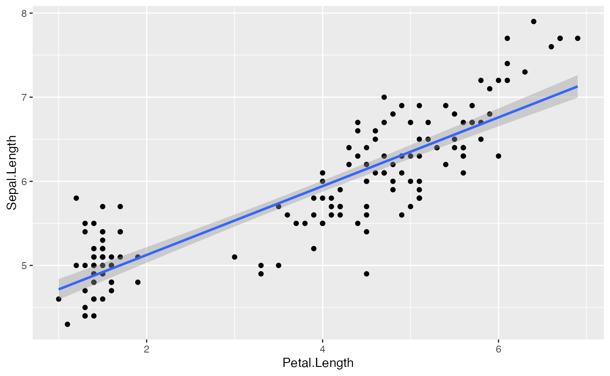
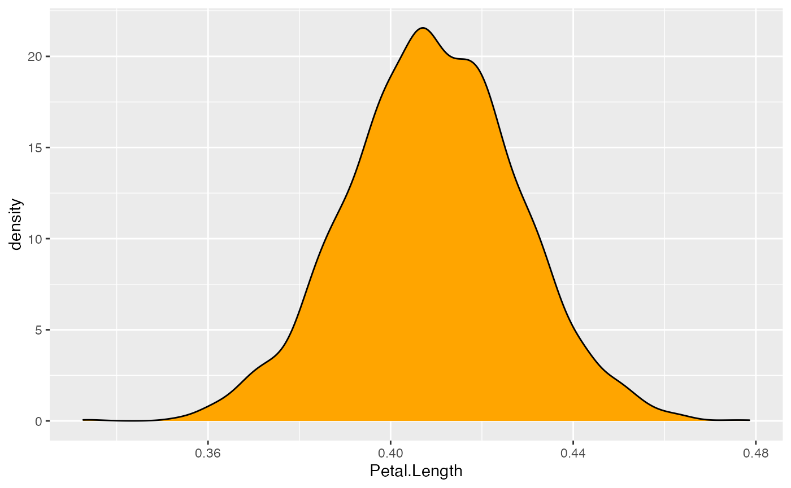
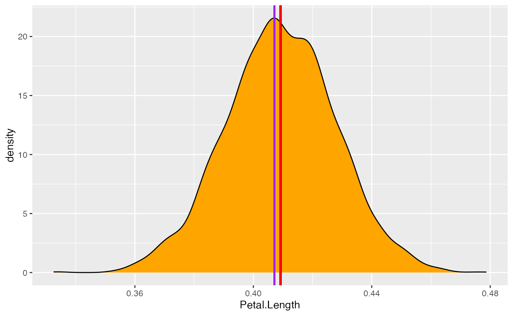
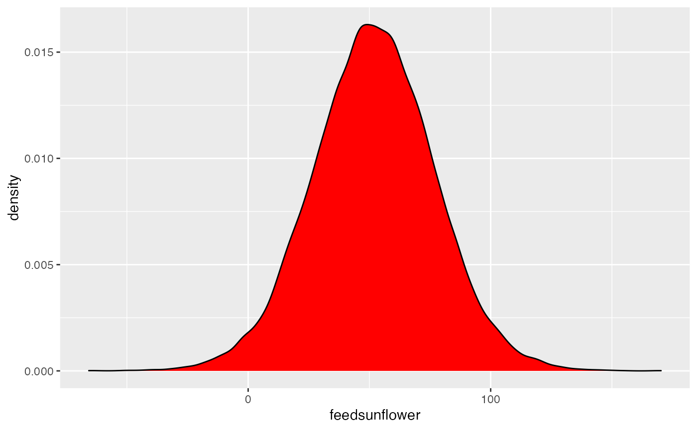

# 1. Initiation to Bayesian models

This vignette can be referred to by citing the package:

- Makowski, D., Ben-Shachar, M. S., & Lüdecke, D. (2019). *bayestestR:
  Describing Effects and their Uncertainty, Existence and Significance
  within the Bayesian Framework*. Journal of Open Source Software,
  4(40), 1541. <https://doi.org/10.21105/joss.01541>

------------------------------------------------------------------------

Now that you’ve read the [**Get
started**](https://easystats.github.io/bayestestR/articles/bayestestR.html)
section, let’s dive in the **subtleties of Bayesian modelling using R**.

## Loading the packages

Once you’ve
[installed](https://easystats.github.io/bayestestR/articles/bayestestR.html#bayestestr-installation)
the necessary packages, we can load `rstanarm` (to fit the models),
`bayestestR` (to compute useful indices), and `insight` (to access the
parameters).

\
[`library`](https://rdrr.io/r/base/library.html)`(`[`rstanarm`](https://mc-stan.org/rstanarm/)`)`\
[`library`](https://rdrr.io/r/base/library.html)`(`[`bayestestR`](https://easystats.github.io/bayestestR/)`)`\
[`library`](https://rdrr.io/r/base/library.html)`(`[`insight`](https://easystats.github.io/insight/)`)`

## Simple linear (regression) model

We will begin by conducting a simple linear regression to test the
relationship between `Petal.Length` (our predictor, or *independent*,
variable) and `Sepal.Length` (our response, or *dependent*, variable)
from the [`iris`](https://en.wikipedia.org/wiki/Iris_flower_data_set)
dataset which is included by default in R.

### Fitting the model

Let’s start by fitting a **frequentist** version of the model, just to
have a reference point:

\
`model`` ``<-`` `[`lm`](https://rdrr.io/r/stats/lm.html)`(``Sepal.Length`` ``~`` ``Petal.Length``, data ``=`` ``iris``)`\
[`summary`](https://rdrr.io/r/base/summary.html)`(``model``)`

    > 
    > Call:
    > lm(formula = Sepal.Length ~ Petal.Length, data = iris)
    > 
    > Residuals:
    >     Min      1Q  Median      3Q     Max 
    > -1.2468 -0.2966 -0.0152  0.2768  1.0027 
    > 
    > Coefficients:
    >              Estimate Std. Error t value Pr(>|t|)    
    > (Intercept)    4.3066     0.0784    54.9   <2e-16 ***
    > Petal.Length   0.4089     0.0189    21.6   <2e-16 ***
    > ---
    > Signif. codes:  0 '***' 0.001 '**' 0.01 '*' 0.05 '.' 0.1 ' ' 1
    > 
    > Residual standard error: 0.41 on 148 degrees of freedom
    > Multiple R-squared:  0.76,    Adjusted R-squared:  0.758 
    > F-statistic:  469 on 1 and 148 DF,  p-value: <2e-16

We can also zoom in on the parameters of interest to us:

\
[`get_parameters`](https://easystats.github.io/insight/reference/get_parameters.html)`(``model``)`

    >      Parameter Estimate
    > 1  (Intercept)     4.31
    > 2 Petal.Length     0.41

In this model, the linear relationship between `Petal.Length` and
`Sepal.Length` is **positive and significant** (\beta = 0.41, t(148) =
21.6, p \< .001). This means that for each one-unit increase in
`Petal.Length` (the predictor), you can expect `Sepal.Length` (the
response) to increase by **0.41**. This effect can be visualized by
plotting the predictor values on the `x` axis and the response values as
`y` using the `ggplot2` package:

\
[`library`](https://rdrr.io/r/base/library.html)`(`[`ggplot2`](https://ggplot2.tidyverse.org)`)`` ``# Load the package`\
\
`# The ggplot function takes the data as argument, and then the variables`\
`# related to aesthetic features such as the x and y axes.`\
[`ggplot`](https://ggplot2.tidyverse.org/reference/ggplot.html)`(``iris``, `[`aes`](https://ggplot2.tidyverse.org/reference/aes.html)`(``x ``=`` ``Petal.Length``, y ``=`` ``Sepal.Length``)``)`` ``+`\
`  `[`geom_point`](https://ggplot2.tidyverse.org/reference/geom_point.html)`(``)`` ``+`` ``# This adds the points`\
`  `[`geom_smooth`](https://ggplot2.tidyverse.org/reference/geom_smooth.html)`(``method ``=`` ``"lm"``)`` ``# This adds a regression line`

Now let’s fit a **Bayesian version** of the model by using the
`stan_glm` function in the `rstanarm` package:

\
`model`` ``<-`` `[`stan_glm`](https://mc-stan.org/rstanarm/reference/stan_glm.html)`(``Sepal.Length`` ``~`` ``Petal.Length``, data ``=`` ``iris``)`

You can see the sampling algorithm being run.

### Extracting the posterior

Once it is done, let us extract the parameters (*i.e.*, coefficients) of
the model.

\
`posteriors`` ``<-`` `[`get_parameters`](https://easystats.github.io/insight/reference/get_parameters.html)`(``model``)`\
\
[`head`](https://rdrr.io/r/utils/head.html)`(``posteriors``)`` ``# Show the first 6 rows`

    >   (Intercept) Petal.Length
    > 1         4.4         0.39
    > 2         4.4         0.40
    > 3         4.3         0.41
    > 4         4.3         0.40
    > 5         4.3         0.40
    > 6         4.3         0.41

As we can see, the parameters take the form of a lengthy dataframe with
two columns, corresponding to the `intercept` and the effect of
`Petal.Length`. These columns contain the **posterior distributions** of
these two parameters. In simple terms, the posterior distribution is a
set of different plausible values for each parameter. Contrast this with
the result we saw from the frequentist linear regression mode using
`lm`, where the results had **single values** for each effect of the
model, and not a distribution of values. This is one of the most
important differences between these two frameworks.

#### About posterior draws

Let’s look at the length of the posteriors.

\
[`nrow`](https://rdrr.io/r/base/nrow.html)`(``posteriors``)`` ``# Size (number of rows)`

    > [1] 4000

**Why is the size 4000, and not more or less?**

First of all, these observations (the rows) are usually referred to as
**posterior draws**. The underlying idea is that the Bayesian sampling
algorithm (*e.g.*, **Monte Carlo Markov Chains - MCMC**) will *draw*
from the hidden true posterior distribution. Thus, it is through these
posterior draws that we can estimate the underlying true posterior
distribution. **Therefore, the more draws you have, the better your
estimation of the posterior distribution**. However, increased draws
also means longer computation time.

If we look at the documentation (`?sampling`) for the `rstanarm`’s
`"sampling"` algorithm used by default in the model above, we can see
several parameters that influence the number of posterior draws. By
default, there are **4** `chains` (you can see it as distinct sampling
runs), that each create **2000** `iter` (draws). However, only half of
these iterations are kept, as half are used for `warm-up` (the
convergence of the algorithm). Thus, the total for posterior draws
equals **`4 chains * (2000 iterations - 1000 warm-up) = 4000`**.

We can change that, for instance:

\
`model`` ``<-`` `[`stan_glm`](https://mc-stan.org/rstanarm/reference/stan_glm.html)`(`\
`  ``Sepal.Length`` ``~`` ``Petal.Length``,`\
`  data ``=`` ``iris``,`\
`  chains ``=`` ``2``,`\
`  iter ``=`` ``1000``,`\
`  warmup ``=`` ``250`\
`)`\
\
[`nrow`](https://rdrr.io/r/base/nrow.html)`(`[`get_parameters`](https://easystats.github.io/insight/reference/get_parameters.html)`(``model``)``)`` ``# Size (number of rows)`

    [1] 1500

In this case, as would be expected, we have
**`2 chains * (1000 iterations - 250 warm-up) = 1500`** posterior draws.
But let’s keep our first model with the default setup (as it has more
draws).

#### Visualizing the posterior distribution

Now that we’ve understood where these values come from, let’s look at
them. We will start by visualizing the posterior distribution of our
parameter of interest, the effect of `Petal.Length`.

\
[`ggplot`](https://ggplot2.tidyverse.org/reference/ggplot.html)`(``posteriors``, `[`aes`](https://ggplot2.tidyverse.org/reference/aes.html)`(``x ``=`` ``Petal.Length``)``)`` ``+`\
`  `[`geom_density`](https://ggplot2.tidyverse.org/reference/geom_density.html)`(``fill ``=`` ``"orange"``)`

This distribution represents the
[probability](https://en.wikipedia.org/wiki/Probability_density_function)
(the `y` axis) of different effects (the `x` axis). The central values
are more probable than the extreme values. As you can see, this
distribution ranges from about **0.35 to 0.50**, with the bulk of it
being at around **0.41**.

> **Congrats! You’ve just described your first posterior distribution.**

And this is the heart of Bayesian analysis. We don’t need *p*-values,
*t*-values, or degrees of freedom. **Everything we need is contained
within this posterior distribution**.

Our description above is consistent with the values obtained from the
frequentist regression (which resulted in a \beta of **0.41**). This is
reassuring! Indeed, **in most cases, Bayesian analysis does not
drastically differ from the frequentist results** or their
interpretation. Rather, it makes the results more interpretable and
intuitive, and easier to understand and describe.

We can now go ahead and **precisely characterize** this posterior
distribution.

### Describing the Posterior

Unfortunately, it is often not practical to report the whole posterior
distributions as graphs. We need to find a **concise way to summarize
it**. We recommend to describe the posterior distribution with **3
elements**:

1.  A **point-estimate** which is a one-value summary (similar to the
    beta in frequentist regressions).
2.  A **credible interval** representing the associated uncertainty.
3.  Some **indices of significance**, giving information about the
    relative importance of this effect.

#### Point-estimate

**What single value can best represent my posterior distribution?**

Centrality indices, such as the *mean*, the *median*, or the *mode* are
usually used as point-estimates. But what’s the difference between them?

Let’s answer this by first inspecting the **mean**:

\
[`mean`](https://rdrr.io/r/base/mean.html)`(``posteriors``$``Petal.Length``)`

    > [1] 0.41

This is close to the frequentist \beta. But, as we know, the mean is
quite sensitive to outliers or extremes values. Maybe the **median**
could be more robust?

\
[`median`](https://rdrr.io/r/stats/median.html)`(``posteriors``$``Petal.Length``)`

    > [1] 0.41

Well, this is **very close to the mean** (and identical when rounding
the values). Maybe we could take the **mode**, that is, the *peak* of
the posterior distribution? In the Bayesian framework, this value is
called the **Maximum A Posteriori (MAP)**. Let’s see:

\
[`map_estimate`](https://easystats.github.io/bayestestR/reference/map_estimate.md)`(``posteriors``$``Petal.Length``)`

    > MAP Estimate
    > 
    > Parameter | MAP_Estimate
    > ------------------------
    > x         |         0.41

**They are all very close!**

Let’s visualize these values on the posterior distribution:

\
[`ggplot`](https://ggplot2.tidyverse.org/reference/ggplot.html)`(``posteriors``, `[`aes`](https://ggplot2.tidyverse.org/reference/aes.html)`(``x ``=`` ``Petal.Length``)``)`` ``+`\
`  `[`geom_density`](https://ggplot2.tidyverse.org/reference/geom_density.html)`(``fill ``=`` ``"orange"``)`` ``+`\
`  ``# The mean in blue`\
`  `[`geom_vline`](https://ggplot2.tidyverse.org/reference/geom_abline.html)`(``xintercept ``=`` `[`mean`](https://rdrr.io/r/base/mean.html)`(``posteriors``$``Petal.Length``)``, color ``=`` ``"blue"``, linewidth ``=`` ``1``)`` ``+`\
`  ``# The median in red`\
`  `[`geom_vline`](https://ggplot2.tidyverse.org/reference/geom_abline.html)`(``xintercept ``=`` `[`median`](https://rdrr.io/r/stats/median.html)`(``posteriors``$``Petal.Length``)``, color ``=`` ``"red"``, linewidth ``=`` ``1``)`` ``+`\
`  ``# The MAP in purple`\
`  `[`geom_vline`](https://ggplot2.tidyverse.org/reference/geom_abline.html)`(`\
`    xintercept ``=`` `[`as.numeric`](https://rdrr.io/r/base/numeric.html)`(`[`map_estimate`](https://easystats.github.io/bayestestR/reference/map_estimate.md)`(``posteriors``$``Petal.Length``)``)``,`\
`    color ``=`` ``"purple"``,`\
`    linewidth ``=`` ``1`\
`  ``)`

Well, all these values give very similar results. Thus, **we will choose
the median**, as this value has a direct meaning from a probabilistic
perspective: **there is 50% chance that the true effect is higher and
50% chance that the effect is lower** (as it divides the distribution in
two equal parts).

#### Uncertainty

Now that the have a point-estimate, we have to **describe the
uncertainty**. We could compute the range:

\
[`range`](https://rdrr.io/r/base/range.html)`(``posteriors``$``Petal.Length``)`

    > [1] 0.33 0.48

But does it make sense to include all these extreme values? Probably
not. Thus, we will compute a [**credible
interval**](https://easystats.github.io/bayestestR/articles/credible_interval.html).
Long story short, it’s kind of similar to a frequentist **confidence
interval**, but easier to interpret and easier to compute — *and it
makes more sense*.

We will compute this **credible interval** based on the [Highest Density
Interval
(HDI)](https://easystats.github.io/bayestestR/articles/credible_interval.html#different-types-of-cis).
It will give us the range containing the 89% most probable effect
values. **Note that we will use 89% CIs instead of 95%** CIs (as in the
frequentist framework) - see discussion on choice of credibility level
[here](https://easystats.github.io/bayestestR/articles/credible_interval.html).

\
[`hdi`](https://easystats.github.io/bayestestR/reference/hdi.md)`(``posteriors``$``Petal.Length``, ci ``=`` ``0.89``)`

    > 89% HDI: [0.38, 0.44]

Nice, so we can conclude that **the effect has 89% chance of falling
within the `[0.38, 0.44]` range**. We have just computed the two most
important pieces of information for describing our effects.

#### Effect significance

However, in many scientific fields it not sufficient to simply describe
the effects. Scientists also want to know if this effect has
significance in practical or statistical terms, or in other words,
whether the effect is **important**. For instance, is the effect
different from 0? So how do we **assess the *significance* of an
effect**. How can we do this?

Well, in this particular case, it is very eloquent: **all possible
effect values (*i.e.*, the whole posterior distribution) are positive
and over 0.35, which is already substantial evidence the effect is not
zero**.

But still, we want some objective decision criterion, to say if **yes or
no the effect is ‘significant’**. One approach, similar to the
frequentist framework, would be to see if the **Credible Interval**
contains 0. If it is not the case, that would mean that our **effect is
‘significant’**.

But this index is not very fine-grained, no? **Can we do better? Yes!**

## A linear model with a categorical predictor

Imagine for a moment you are interested in how the weight of chickens
varies depending on two different **feed types**. For this example, we
will start by selecting from the `chickwts` dataset (available in base
R) two feed types of interest for us (*we do have peculiar interests*):
**meat meals** and **sunflowers**.

### Data preparation and model fitting

\
[`library`](https://rdrr.io/r/base/library.html)`(`[`datawizard`](https://easystats.github.io/datawizard/)`)`\
\
`# We keep only rows for which feed is meatmeal or sunflower`\
`data`` ``<-`` `[`data_filter`](https://easystats.github.io/datawizard/reference/data_match.html)`(``chickwts``, ``feed`` `[`%in%`](https://rdrr.io/r/base/match.html)` `[`c`](https://rdrr.io/r/base/c.html)`(``"meatmeal"``, ``"sunflower"``)``)`

Let’s run another Bayesian regression to predict the **weight** with the
**two types of feed type**.

\
`model`` ``<-`` `[`stan_glm`](https://mc-stan.org/rstanarm/reference/stan_glm.html)`(``weight`` ``~`` ``feed``, data ``=`` ``data``)`

### Posterior description

\
`posteriors`` ``<-`` `[`get_parameters`](https://easystats.github.io/insight/reference/get_parameters.html)`(``model``)`\
\
[`ggplot`](https://ggplot2.tidyverse.org/reference/ggplot.html)`(``posteriors``, `[`aes`](https://ggplot2.tidyverse.org/reference/aes.html)`(``x ``=`` ``feedsunflower``)``)`` ``+`\
`  `[`geom_density`](https://ggplot2.tidyverse.org/reference/geom_density.html)`(``fill ``=`` ``"red"``)`

This represents the **posterior distribution of the difference** between
`meatmeal` and `sunflowers`. It seems that the difference is
**positive** (since the values are concentrated on the right side of 0).
Eating sunflowers makes you more fat (*at least, if you’re a chicken*).
But, **by how much?**

Let us compute the **median** and the **CI**:

\
[`median`](https://rdrr.io/r/stats/median.html)`(``posteriors``$``feedsunflower``)`

    > [1] 52

\
[`hdi`](https://easystats.github.io/bayestestR/reference/hdi.md)`(``posteriors``$``feedsunflower``)`

    > 95% HDI: [2.76, 101.93]

It makes you fat by around 51 grams (the median). However, the
uncertainty is quite high: **there is 89% chance that the difference
between the two feed types is between 14 and 91.**

> **Is this effect different from 0?**

### ROPE Percentage

Testing whether this distribution is different from 0 doesn’t make
sense, as 0 is a single value (*and the probability that any
distribution is different from a single value is infinite*).

However, one way to assess **significance** could be to define an area
*around* 0, which will consider as *practically equivalent* to zero
(*i.e.*, absence of, or a negligible, effect). This is called the
[**Region of Practical Equivalence
(ROPE)**](https://easystats.github.io/bayestestR/articles/region_of_practical_equivalence.html),
and is one way of testing the significance of parameters.

**How can we define this region?**

> ***Driing driiiing***

– ***The easystats team speaking. How can we help?***

– ***I am Prof. Sanders. An expert in chicks… I mean chickens. Just
calling to let you know that based on my expert knowledge, an effect
between -20 and 20 is negligible. Bye.***

Well, that’s convenient. Now we know that we can define the ROPE as the
`[-20, 20]` range. All effects within this range are considered as
*null* (negligible). We can now compute the **proportion of the 89% most
probable values (the 89% CI) which are not null**, *i.e.*, which are
outside this range.

\
[`rope`](https://easystats.github.io/bayestestR/reference/rope.md)`(``posteriors``$``feedsunflower``, range ``=`` `[`c`](https://rdrr.io/r/base/c.html)`(``-``20``, ``20``)``, ci ``=`` ``0.89``)`

    > # Proportion of samples inside the ROPE [-20.00, 20.00]:
    > 
    > Inside ROPE
    > -----------
    > 4.95 %

**5% of the 89% CI can be considered as null**. Is that a lot? Based on
our
[**guidelines**](https://easystats.github.io/bayestestR/articles/guidelines.html),
yes, it is too much. **Based on this particular definition of ROPE**, we
conclude that this effect is not significant (the probability of being
negligible is too high).

That said, to be honest, I have **some doubts about this
Prof. Sanders**. I don’t really trust **his definition of ROPE**. Is
there a more **objective** way of defining it?

Prof. Sanders giving default values to define the Region of Practical
Equivalence (ROPE).

**Yes!** One of the practice is for instance to use the **tenth
(`1/10 = 0.1`) of the standard deviation (SD)** of the response
variable, which can be considered as a “negligible” effect size (Cohen,
1988).

\
`rope_value`` ``<-`` ``0.1`` ``*`` `[`sd`](https://rdrr.io/r/stats/sd.html)`(``data``$``weight``)`\
`rope_range`` ``<-`` `[`c`](https://rdrr.io/r/base/c.html)`(``-``rope_value``, ``rope_value``)`\
`rope_range`

    > [1] -6.2  6.2

Let’s redefine our ROPE as the region within the `[-6.2, 6.2]` range.
**Note that this can be directly obtained by the `rope_range` function
:)**

\
`rope_value`` ``<-`` `[`rope_range`](https://easystats.github.io/bayestestR/reference/rope_range.md)`(``model``)`\
`rope_value`

    > [1] -6.2  6.2

Let’s recompute the **percentage in ROPE**:

\
[`rope`](https://easystats.github.io/bayestestR/reference/rope.md)`(``posteriors``$``feedsunflower``, range ``=`` ``rope_range``, ci ``=`` ``0.89``)`

    > # Proportion of samples inside the ROPE [-6.17, 6.17]:
    > 
    > Inside ROPE
    > -----------
    > 0.00 %

With this reasonable definition of ROPE, we observe that the 89% of the
posterior distribution of the effect does **not** overlap with the ROPE.
Thus, we can conclude that **the effect is significant** (in the sense
of *important* enough to be noted).

### Probability of Direction (pd)

Maybe we are not interested in whether the effect is non-negligible.
Maybe **we just want to know if this effect is positive or negative**.
In this case, we can simply compute the proportion of the posterior that
is positive, no matter the “size” of the effect.

\
`# select only positive values`\
`n_positive`` ``<-`` `[`nrow`](https://rdrr.io/r/base/nrow.html)`(`[`data_filter`](https://easystats.github.io/datawizard/reference/data_match.html)`(``posteriors``, ``feedsunflower`` ``>`` ``0``)``)`\
\
`n_positive`` ``/`` `[`nrow`](https://rdrr.io/r/base/nrow.html)`(``posteriors``)`` ``*`` ``100`

    > [1] 98

We can conclude that **the effect is positive with a probability of
98%**. We call this index the [**Probability of Direction
(pd)**](https://easystats.github.io/bayestestR/articles/probability_of_direction.html).
It can, in fact, be computed more easily with the following:

\
[`p_direction`](https://easystats.github.io/bayestestR/reference/p_direction.md)`(``posteriors``$``feedsunflower``)`

    > Probability of Direction
    > 
    > Parameter |     pd
    > ------------------
    > Posterior | 98.09%

Interestingly, it so happens that **this index is usually highly
correlated with the frequentist *p*-value**. We could almost roughly
infer the corresponding *p*-value with a simple transformation:

\
`pd`` ``<-`` ``97.82`\
`onesided_p`` ``<-`` ``1`` ``-`` ``pd`` ``/`` ``100`\
`twosided_p`` ``<-`` ``onesided_p`` ``*`` ``2`\
`twosided_p`

    > [1] 0.044

If we ran our model in the frequentist framework, we should
approximately observe an effect with a *p*-value of 0.04. **Is that
true?**

#### Comparison to frequentist

\
[`summary`](https://rdrr.io/r/base/summary.html)`(`[`lm`](https://rdrr.io/r/stats/lm.html)`(``weight`` ``~`` ``feed``, data ``=`` ``data``)``)`

    > 
    > Call:
    > lm(formula = weight ~ feed, data = data)
    > 
    > Residuals:
    >     Min      1Q  Median      3Q     Max 
    > -123.91  -25.91   -6.92   32.09  103.09 
    > 
    > Coefficients:
    >               Estimate Std. Error t value Pr(>|t|)    
    > (Intercept)      276.9       17.2   16.10  2.7e-13 ***
    > feedsunflower     52.0       23.8    2.18     0.04 *  
    > ---
    > Signif. codes:  0 '***' 0.001 '**' 0.01 '*' 0.05 '.' 0.1 ' ' 1
    > 
    > Residual standard error: 57 on 21 degrees of freedom
    > Multiple R-squared:  0.185,   Adjusted R-squared:  0.146 
    > F-statistic: 4.77 on 1 and 21 DF,  p-value: 0.0405

The frequentist model tells us that the difference is **positive and
significant** (\beta = 52, p = 0.04).

**Although we arrived to a similar conclusion, the Bayesian framework
allowed us to develop a more profound and intuitive understanding of our
effect, and of the uncertainty of its estimation.**

## All with one function

And yet, I agree, it was a bit **tedious** to extract and compute all
the indices. **But what if I told you that we can do all of this, and
more, with only one function?**

> **Behold, `describe_posterior`!**

This function computes all of the adored mentioned indices, and can be
run directly on the model:

\
[`describe_posterior`](https://easystats.github.io/bayestestR/reference/describe_posterior.md)`(``model``, test ``=`` `[`c`](https://rdrr.io/r/base/c.html)`(``"p_direction"``, ``"rope"``, ``"bayesfactor"``)``)`

    > Summary of Posterior Distribution
    > 
    > Parameter     | Median |           95% CI |     pd |          ROPE | % in ROPE
    > ------------------------------------------------------------------------------
    > (Intercept)   | 277.13 | [240.57, 312.75] |   100% | [-6.17, 6.17] |        0%
    > feedsunflower |  51.69 | [  2.81, 102.04] | 98.09% | [-6.17, 6.17] |     1.01%
    > 
    > Parameter     |       BF |  Rhat | ESS (tail)
    > ---------------------------------------------
    > (Intercept)   | 1.77e+13 | 1.000 |      24371
    > feedsunflower |    0.770 | 1.000 |      24697

**Tada!** There we have it! The **median**, the **CI**, the **pd** and
the **ROPE percentage**!

Understanding and describing posterior distributions is just one aspect
of Bayesian modelling. **Are you ready for more?!** [**Click
here**](https://easystats.github.io/bayestestR/articles/example2.html)
to see the next example.

## References

Cohen, J. (1988). *Statistical power analysis for the social sciences*.
