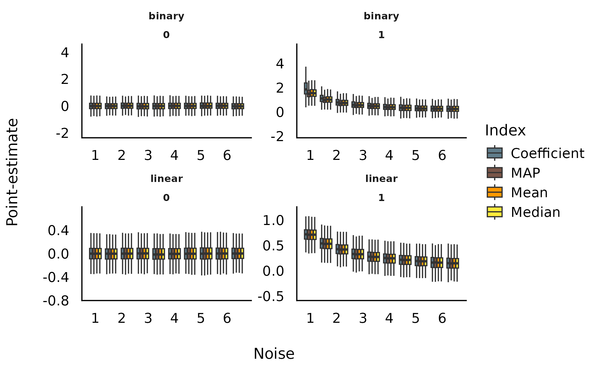
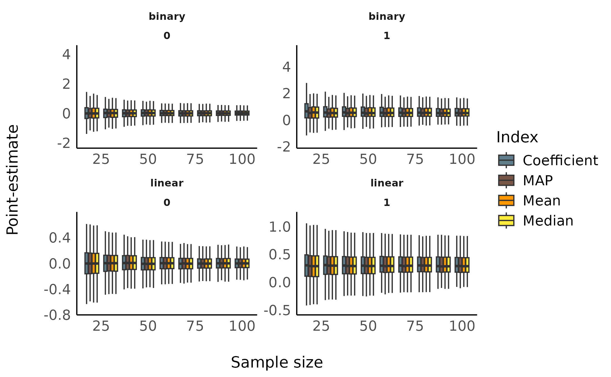
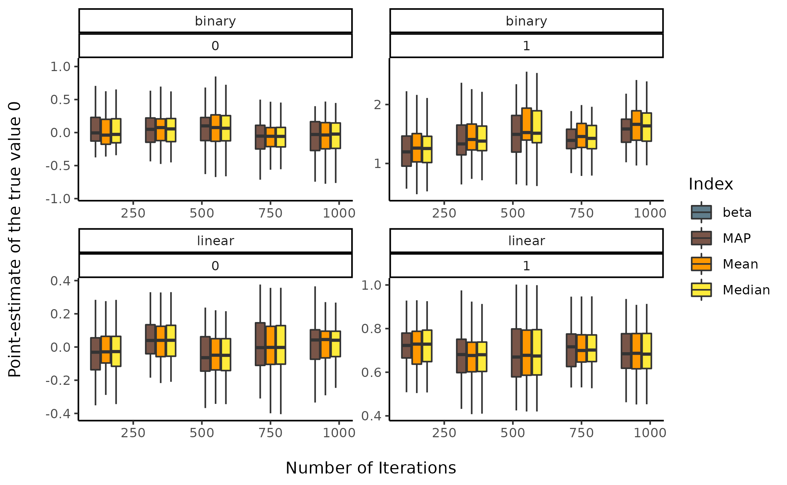
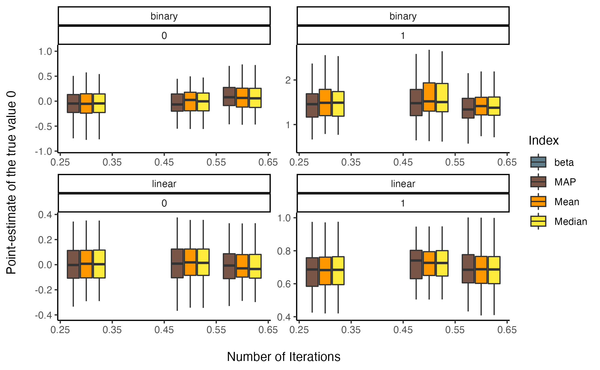

# In-Depth 1: Comparison of Point-Estimates

This vignette can be referred to by citing the package:

- Makowski, D., Ben-Shachar, M. S., & Lüdecke, D. (2019). *bayestestR:
  Describing Effects and their Uncertainty, Existence and Significance
  within the Bayesian Framework*. Journal of Open Source Software,
  4(40), 1541. <https://doi.org/10.21105/joss.01541>

------------------------------------------------------------------------

## Effect Point-Estimates in the Bayesian Framework

### Introduction

One of the main difference between the Bayesian and the frequentist
frameworks is that the former returns a probability *distribution* for
each effect (*i.e.*, a model parameter of interest, such as a regression
slope) instead of a *single value*. However, there is still a need and
demand - for reporting or use in further analysis - for a single value
(**point-estimate**) that best characterises the underlying posterior
distribution.

There are three main indices used in the literature for effect
estimation: - the **mean** - the **median** - the **MAP** (Maximum A
Posteriori) estimate (roughly corresponding to the mode - the “peak” -
of the distribution)

Unfortunately, there is no consensus about which one to use, as no
systematic comparison has ever been done.

In the present work, we will compare these three point-estimates of
effect with each other, as well as with the widely known **beta**,
extracted from a comparable frequentist model. These comparisons can
help us draw bridges and relationships between these two influential
statistical frameworks.

### Experiment 1: Relationship with Error (Noise) and Sample Size

#### Methods

We will be carrying out simulation aimed at modulating the following
characteristics:

- **Model type**: linear or logistic.
- **“True” effect** (*known* parameters values from which data is
  drawn): Can be 1 or 0 (no effect).
- **Sample size**: From 20 to 100 by steps of 10.
- **Error**: Gaussian noise applied to the predictor with SD uniformly
  spread between 0.33 and 6.66 (with 1000 different values).

We generated a dataset for each combination of these characteristics,
resulting in a total of `2 * 2 * 9 * 1000 = 36000` Bayesian and
frequentist models. The code used for generation is available
[here](https://easystats.github.io/circus/articles/bayesian_indices.html)
(please note that it takes usually several days/weeks to complete).

\
[`library`](https://rdrr.io/r/base/library.html)`(`[`ggplot2`](https://ggplot2.tidyverse.org)`)`\
[`library`](https://rdrr.io/r/base/library.html)`(`[`datawizard`](https://easystats.github.io/datawizard/)`)`\
[`library`](https://rdrr.io/r/base/library.html)`(`[`see`](https://easystats.github.io/see/)`)`\
[`library`](https://rdrr.io/r/base/library.html)`(`[`parameters`](https://easystats.github.io/parameters/)`)`\
\
`df`` ``<-`` `[`read.csv`](https://rdrr.io/r/utils/read.table.html)`(``"https://raw.github.com/easystats/circus/main/data/bayesSim_study1.csv"``)`

#### Results

##### Sensitivity to Noise

\
`dat`` ``<-`` ``df`\
`dat`` ``<-`` `[`data_select`](https://easystats.github.io/datawizard/reference/extract_column_names.html)`(`\
`  ``dat``,`\
`  select ``=`` `[`c`](https://rdrr.io/r/base/c.html)`(`\
`    ``"error"``,`\
`    ``"true_effect"``,`\
`    ``"outcome_type"``,`\
`    ``"Coefficient"``,`\
`    ``"Median"``,`\
`    ``"Mean"``,`\
`    ``"MAP"`\
`  ``)`\
`)`\
`dat`` ``<-`` `[`reshape_longer`](https://easystats.github.io/datawizard/reference/data_to_long.html)`(`\
`  ``dat``,`\
`  select ``=`` ``-`[`c`](https://rdrr.io/r/base/c.html)`(``"error"``, ``"true_effect"``, ``"outcome_type"``)``,`\
`  names_to ``=`` ``"estimate"``,`\
`  values_to ``=`` ``"value"`\
`)`\
`dat``$``temp`` ``<-`` `[`as.factor`](https://rdrr.io/r/base/factor.html)`(`[`cut`](https://rdrr.io/r/base/cut.html)`(``dat``$``error``, ``10``, labels ``=`` ``FALSE``)``)`\
\
`tmp`` ``<-`` `[`lapply`](https://rdrr.io/r/base/lapply.html)`(`[`split`](https://rdrr.io/r/base/split.html)`(``dat``, ``dat``$``temp``)``, ``function``(``x``)`` ``{`\
`  ``x``$``error_group`` ``<-`` `[`rep`](https://rdrr.io/r/base/rep.html)`(`[`round`](https://rdrr.io/r/base/Round.html)`(`[`mean`](https://rdrr.io/r/base/mean.html)`(``x``$``error``)``, ``1``)``, times ``=`` `[`nrow`](https://rdrr.io/r/base/nrow.html)`(``x``)``)`\
`  `[`return`](https://rdrr.io/r/base/function.html)`(``x``)`\
`}``)`\
\
`dat`` ``<-`` `[`do.call`](https://rdrr.io/r/base/do.call.html)`(``rbind``, ``tmp``)`\
`dat`` ``<-`` `[`data_filter`](https://easystats.github.io/datawizard/reference/data_match.html)`(``dat``, ``value`` ``<`` ``6``)`\
\
[`ggplot`](https://ggplot2.tidyverse.org/reference/ggplot.html)`(`\
`  ``dat``,`\
`  `[`aes`](https://ggplot2.tidyverse.org/reference/aes.html)`(`\
`    x ``=`` ``error_group``,`\
`    y ``=`` ``value``,`\
`    fill ``=`` ``estimate``,`\
`    group ``=`` `[`interaction`](https://rdrr.io/r/base/interaction.html)`(``estimate``, ``error_group``)`\
`  ``)`\
`)`` ``+`\
`  ``# geom_hline(yintercept = 0) +`\
`  ``# geom_point(alpha=0.05, size=2, stroke = 0, shape=16) +`\
`  ``# geom_smooth(method="loess") +`\
`  `[`geom_boxplot`](https://ggplot2.tidyverse.org/reference/geom_boxplot.html)`(``outlier.shape ``=`` ``NA``)`` ``+`\
`  `[`theme_modern`](https://easystats.github.io/see/reference/theme_modern.html)`(``)`` ``+`\
`  `[`scale_fill_manual`](https://ggplot2.tidyverse.org/reference/scale_manual.html)`(`\
`    values ``=`` `[`c`](https://rdrr.io/r/base/c.html)`(`\
`      ``"Coefficient"`` ``=`` ``"#607D8B"``,`\
`      ``"MAP"`` ``=`` ``"#795548"``,`\
`      ``"Mean"`` ``=`` ``"#FF9800"``,`\
`      ``"Median"`` ``=`` ``"#FFEB3B"`\
`    ``)``,`\
`    name ``=`` ``"Index"`\
`  ``)`` ``+`\
`  `[`ylab`](https://ggplot2.tidyverse.org/reference/labs.html)`(``"Point-estimate"``)`` ``+`\
`  `[`xlab`](https://ggplot2.tidyverse.org/reference/labs.html)`(``"Noise"``)`` ``+`\
`  `[`facet_wrap`](https://ggplot2.tidyverse.org/reference/facet_wrap.html)`(``~`` ``outcome_type`` ``*`` ``true_effect``, scales ``=`` ``"free"``)`

##### Sensitivity to Sample Size

\
`dat`` ``<-`` ``df`\
`dat`` ``<-`` `[`data_select`](https://easystats.github.io/datawizard/reference/extract_column_names.html)`(`\
`  ``dat``,`\
`  select ``=`` `[`c`](https://rdrr.io/r/base/c.html)`(`\
`    ``"sample_size"``,`\
`    ``"true_effect"``,`\
`    ``"outcome_type"``,`\
`    ``"Coefficient"``,`\
`    ``"Median"``,`\
`    ``"Mean"``,`\
`    ``"MAP"`\
`  ``)`\
`)`\
`dat`` ``<-`` `[`reshape_longer`](https://easystats.github.io/datawizard/reference/data_to_long.html)`(`\
`  ``dat``,`\
`  select ``=`` ``-`[`c`](https://rdrr.io/r/base/c.html)`(``"sample_size"``, ``"true_effect"``, ``"outcome_type"``)``,`\
`  names_to ``=`` ``"estimate"``,`\
`  values_to ``=`` ``"value"`\
`)`\
`dat``$``temp`` ``<-`` `[`as.factor`](https://rdrr.io/r/base/factor.html)`(`[`cut`](https://rdrr.io/r/base/cut.html)`(``dat``$``sample_size``, ``10``, labels ``=`` ``FALSE``)``)`\
\
`tmp`` ``<-`` `[`lapply`](https://rdrr.io/r/base/lapply.html)`(`[`split`](https://rdrr.io/r/base/split.html)`(``dat``, ``dat``$``temp``)``, ``function``(``x``)`` ``{`\
`  ``x``$``size_group`` ``<-`` `[`rep`](https://rdrr.io/r/base/rep.html)`(`[`round`](https://rdrr.io/r/base/Round.html)`(`[`mean`](https://rdrr.io/r/base/mean.html)`(``x``$``sample_size``)``, ``1``)``, times ``=`` `[`nrow`](https://rdrr.io/r/base/nrow.html)`(``x``)``)`\
`  `[`return`](https://rdrr.io/r/base/function.html)`(``x``)`\
`}``)`\
\
`dat`` ``<-`` `[`do.call`](https://rdrr.io/r/base/do.call.html)`(``rbind``, ``tmp``)`\
`dat`` ``<-`` `[`data_filter`](https://easystats.github.io/datawizard/reference/data_match.html)`(``dat``, ``value`` ``<`` ``6``)`\
\
[`ggplot`](https://ggplot2.tidyverse.org/reference/ggplot.html)`(`\
`  ``dat``,`\
`  `[`aes`](https://ggplot2.tidyverse.org/reference/aes.html)`(`\
`    x ``=`` ``size_group``,`\
`    y ``=`` ``value``,`\
`    fill ``=`` ``estimate``,`\
`    group ``=`` `[`interaction`](https://rdrr.io/r/base/interaction.html)`(``estimate``, ``size_group``)`\
`  ``)`\
`)`` ``+`\
`  ``# geom_hline(yintercept = 0) +`\
`  ``# geom_point(alpha=0.05, size=2, stroke = 0, shape=16) +`\
`  ``# geom_smooth(method="loess") +`\
`  `[`geom_boxplot`](https://ggplot2.tidyverse.org/reference/geom_boxplot.html)`(``outlier.shape ``=`` ``NA``)`` ``+`\
`  `[`theme_modern`](https://easystats.github.io/see/reference/theme_modern.html)`(``)`` ``+`\
`  `[`scale_fill_manual`](https://ggplot2.tidyverse.org/reference/scale_manual.html)`(`\
`    values ``=`` `[`c`](https://rdrr.io/r/base/c.html)`(`\
`      ``"Coefficient"`` ``=`` ``"#607D8B"``,`\
`      ``"MAP"`` ``=`` ``"#795548"``,`\
`      ``"Mean"`` ``=`` ``"#FF9800"``,`\
`      ``"Median"`` ``=`` ``"#FFEB3B"`\
`    ``)``,`\
`    name ``=`` ``"Index"`\
`  ``)`` ``+`\
`  `[`ylab`](https://ggplot2.tidyverse.org/reference/labs.html)`(``"Point-estimate"``)`` ``+`\
`  `[`xlab`](https://ggplot2.tidyverse.org/reference/labs.html)`(``"Sample size"``)`` ``+`\
`  `[`facet_wrap`](https://ggplot2.tidyverse.org/reference/facet_wrap.html)`(``~`` ``outcome_type`` ``*`` ``true_effect``, scales ``=`` ``"free"``)`

##### Statistical Modelling

We fitted a (frequentist) multiple linear regression to statistically
test the the predict the presence or absence of effect with the
estimates as well as their interaction with noise and sample size.

\
`dat`` ``<-`` ``df`\
`dat`` ``<-`` `[`data_select`](https://easystats.github.io/datawizard/reference/extract_column_names.html)`(`\
`  ``dat``,`\
`  select ``=`` `[`c`](https://rdrr.io/r/base/c.html)`(`\
`    ``"sample_size"``,`\
`    ``"true_effect"``,`\
`    ``"outcome_type"``,`\
`    ``"Coefficient"``,`\
`    ``"Median"``,`\
`    ``"Mean"``,`\
`    ``"MAP"`\
`  ``)`\
`)`\
`dat`` ``<-`` `[`reshape_longer`](https://easystats.github.io/datawizard/reference/data_to_long.html)`(`\
`  ``dat``,`\
`  select ``=`` ``-`[`c`](https://rdrr.io/r/base/c.html)`(``"sample_size"``, ``"true_effect"``, ``"outcome_type"``)``,`\
`  names_to ``=`` ``"estimate"``,`\
`  values_to ``=`` ``"value"`\
`)`\
\
`out`` ``<-`` `[`glm`](https://rdrr.io/r/stats/glm.html)`(``true_effect`` ``~`` ``outcome_type`` ``/`` ``estimate`` ``/`` ``value``, data ``=`` ``dat``, family ``=`` ``"binomial"``)`\
`out`` ``<-`` `[`parameters`](https://easystats.github.io/parameters/reference/model_parameters.html)`(``out``, ci_method ``=`` ``"wald"``)`\
`out`` ``<-`` `[`data_select`](https://easystats.github.io/datawizard/reference/extract_column_names.html)`(``out``, `[`c`](https://rdrr.io/r/base/c.html)`(``"Parameter"``, ``"Coefficient"``, ``"p"``)``)`\
`rows`` ``<-`` `[`grep`](https://rdrr.io/r/base/grep.html)`(``"^outcome_type(.*):value$"``, x ``=`` ``out``$``Parameter``)`\
`out`` ``<-`` `[`data_filter`](https://easystats.github.io/datawizard/reference/data_match.html)`(``out``, ``rows``)`\
`out`` ``<-`` ``out``[`[`order`](https://rdrr.io/r/base/order.html)`(``out``$``Coefficient``, decreasing ``=`` ``TRUE``)``, ``]`\
`knitr``::`[`kable`](https://rdrr.io/pkg/knitr/man/kable.html)`(``out``, digits ``=`` ``2``)`

|     | Parameter                                    | Coefficient |   p |
|:----|:---------------------------------------------|------------:|----:|
| 14  | outcome_typelinear:estimateMean:value        |        10.8 |   0 |
| 16  | outcome_typelinear:estimateMedian:value      |        10.8 |   0 |
| 12  | outcome_typelinear:estimateMAP:value         |        10.7 |   0 |
| 10  | outcome_typelinear:estimateCoefficient:value |        10.5 |   0 |
| 11  | outcome_typebinary:estimateMAP:value         |         4.4 |   0 |
| 15  | outcome_typebinary:estimateMedian:value      |         4.3 |   0 |
| 13  | outcome_typebinary:estimateMean:value        |         4.2 |   0 |
| 9   | outcome_typebinary:estimateCoefficient:value |         3.9 |   0 |

This suggests that, in order to delineate between the presence and the
absence of an effect, compared to the frequentist’s beta coefficient:

- For linear models, the **Mean** was the better predictor, closely
  followed by the **Median**, the **MAP** and the frequentist
  **Coefficient**.
- For logistic models, the **MAP** was the better predictor, followed by
  the **Median**, the **Mean** and, behind, the frequentist
  **Coefficient**.

Overall, the **median** appears to be a safe choice, maintaining a high
performance across different types of models.

### Experiment 2: Relationship with Sampling Characteristics

#### Methods

We will be carrying out another simulation aimed at modulating the
following characteristics:

- **Model type**: linear or logistic.
- **“True” effect** (original regression coefficient from which data is
  drawn): Can be 1 or 0 (no effect).
- **draws**: from 10 to 5000 by step of 5 (1000 iterations).
- **warmup**: Ratio of warmup iterations. from 1/10 to 9/10 by step of
  0.1 (9 iterations).

We generated 3 datasets for each combination of these characteristics,
resulting in a total of `2 * 2 * 8 * 40 * 9 * 3 = 34560` Bayesian and
frequentist models. The code used for generation is available
[here](https://easystats.github.io/circus/articles/bayesian_indices.html)
(please note that it takes usually several days/weeks to complete).

\
`df`` ``<-`` `[`read.csv`](https://rdrr.io/r/utils/read.table.html)`(``"https://raw.github.com/easystats/circus/main/data/bayesSim_study2.csv"``)`

#### Results

##### Sensitivity to number of iterations

\
`dat`` ``<-`` ``df`\
`dat`` ``<-`` `[`data_select`](https://easystats.github.io/datawizard/reference/extract_column_names.html)`(`\
`  ``dat``,`\
`  select ``=`` `[`c`](https://rdrr.io/r/base/c.html)`(``"iterations"``, ``"true_effect"``, ``"outcome_type"``, ``"beta"``, ``"Median"``, ``"Mean"``, ``"MAP"``)`\
`)`\
`dat`` ``<-`` `[`reshape_longer`](https://easystats.github.io/datawizard/reference/data_to_long.html)`(`\
`  ``dat``,`\
`  select ``=`` ``-`[`c`](https://rdrr.io/r/base/c.html)`(``"iterations"``, ``"true_effect"``, ``"outcome_type"``)``,`\
`  names_to ``=`` ``"estimate"``,`\
`  values_to ``=`` ``"value"`\
`)`\
`dat``$``temp`` ``<-`` `[`as.factor`](https://rdrr.io/r/base/factor.html)`(`[`cut`](https://rdrr.io/r/base/cut.html)`(``dat``$``iterations``, ``5``, labels ``=`` ``FALSE``)``)`\
\
`tmp`` ``<-`` `[`lapply`](https://rdrr.io/r/base/lapply.html)`(`[`split`](https://rdrr.io/r/base/split.html)`(``dat``, ``dat``$``temp``)``, ``function``(``x``)`` ``{`\
`  ``x``$``iterations_group`` ``<-`` `[`rep`](https://rdrr.io/r/base/rep.html)`(`[`round`](https://rdrr.io/r/base/Round.html)`(`[`mean`](https://rdrr.io/r/base/mean.html)`(``x``$``iterations``)``, ``1``)``, times ``=`` `[`nrow`](https://rdrr.io/r/base/nrow.html)`(``x``)``)`\
`  `[`return`](https://rdrr.io/r/base/function.html)`(``x``)`\
`}``)`\
\
`dat`` ``<-`` `[`do.call`](https://rdrr.io/r/base/do.call.html)`(``rbind``, ``tmp``)`\
`dat`` ``<-`` `[`data_filter`](https://easystats.github.io/datawizard/reference/data_match.html)`(``dat``, ``value`` ``<`` ``6``)`\
\
[`ggplot`](https://ggplot2.tidyverse.org/reference/ggplot.html)`(`\
`  ``dat``,`\
`  `[`aes`](https://ggplot2.tidyverse.org/reference/aes.html)`(`\
`    x ``=`` ``iterations_group``,`\
`    y ``=`` ``value``,`\
`    fill ``=`` ``estimate``,`\
`    group ``=`` `[`interaction`](https://rdrr.io/r/base/interaction.html)`(``estimate``, ``iterations_group``)`\
`  ``)`\
`)`` ``+`\
`  `[`geom_boxplot`](https://ggplot2.tidyverse.org/reference/geom_boxplot.html)`(``outlier.shape ``=`` ``NA``)`` ``+`\
`  `[`theme_classic`](https://ggplot2.tidyverse.org/reference/ggtheme.html)`(``)`` ``+`\
`  `[`scale_fill_manual`](https://ggplot2.tidyverse.org/reference/scale_manual.html)`(`\
`    values ``=`` `[`c`](https://rdrr.io/r/base/c.html)`(`\
`      ``"beta"`` ``=`` ``"#607D8B"``,`\
`      ``"MAP"`` ``=`` ``"#795548"``,`\
`      ``"Mean"`` ``=`` ``"#FF9800"``,`\
`      ``"Median"`` ``=`` ``"#FFEB3B"`\
`    ``)``,`\
`    name ``=`` ``"Index"`\
`  ``)`` ``+`\
`  `[`ylab`](https://ggplot2.tidyverse.org/reference/labs.html)`(``"Point-estimate of the true value 0\n"``)`` ``+`\
`  `[`xlab`](https://ggplot2.tidyverse.org/reference/labs.html)`(``"\nNumber of Iterations"``)`` ``+`\
`  `[`facet_wrap`](https://ggplot2.tidyverse.org/reference/facet_wrap.html)`(``~`` ``outcome_type`` ``*`` ``true_effect``, scales ``=`` ``"free"``)`

##### Sensitivity to warmup ratio

\
`dat`` ``<-`` ``df`\
`dat``$``warmup`` ``<-`` ``dat``$``warmup`` ``/`` ``dat``$``iterations`\
`dat`` ``<-`` `[`data_select`](https://easystats.github.io/datawizard/reference/extract_column_names.html)`(`\
`  ``dat``,`\
`  select ``=`` `[`c`](https://rdrr.io/r/base/c.html)`(``"warmup"``, ``"true_effect"``, ``"outcome_type"``, ``"beta"``, ``"Median"``, ``"Mean"``, ``"MAP"``)`\
`)`\
`dat`` ``<-`` `[`reshape_longer`](https://easystats.github.io/datawizard/reference/data_to_long.html)`(`\
`  ``dat``,`\
`  select ``=`` ``-`[`c`](https://rdrr.io/r/base/c.html)`(``"warmup"``, ``"true_effect"``, ``"outcome_type"``)``,`\
`  names_to ``=`` ``"estimate"``,`\
`  values_to ``=`` ``"value"`\
`)`\
`dat``$``temp`` ``<-`` `[`as.factor`](https://rdrr.io/r/base/factor.html)`(`[`cut`](https://rdrr.io/r/base/cut.html)`(``dat``$``warmup``, ``3``, labels ``=`` ``FALSE``)``)`\
\
`tmp`` ``<-`` `[`lapply`](https://rdrr.io/r/base/lapply.html)`(`[`split`](https://rdrr.io/r/base/split.html)`(``dat``, ``dat``$``temp``)``, ``function``(``x``)`` ``{`\
`  ``x``$``warmup_group`` ``<-`` `[`rep`](https://rdrr.io/r/base/rep.html)`(`[`round`](https://rdrr.io/r/base/Round.html)`(`[`mean`](https://rdrr.io/r/base/mean.html)`(``x``$``warmup``)``, ``1``)``, times ``=`` `[`nrow`](https://rdrr.io/r/base/nrow.html)`(``x``)``)`\
`  `[`return`](https://rdrr.io/r/base/function.html)`(``x``)`\
`}``)`\
\
`dat`` ``<-`` `[`do.call`](https://rdrr.io/r/base/do.call.html)`(``rbind``, ``tmp``)`\
`dat`` ``<-`` `[`data_filter`](https://easystats.github.io/datawizard/reference/data_match.html)`(``dat``, ``value`` ``<`` ``6``)`\
\
[`ggplot`](https://ggplot2.tidyverse.org/reference/ggplot.html)`(`\
`  ``dat``,`\
`  `[`aes`](https://ggplot2.tidyverse.org/reference/aes.html)`(`\
`    x ``=`` ``warmup_group``,`\
`    y ``=`` ``value``,`\
`    fill ``=`` ``estimate``,`\
`    group ``=`` `[`interaction`](https://rdrr.io/r/base/interaction.html)`(``estimate``, ``warmup_group``)`\
`  ``)`\
`)`` ``+`\
`  `[`geom_boxplot`](https://ggplot2.tidyverse.org/reference/geom_boxplot.html)`(``outlier.shape ``=`` ``NA``)`` ``+`\
`  `[`theme_classic`](https://ggplot2.tidyverse.org/reference/ggtheme.html)`(``)`` ``+`\
`  `[`scale_fill_manual`](https://ggplot2.tidyverse.org/reference/scale_manual.html)`(`\
`    values ``=`` `[`c`](https://rdrr.io/r/base/c.html)`(`\
`      ``"beta"`` ``=`` ``"#607D8B"``,`\
`      ``"MAP"`` ``=`` ``"#795548"``,`\
`      ``"Mean"`` ``=`` ``"#FF9800"``,`\
`      ``"Median"`` ``=`` ``"#FFEB3B"`\
`    ``)``,`\
`    name ``=`` ``"Index"`\
`  ``)`` ``+`\
`  `[`ylab`](https://ggplot2.tidyverse.org/reference/labs.html)`(``"Point-estimate of the true value 0\n"``)`` ``+`\
`  `[`xlab`](https://ggplot2.tidyverse.org/reference/labs.html)`(``"\nNumber of Iterations"``)`` ``+`\
`  `[`facet_wrap`](https://ggplot2.tidyverse.org/reference/facet_wrap.html)`(``~`` ``outcome_type`` ``*`` ``true_effect``, scales ``=`` ``"free"``)`

### Discussion

Conclusions can be found in the [guidelines
section](https://easystats.github.io/bayestestR/articles/guidelines.html)
article.

## Suggestions

If you have any advice, opinion or such, we encourage you to let us know
by opening an [discussion
thread](https://github.com/easystats/bayestestR/issues) or making a pull
request.
