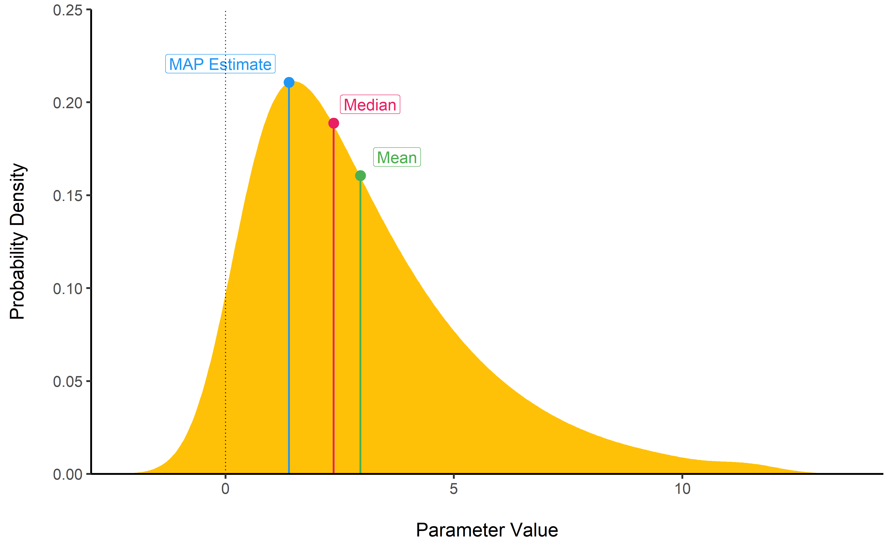
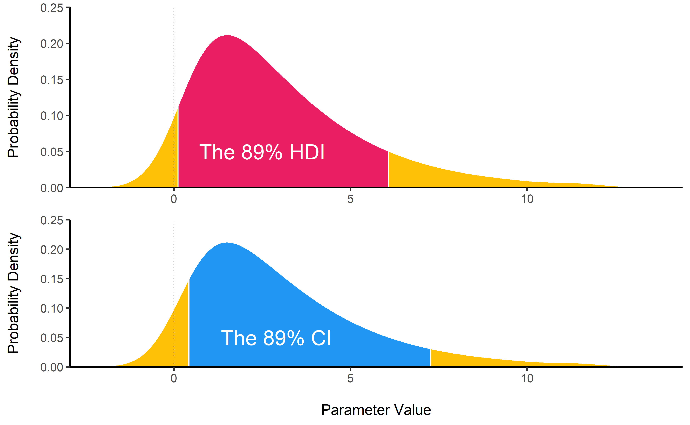
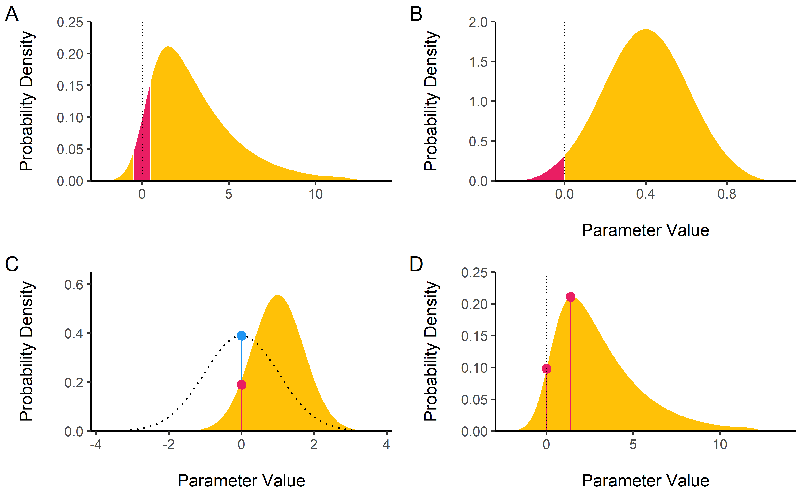
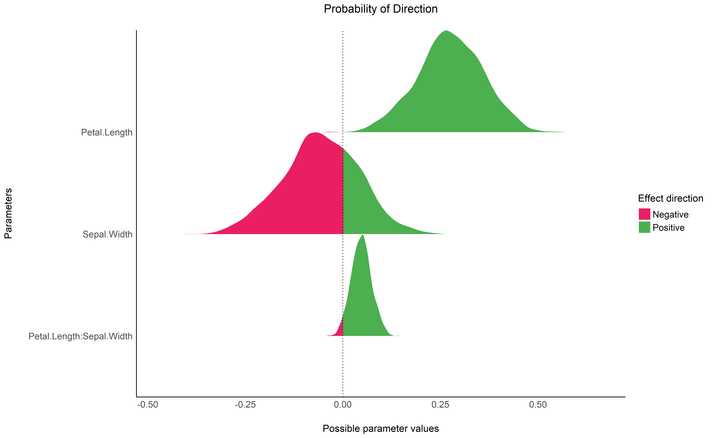
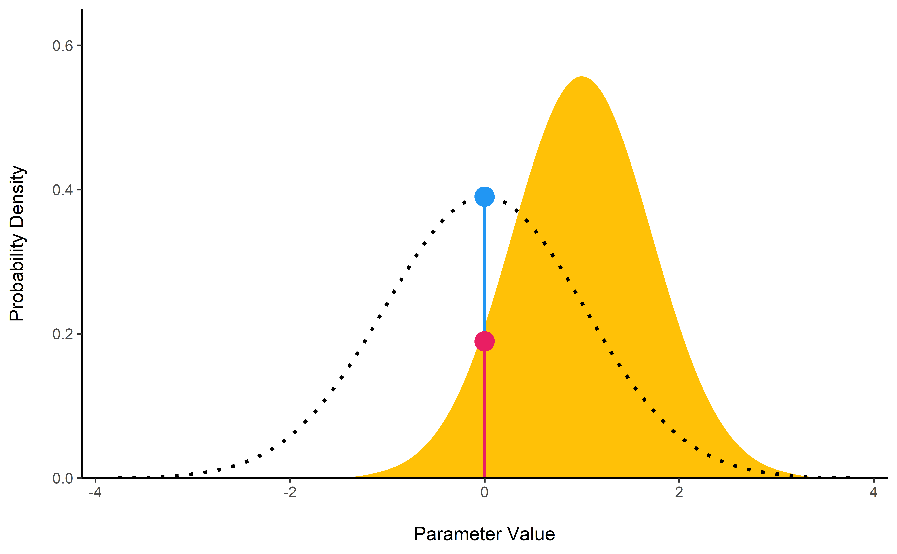
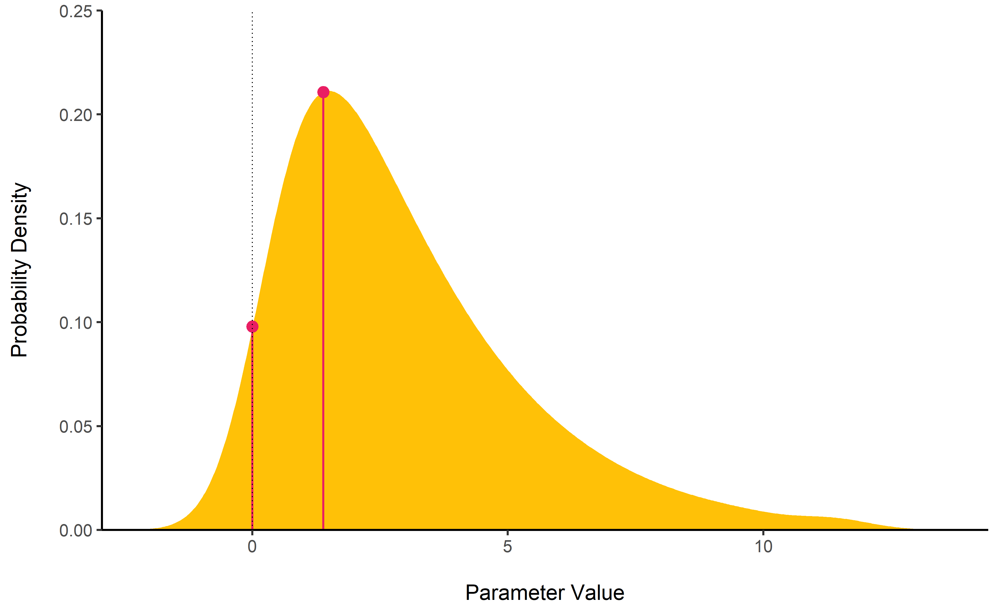

# Introduction

The Bayesian framework for statistics is quickly gaining in popularity among scientists, for reasons such as reliability and accuracy (particularly in noisy data and small samples), the possibility to incorporate prior knowledge into the analysis or the intuitive interpretation of results [@andrews2013prior; @etz2016bayesian; @kruschke2010believe; @kruschke2012time; @wagenmakers2018bayesian]. 

Adopting the Bayesian framework is more of a shift in the paradigm than a change in the methodology. All the common statistical procedures (*t*-tests, correlations, ANOVAs, regressions, ...) can also be achieved within the Bayesian framework. One of the core difference is that in the *frequentist* view, the effects are fixed (but unknown) and data are random. On the contrary, the Bayesian inference process computes the probability of different effects *given the observed data*. Instead of having estimates of the "true effect", the probabilistic approach gives a distribution of possible values for the parameters, called the *posterior distribution*. 

The uncertainty in Bayesian inference can be summarized, for instance, by the *median* of the distribution, as well as a range of values of the posterior distribution that includes the 95\% most probable values (the 95\% *credible interval*). Cum grano salis, these are considered the counterparts to the point-estimate and confidence interval in a frequentist framework. To illustrate the difference of interpretation, the Bayesian framework allows to say *"given the observed data, the effect has 95\% probability of falling within this range"*, while the frequentist less straightforward alternative would be *"there is a 95\% probability that when repeatedly computing a confidence interval from data of this sort, the effect falls within this range"*. In essence, the Bayesian sampling algorithms (such as MCMC sampling) return a probability distribution (*the posterior*) of an effect that is compatible with the observed data. The effect can be described by [characterizing the posterior distribution](https://easystats.github.io/bayestestR/articles/guidelines.html) of the related effect in relation to its centrality (point-estimates), uncertainty, existance and significane.

The existing R packages allow the users to easily fit a large variety of models and extract, and visualize, the posterior draws. However, most of these packages only return a limited set of indices (*e.g.*, point-estimates and CI). `BayestestR` provides a comprehensive and consistent set of functions to analyze and describe a variety of models objects, including popular modeling packages such as `rstanarm` [@goodrich2018rstanarm], `brms` [@burkner2017brms] or `BayesFactor` [@morey2014bayesfactor]. Beyond computing point-estimates (mean, median or MAP estimate) and quantifying the related uncertainty (with different types of CIs), `bayestestR` focuses on implementing a null-hypothesis testing framework. By providing an easy access to both established and exploratory indices of effect existence and significance, `bayestestR` appears as a useful tool supporting the research and usage of Bayesian statistics. The main functions are described below, and a full documentation is available on the [package's website](https://easystats.github.io/bayestestR).

# Features

[**`describe_posterior()`**](https://easystats.github.io/bayestestR/reference/describe_posterior.html)
is the master function with which you can compute all of the indices
cited below *at once*.

``` r
describe_posterior(rnorm(1000))
```

<!-- Need a introductory paragraph -->

## Indices of Centrality: Point-estimates

<!-- Need a introductory paragraph -->

### MAP Estimate

[**`map_estimate()`**](https://easystats.github.io/bayestestR/reference/map_estimate.html)
find the **Highest Maximum A Posteriori (MAP)** estimate of a posterior,
*i.e.,* the most probable value.

``` r
map_estimate(rnorm(1000, .4, 1))
#> MAP = 0.39
```

<!-- -->

## Uncertainty

### Highest Density Interval (HDI) - Credible Interval (CI)

[**`hdi()`**](https://easystats.github.io/bayestestR/reference/hdi.html)
computes the **Highest Density Interval (HDI)** of a posterior
distribution, i.e., the interval which contains all points within the
interval have a higher probability density than points outside the
interval. The HDI can be used in the context of Bayesian posterior
characterisation as **Credible Interval (CI)**.

Unlike equal-tailed intervals (see
[ci](https://easystats.github.io/bayestestR/reference/ci.html)) that
typically exclude 2.5% from each tail of the distribution, the HDI is
*not* equal-tailed and therefore always includes the mode(s) of
posterior distributions.

By default, `hdi()` returns the 89% intervals (`ci = 0.89`), deemed to
be more stable than, for instance, 95% intervals (Kruschke, 2014). An
effective sample size of at least 10.000 is recommended if 95% intervals
should be computed (Kruschke 2014, p. 183ff). Moreover, 89 is the
highest prime number that does not exceed the already unstable 95%
threshold (McElreath, 2015).

``` r
hdi(rnorm(1000), ci = .89)
```

<!-- -->

## Null-Hypothesis Significance Testing (NHST)

### ROPE

[**`rope()`**](https://easystats.github.io/bayestestR/reference/rope.html)
computes the proportion (in percentage) of the HDI (default to the 89%
HDI) of a posterior distribution that lies within a region of practical
equivalence.

Statistically, the probability of a posterior distribution of being
different from 0 does not make much sense (the probability of it being
different from a single point being infinite). Therefore, the idea
underlining ROPE is to let the user define an area around the null value
enclosing values that are *equivalent to the null* value for practical
purposes (Kruschke 2010, 2011, 2014).

Kruschke (2018) suggests that such null value could be set, by default,
to the -0.1 to 0.1 range of a standardized parameter (negligible effect
size according to Cohen, 1988). This could be generalized: For instance,
for linear models, the ROPE could be set as `0 +/- .1 * sd(y)`. This
ROPE range can be automatically computed for models using the
[rope\_range](https://easystats.github.io/bayestestR/reference/rope_range.html)
function.

Kruschke (2010, 2011, 2014) suggests using the proportion of the 95% (or
90%, considered more stable) HDI that falls within the ROPE as an index
for “null-hypothesis” testing (as understood under the Bayesian
framework, see
[equivalence\_test](https://easystats.github.io/bayestestR/reference/equivalence_test.html)).

``` r
rope(rnorm(1000, 1, 1), range = c(-0.1, 0.1))
```

<!-- -->

### Equivalence test

[**`equivalence_test()`**](https://easystats.github.io/bayestestR/reference/equivalence_test.html)
a **Test for Practical Equivalence** based on the *“HDI+ROPE decision
rule”* (Kruschke, 2018) to check whether parameter values should be
accepted or rejected against an explicitly formulated “null hypothesis”
(i.e., a
[ROPE](https://easystats.github.io/bayestestR/reference/rope.html)).

``` r
equivalence_test(rnorm(1000, 1, 1), range = c(-0.1, 0.1))
```

### Probability of Direction (*p*d)

[**`p_direction()`**](https://easystats.github.io/bayestestR/reference/p_direction.html)
computes the **Probability of Direction** (***p*d**, also known as the
Maximum Probability of Effect - *MPE*). It varies between 50% and 100% (*i.e.*, `0.5` and `1`)
and can be interpreted as the probability (expressed in percentage) that
a parameter (described by its posterior distribution) is strictly
positive or negative (whichever is the most probable). It is
mathematically defined as the proportion of the posterior distribution
that is of the median’s sign. Although differently expressed, this index
is fairly similar (i.e., is strongly correlated) to the frequentist
***p*-value**.

**Relationship with the p-value**: In most cases, it seems that the *pd*
corresponds to the frequentist one-sided *p*-value through the formula
`p-value = (1-pd/100)` and to the two-sided *p*-value (the most commonly
reported) through the formula `p-value = 2*(1-pd/100)`. Thus, a `pd` of
`95%`, `97.5%` `99.5%` and `99.95%` corresponds approximately to a
two-sided *p*-value of respectively `.1`, `.05`, `.01` and `.001`. See
the [*reporting
guidelines*](https://easystats.github.io/bayestestR/articles/guidelines.html).

``` r
p_direction(rnorm(1000, mean = 1, sd = 1))
```

<!-- -->

### Bayes Factor

[**`bayesfactor_savagedickey()`**](https://easystats.github.io/bayestestR/reference/bayesfactor_savagedickey.html)
computes the ratio between the density of a single value (typically the
null) in two distributions, typically the posterior vs. the prior
distributions. This method is used to examine if the hypothesis value is
less or more likely given the observed data, and is an approximation of a Bayes factor comparing 
the model against a model in which the parameter of choice is restricted to the point null. 

``` r
prior <- rnorm(1000, mean = 0, sd = 1)
posterior <- rnorm(1000, mean = 1, sd = 0.7)

bayesfactor_savagedickey(posterior, prior, direction = "two-sided", hypothesis = 0)
```

<!-- -->

### MAP-based *p*-value

[**`p_map()`**](https://easystats.github.io/bayestestR/reference/p_map.html)
computes a Bayesian equivalent of the p-value, related to the odds that
a parameter (described by its posterior distribution) has against the
null hypothesis (*h0*) using Mills’ (2014, 2017) *Objective Bayesian
Hypothesis Testing* framework. It is mathematically based on the density
at the Maximum A Priori (MAP) and corresponds to the density value at 0
divided by the density of the MAP estimate.

``` r
p_map(rnorm(1000, 1, 1))
```

<!-- -->

## Utilities

### Find ROPE’s appropriate range

[**`rope_range()`**](https://easystats.github.io/bayestestR/reference/rope_range.html):
This function attempts at automatically finding suitable “default”
values for the Region Of Practical Equivalence (ROPE). Kruschke (2018)
suggests that such null value could be set, by default, to a range from
`-0.1` to `0.1` of a standardized parameter (negligible effect size
according to Cohen, 1988), which can be generalised for linear models to
`-0.1 * sd(y), 0.1 * sd(y)`. For logistic models, the parameters
expressed in log odds ratio can be converted to standardized difference
through the formula `sqrt(3)/pi`, resulting in a range of `-0.05` to
`-0.05`.

``` r
rope_range(model)
```

### Density Estimation

[**`estimate_density()`**](https://easystats.github.io/bayestestR/reference/estimate_density.html):
This function is a wrapper over different methods of density estimation.
By default, it uses the base R `density` with by default uses a
different smoothing bandwidth (`"SJ"`) from the legacy default
implemented the base R `density` function (`"nrd0"`). However, Deng &
Wickham suggest that `method = "KernSmooth"` is the fastest and the most
accurate.

### Perfect Distributions

[**`distribution()`**](https://easystats.github.io/bayestestR/reference/distribution.html):
Generate a sample of size n with near-perfect distributions.

``` r
distribution(n = 10)
```

### Probability of a Value

[**`density_at()`**](https://easystats.github.io/bayestestR/reference/density_at.html):
Compute the density of a given point of a distribution.

``` r
density_at(rnorm(1000, 1, 1), 1)
```


# Licensing and Availability

**bayestestR** is licensed under the GNU General Public License (v3.0), with all source code stored at GitHub (https://github.com/easystats/bayestestR), with a corresponding issue tracker for bug-reporting and feature enhancements. In the spirit of open science and research, we encourage interaction with our package through requests/tips for fixes, feature updates, as well as general questions and concerns via direct interaction with contributors and developers.

# Acknowledgments

We would like to thank the [council of masters](https://github.com/orgs/easystats/people) of easystats, all other padawan contributors as well as the users.

# References