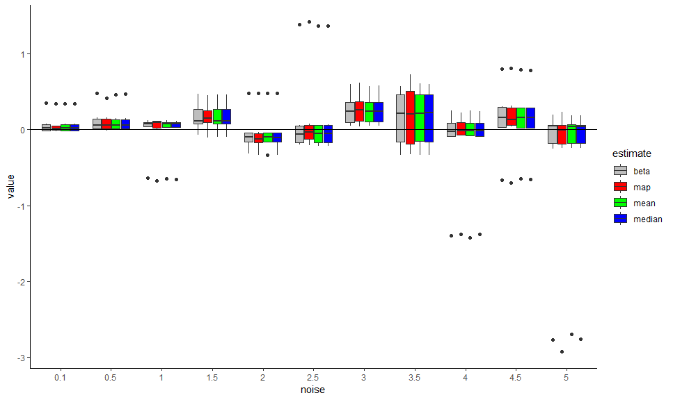
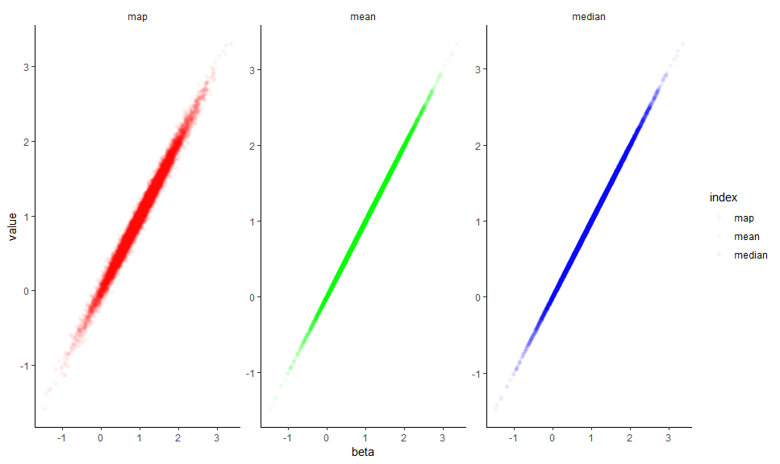
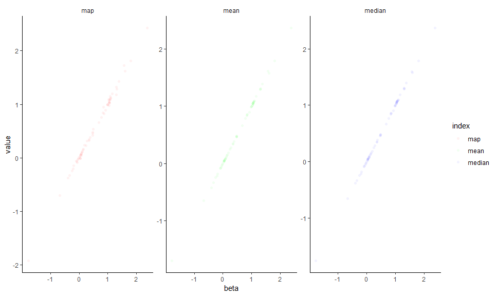
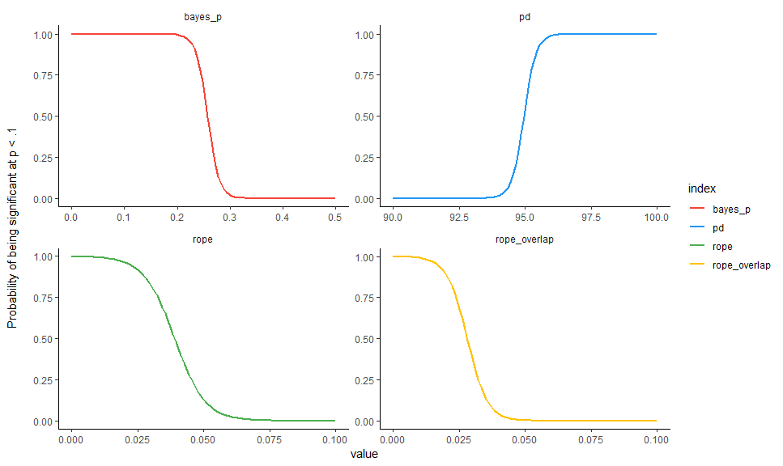
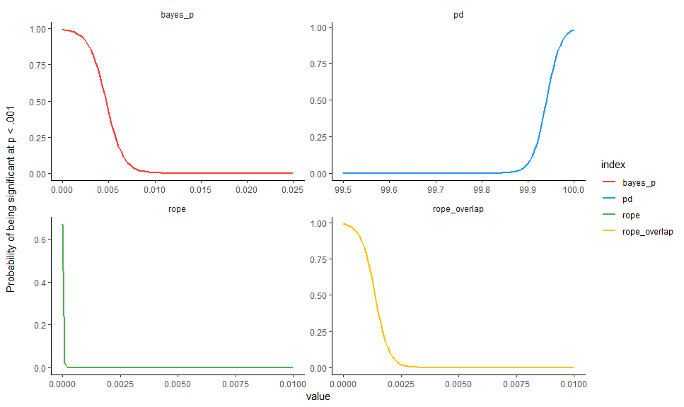
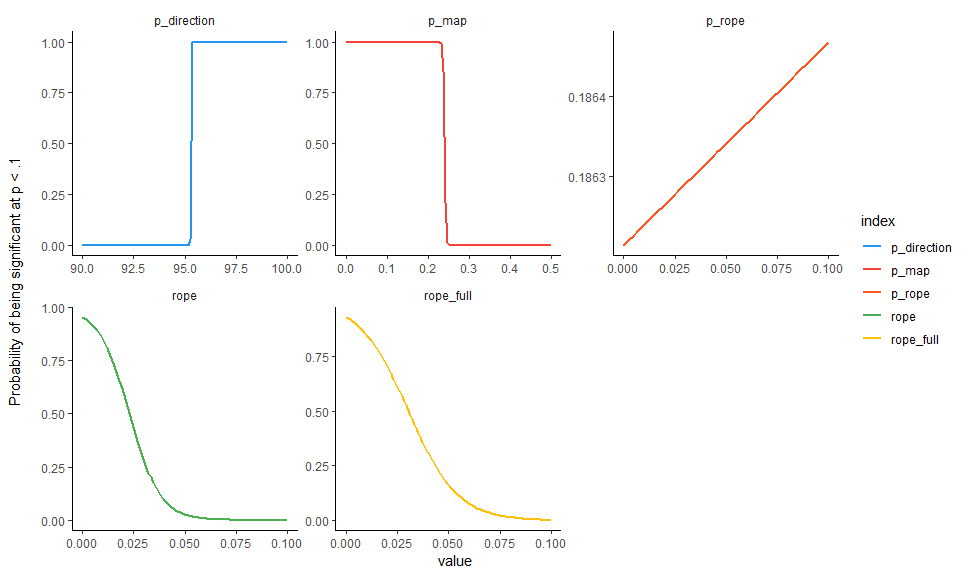
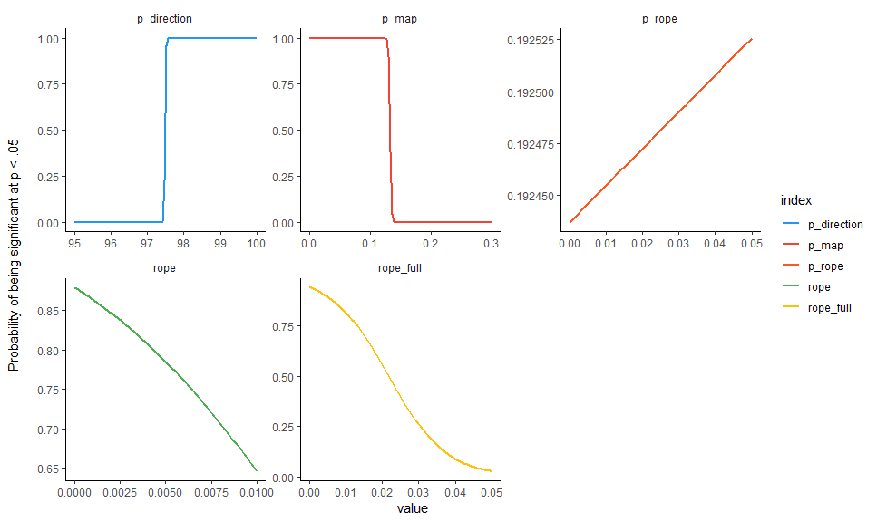
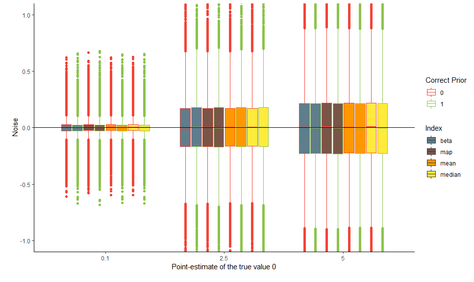

bayestestR
================

-   [Goal](#goal)
-   [Installation](#installation)
-   [Functions](#functions)
-   [Comparison of Indices](#comparison-of-indices)
    -   [Generate Regression Data with Noise](#generate-regression-data-with-noise)
    -   [Comparison of Parameter's Point-Estimates](#comparison-of-parameters-point-estimates)
        -   [Relationship with the theorethical true value](#relationship-with-the-theorethical-true-value)
        -   [Relationship with the frequentist beta](#relationship-with-the-frequentist-beta)
    -   [Comparison of Indices of Effect Existence](#comparison-of-indices-of-effect-existence)
        -   [Relationship with the Frequentist p value](#relationship-with-the-frequentist-p-value)
        -   [Relationship with frequentist's arbitrary clusters](#relationship-with-frequentists-arbitrary-clusters)
        -   [Relationship between the two ROPE indices](#relationship-between-the-two-rope-indices)
-   [Conclusions and Guidelines](#conclusions-and-guidelines)
    -   [:warning: Frequentist-like Arbitrary Thresholds](#warning-frequentist-like-arbitrary-thresholds)
-   [Credits](#credits)

[](https://travis-ci.org/DominiqueMakowski/bayestestR) [](https://codecov.io/gh/DominiqueMakowski/bayestestR) [](http://hits.dwyl.io/DominiqueMakowski/bayestestR)

Understand and Describe Bayesian Models and Posterior Distributions.

------------------------------------------------------------------------

Goal
====

`bayestestR` is a lightweight package providing utilities to describe posterior distributions and Bayesian models.

Installation
============

Run the following:

``` r
install.packages("devtools")
library("devtools")
install_github("DominiqueMakowski/bayestestR")
```

``` r
library("bayestestR")
```

------------------------------------------------------------------------

Functions
=========

-   **`p_map()`**: Compute a Bayesian equivalent of the p-value, related to the odds that a parameter (described by its posterior distribution) has againt the null hypothesis (h0) using Mills' (2014, 2017) Objective Bayesian Hypothesis Testing paradigm. It is mathematically based on the density at the Maximum A Priori (MAP).

``` r
p_map(posterior = rnorm(1000, 0, 1))
p_map(posterior = rnorm(1000, 10, 1))
```

-   **`p_direction()`**: Compute the Probability of Direction (p, also known as the Maximum Probability of Effect - MPE), a Bayesian equivalent of the p-value (altough differently expressed). It varies between 50% and 100% and can be interpreted as the probability that a parameter (described by its posterior distribution) is positive or negative (following the median's sign). It is defined as the proportion of the posterior distribution of the median's sign. It is used as an index of effect existence, i.e., whether the probability that the effect is in the same direction than the point-estimate (independently of the effect's size or significance). This p-value is fairly similar to its frequentist counterpart (i.e., is strongly correlated).

``` r
# Compute the pd of a posterior distribution of mean 1 and SD 1
pd(rnorm(1000, mean = 1, sd = 1))
```

-   **`rope()`**: Compute the proportion of the HDI of a posterior distribution that lies within a region of practical equivalence.

``` r
rope(posterior = rnorm(1000, 0, 0.01), rope = c(-0.1, 0.1))
rope(posterior = rnorm(1000, 0, 1), rope = c(-0.1, 0.1))
rope(posterior = rnorm(1000, 1, 0.01), rope = c(-0.1, 0.1))
```

-   **`rope_test()`**: Perform a Test for Practical Equivalence based on the "HDI+ROPE decision rule" (Kruschke 2018) to check whether parameter values should be accepted or rejected against an explicitely formulated "null hypothesis".

``` r
rope_test(posterior = rnorm(1000, 0, 0.01), rope = c(-0.1, 0.1))
rope_test(posterior = rnorm(1000, 0, 1), rope = c(-0.1, 0.1))
rope_test(posterior = rnorm(1000, 1, 0.01), rope = c(-0.1, 0.1))
```

-   **`hdi()`**: Compute the highest density interval (HDI) of a posterior distribution, i.e., the interval which contains all points within the interval have a higher probability density than points outside the interval.

``` r
posterior <- rnorm(1000)
hdi(posterior, prob = 0.9)
hdi(posterior, prob = c(0.8, 0.9, 0.95))
```

-   **`map_estimate()`**: Find the Highest Maximum A Posteriori (MAP) estimate of a posterior.

``` r
posterior <- rnorm(1000)
map_estimate(posterior)
```

-   **`rnorm_perfect()`**: Generate a sample of size n with a near-perfect normal distribution.

``` r
x <- rnorm_perfect(n = 10)
plot(density(x))
```

------------------------------------------------------------------------

Comparison of Indices
=====================

Generate Regression Data with Noise
-----------------------------------

``` r
library(ggplot2)
library(dplyr)
library(tidyr)

df <- read.csv("https://raw.github.com/DominiqueMakowski/bayestestR/master/data/bayes_indices.csv")
```

For the sake of time and computational space, we downloaded the data from github. However, you can find the code to generate it again below (*takes about 1h*).

``` r
library(bayestestR)
library(rstanarm)
library(broom)

set.seed(333)

data <- data.frame(x = scale(rnorm(50, 0, 1)))
data$y <- scale(data$x)


bayes_indices <- data.frame()
for(noise in c(0.1, seq(0.5, 5, by=0.5))){
  print(noise)
  for(sample_size in c(25, 50, 100)){
    for(i in 1:1000){
      cat(".")
      df <- data
      df$y <- df$y + rnorm(50, mean = 0, sd = noise)
  
      freq_model <- lm(y ~ x, data=df)
      summary(freq_model)
      beta <- broom::tidy(freq_model)[2, ]$estimate
      p_frequentist <- broom::tidy(freq_model)[2, ]$p.value
  
      out <- capture.output(bayes_model <- rstanarm::stan_glm(y ~ x, data=df))
      posterior <- as.data.frame(bayes_model)$x
  
      median <- median(posterior)
      mean <- mean(posterior)
      map <- map_estimate(posterior)[1]
  
      p_direction <- p_direction(posterior)
      rope <- rope(posterior, rope = c(-0.1, 0.1))
      rope_full <- rope(posterior, rope = c(-0.1, 0.1), CI=100)
      p_map <- p_map(posterior)
  
      bayes_indices <- rbind(bayes_indices,
                         data.frame(noise=noise,
                                    sample_size=sample_size,
                                    iteration=i,
                                    beta = beta,
                                    median = median,
                                    mean = mean,
                                    map = map,
                                    p_frequentist = p_frequentist,
                                    p_direction = p_direction,
                                    rope = rope,
                                    rope_full = rope_full,
                                    p_map = p_map))
    }
  }
  write.csv(bayes_indices, "../data/bayes_indices.csv")
}
```

Comparison of Parameter's Point-Estimates
-----------------------------------------

### Relationship with the theorethical true value

``` r
df %>% 
  select(noise, beta, median, mean, map) %>% 
  gather(estimate, value, -noise) %>% 
  mutate(noise = as.factor(noise),
         value = value) %>% 
  ggplot(aes(x = noise, y = value, fill = estimate)) +
  geom_boxplot() +
  geom_hline(yintercept = 1) +
  theme_classic() +
  scale_fill_manual(values = c("beta" = "grey", "map" = "red", "mean" = "green", "median" = "blue"))
```



-   **Frequentist beta**: median = 1.0014, 95% CI \[0.06, 1.93\]
-   **MAP estimate**: median = 1.00053, 95% CI \[0.09, 1.97\]
-   **Mean**: median = 1.0005, 95% CI \[0.06, 1.91\]
-   **Median**: median = 1.00055, 95% CI \[0.05, 1.91\]

### Relationship with the frequentist beta

``` r
df %>% 
  select(noise, beta, median, mean, map) %>% 
  gather(index, value, -noise, -beta) %>% 
  ggplot(aes(x = beta, y = value, color = index)) +
  geom_point(alpha = 0.05, shape = 16) +
  facet_wrap(~index, scales = "free") +
  theme_classic() +
  theme(strip.background = element_blank()) +
  scale_color_manual(values = c("map" = "red", "mean" = "green", "median" = "blue"))
```



Comparison of Indices of Effect Existence
-----------------------------------------

### Relationship with the Frequentist p value

``` r
df %>% 
  select(noise, p_frequentist, p_direction, p_map, rope, rope_full) %>% 
  gather(index, value, -noise, -p_frequentist) %>% 
  ggplot(aes(x = p_frequentist, y = value, color = index)) +
  geom_point(shape=16, alpha=0.05) +
  facet_wrap(~index, scales = "free") +
  theme_classic() +
  theme(strip.background = element_blank()) +
  scale_color_manual(values = c("p_map" = "#f44336", "p_direction" = "#2196F3", "rope" = "#4CAF50", "rope_full" = "#FFC107"))
```



### Relationship with frequentist's arbitrary clusters

``` r
df$sig_1 <- factor(ifelse(df$p_frequentist >= .1, "n.s.", "°"), levels=c("n.s.", "°"))
df$sig_05 <- factor(ifelse(df$p_frequentist >= .05, "n.s.", "*"), levels=c("n.s.", "*"))
df$sig_01 <- factor(ifelse(df$p_frequentist >= .01, "n.s.", "**"), levels=c("n.s.", "**"))
df$sig_001 <- factor(ifelse(df$p_frequentist >= .001, "n.s.", "***"), levels=c("n.s.", "***"))

get_data <- function(predictor, outcome, lbound=0, ubound=0.3){
  fit <- glm(paste(outcome, "~", predictor), data=df, family = "binomial")
  data <- data.frame(x=1:100) 
  data[predictor] <- seq(lbound, ubound, length.out = 100)
  data$index <- predictor
  data[outcome] = predict(fit, newdata=data, type="response")
  data <- select_(data, "value"=predictor, outcome, "index")
  return(data)
}
```

#### Significant at .1

``` r
data <- rbind(
  get_data(predictor="p_map", outcome="sig_1", lbound=0, ubound=0.5),
  get_data(predictor="p_direction", outcome="sig_1", lbound=90, ubound=100),
  get_data(predictor="rope", outcome="sig_1", lbound=0, ubound=0.1),
  get_data(predictor="rope_full", outcome="sig_1", lbound=0, ubound=0.1))


data %>% 
  mutate(index = as.factor(index)) %>% 
  ggplot(aes(x=value, y=sig_1, color=index)) +
  geom_line(size=1) +
  facet_wrap(~index, scales = "free") +
  theme_classic() +
  theme(strip.background = element_blank()) +
  scale_color_manual(values = c("p_map" = "#f44336", "p_direction" = "#2196F3", "rope" = "#4CAF50", "rope_full" = "#FFC107")) +
  ylab("Probability of being significant at p < .1\n")
```



#### Significant at .05

``` r
data <- rbind(
  get_data(predictor="p_map", outcome="sig_05", lbound=0, ubound=0.3),
  get_data(predictor="p_direction", outcome="sig_05", lbound=95, ubound=100),
  get_data(predictor="rope", outcome="sig_05", lbound=0, ubound=0.01),
  get_data(predictor="rope_full", outcome="sig_05", lbound=0, ubound=0.05))


data %>% 
  mutate(index = as.factor(index)) %>% 
  ggplot(aes(x=value, y=sig_05, color=index)) +
  geom_line(size=1) +
  facet_wrap(~index, scales = "free") +
  theme_classic() +
  theme(strip.background = element_blank()) +
  scale_color_manual(values = c("p_map" = "#f44336", "p_direction" = "#2196F3", "rope" = "#4CAF50", "rope_full" = "#FFC107")) +
  ylab("Probability of being significant at p < .05\n")
```



#### Significant at .01

``` r
data <- rbind(
  get_data(predictor="p_map", outcome="sig_01", lbound=0, ubound=0.1),
  get_data(predictor="p_direction", outcome="sig_01", lbound=98, ubound=100),
  get_data(predictor="rope", outcome="sig_01", lbound=0, ubound=0.01),
  get_data(predictor="rope_full", outcome="sig_01", lbound=0, ubound=0.02))


data %>% 
  mutate(index = as.factor(index)) %>% 
  ggplot(aes(x=value, y=sig_01, color=index)) +
  geom_line(size=1) +
  facet_wrap(~index, scales = "free") +
  theme_classic() +
  theme(strip.background = element_blank()) +
  scale_color_manual(values = c("p_map" = "#f44336", "p_direction" = "#2196F3", "rope" = "#4CAF50", "rope_full" = "#FFC107")) +
  ylab("Probability of being significant at p < .01\n")
```



#### Significant at .001

``` r
data <- rbind(
  get_data(predictor="p_map", outcome="sig_001", lbound=0, ubound=0.02),
  get_data(predictor="p_direction", outcome="sig_001", lbound=99.5, ubound=100),
  get_data(predictor="rope", outcome="sig_001", lbound=0, ubound=0.01),
  get_data(predictor="rope_full", outcome="sig_001", lbound=0, ubound=0.005))


data %>% 
  mutate(index = as.factor(index)) %>% 
  ggplot(aes(x=value, y=sig_001, color=index)) +
  geom_line(size=1) +
  facet_wrap(~index, scales = "free") +
  theme_classic() +
  theme(strip.background = element_blank()) +
  scale_color_manual(values = c("p_map" = "#f44336", "p_direction" = "#2196F3", "rope" = "#4CAF50", "rope_full" = "#FFC107")) +
  ylab("Probability of being significant at p < .001\n")
```



### Relationship between the two ROPE indices

``` r
df %>% 
  ggplot(aes(x = rope, y = rope_full, color=p_frequentist)) +
  geom_point(shape=16, alpha=0.2) +
  theme_classic() 
```



<!-- ### Relationship with Noise -->
<!-- ```{r, message=FALSE, warning=FALSE} -->
<!-- df %>%  -->
<!--   select(noise, p, p_map, p_direction, rope, rope_overlap) %>%  -->
<!--   gather(index, value, -noise) %>%  -->
<!--   mutate(noise = as.factor(noise)) %>% -->
<!--   ggplot(aes(x=noise, y=value, fill=index)) + -->
<!--   geom_boxplot() + -->
<!--   # geom_point() + -->
<!--   # geom_smooth(method="loess") + -->
<!--   facet_wrap(~index, scales="free") + -->
<!--   theme_classic() + -->
<!--   theme(strip.background = element_blank()) + -->
<!--   scale_fill_manual(values=c("p"="#9C27B0", "p_map"="#f44336", "p_direction"="#2196F3", "rope"="#4CAF50", "rope_overlap"="#FFC107")) -->
<!-- ``` -->
<!-- ```{r, message=FALSE, warning=FALSE} -->
<!-- summary(lm(p ~ noise, data=df)) -->
<!-- summary(lm(p_map ~ noise, data=df)) -->
<!-- summary(lm(p_direction ~ noise, data=df)) -->
<!-- summary(lm(rope ~ noise, data=df)) -->
<!-- summary(lm(rope_overlap ~ noise, data=df)) -->
<!-- ``` -->
Conclusions and Guidelines
==========================

From that, we can conclude:

-   The **MAP estimate** seems to be more biased than the mean and the median of the posterior distribution (larger CI).
-   Aside from being more robust, the **median** makes more sense than the **mean** in a probabilistic framework (*e.g.*, there is 50% chance that the true effect is either higher or lower than the median).
-   The **traditional ROPE** is not sensitive to delineate highly "significant" effects. While being relatively similar (and more straighforward in its definition), the **overlap-based ROPE** does not present the same flaw.
-   The **Probability of Direction (p)** is the closest index to the frequentist *p* value.

**To minimally describe the posterior distribution of a parameter, we suggest reporting the *median* and the *90% CI (the 90% HDI)* for parameter characterisation and, in the context of null-hypothesis testing, the Probability of Direction (*p*d) for effect existence and (especially in the context of confirmatory analyses) the ROPE (overlap based) with an explicitly specified range for effect significance.**

:warning: Frequentist-like Arbitrary Thresholds
-----------------------------------------------

**The following thresholds are presented as landmarks only for comparison with the frequentist framework. Please consider with caution.**

-   **p (direction)**

    -   *p* (direction) &lt; 95% ~ *p* &lt; .1: uncertain
    -   *p* (direction) &gt; 95% ~ *p* &lt; .1: possibly existing
    -   *p* (direction) &gt; 97.5% ~ *p* &lt; .05: likely existing
    -   *p* (direction) &gt; 99% ~ *p* &lt; .01: probably existing
    -   *p* (direction) &gt; 99.9% ~ *p* &lt; .001: certainly existing
    -   *p* (direction) = 100%: definitely existing

-   **ROPE**

    -   ROPE &gt; 0.95: definitely not significant
    -   ROPE &gt; 0.9: likely not significant
    -   ROPE &lt; 0.1: likely significant
    -   ROPE &lt; 0.05: definitely significant

*Note: If you have any advice, opinion or such, we encourage you to let us know by opening an [discussion thread](https://github.com/DominiqueMakowski/bayestestR/issues) or making a pull request.*

Credits
=======

You can cite the package as following: - Makowski, (2019). *Understand and Describe Bayesian Models and Posterior Distributions using BayestestR*. CRAN. doi: .

Please remember that parts of the code in this package was inspired / shamelessly copied from other great packages that you must check out and cite, such as [sjstats](https://github.com/strengejacke/sjstats) or [BayesTesting.jl](https://github.com/tszanalytics/BayesTesting.jl). All credits go to their authors.
